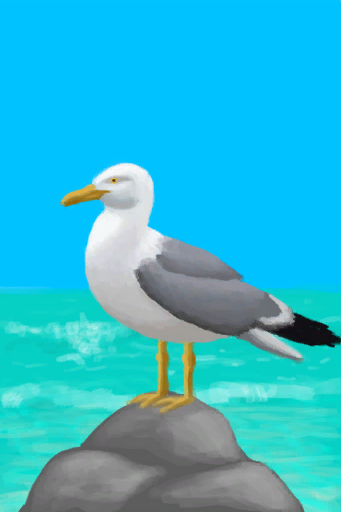

# Rocks  
> A rocky area below the cliffs of the island. Could probably get stones and crabs from here.  
  

<a href="Rocks.md" style="color:black">Rocks</a>

<a href="CaveSea.md" style="color:black">Sea Cave</a>

<a href="Beach.md" style="color:black">Beach</a>

<a href="BirdRock.md" style="color:black">Bird Rock</a>

<a href="Sea_Rocks.md" style="color:black">Sea</a>

  
  
<table class="table table-bordered" data-toggle="table"  data-show-header="false"><thead style="display:none"><tr ><th  style="width:50%;text-align:left;vertical-align:top;"  >title</th><th  style="width:50%;text-align:left;vertical-align:top;"  data-sortable="true"  ></th></tr></thead><tr ><td  style="width:50%;text-align:left;vertical-align:top;"  >** Unique On Board **  **Environment：**[Rocks(Environment)](Env_Rocks.md)  ** EnvironmentEffect: ** [

[Temperature](TemperaturePerceived.md)](TemperaturePerceived.md)<b>-5</b> [

[Land Sickness](LandSickness.md)](LandSickness.md)addition<b>-8</b></td><td  style="width:50%;text-align:left;vertical-align:top;"  ></td></tr></tbody></table>  
  
## Exploration  
<table class="table table-bordered" data-toggle="table"  ><thead style=""><tr ><th  style="text-align:left;vertical-align:top;"  >Progress</th><th  style="text-align:left;vertical-align:top;"  >Target</th></tr></thead><tr ><td  style="text-align:left;vertical-align:top;"  >20%</td><td  style="text-align:left;vertical-align:top;"  >[Tide Pool(Rocks)](TidePool.md)</td></tr><tr ><td  style="text-align:left;vertical-align:top;"  >20%</td><td  style="text-align:left;vertical-align:top;"  >[Flooded Tide Pool(Rocks)](TidePoolFlooded.md)</td></tr><tr ><td  style="text-align:left;vertical-align:top;"  >40%</td><td  style="text-align:left;vertical-align:top;"  >[Tide Pool(Rocks)](TidePool.md)</td></tr><tr ><td  style="text-align:left;vertical-align:top;"  >40%</td><td  style="text-align:left;vertical-align:top;"  >[Flooded Tide Pool(Rocks)](TidePoolFlooded.md)</td></tr><tr ><td  style="text-align:left;vertical-align:top;"  >60%</td><td  style="text-align:left;vertical-align:top;"  >[Cave(Event)(Rocks)](Event_CaveFound.md)</td></tr><tr ><td  style="text-align:left;vertical-align:top;"  >80%</td><td  style="text-align:left;vertical-align:top;"  >[Tide Pool(Rocks)](TidePool.md)</td></tr><tr ><td  style="text-align:left;vertical-align:top;"  >80%</td><td  style="text-align:left;vertical-align:top;"  >[Flooded Tide Pool(Rocks)](TidePoolFlooded.md)</td></tr><tr ><td  style="text-align:left;vertical-align:top;"  >100%</td><td  style="text-align:left;vertical-align:top;"  >[To Beach(Rocks)](Path_RocksToBeach.md)</td></tr></tbody></table>  
  
## Action  

<table><tr><td rowspan="2" style="width:200px;text-align:center;font-size:1.3em;font-weight:bold">

Explore

15m

</td><td>[“LegAction(Group)”](LegAction.md), [“SlipperyAction(Group)”](SlipperyAction.md)</td></tr><tr><td></td></tr><tr><td colspan="2"><b>Require：</b>[

[Light](Light.md)](Light.md): <b>10-100</b></td></tr><tr><td colspan="2"><b>StatChange：</b>[

[Foot Damage](FootDamage.md)](FootDamage.md)<b>+20</b>, [

[Stamina](Stamina.md)](Stamina.md)<b>-4</b>, [

[Stress](Stress.md)](Stress.md)<b>-10</b>, [Exploration Rocks](Exploration_Rocks.md)<b>+1</b>, [TV Rocks - Explore](TV_RocksExplore.md)<b>+1</b></td></tr><tr><td colspan="2">

<table style="margin-bottom:3px;"><tr><td rowspan=2 style="text-align:center" width="80px">
Base Weight

0
</td><td style="font-size:0.6em;line-height:0.6em;font-weight:bold">Conch</td></tr><tr><td>[

[Conch](Conch.md)](Conch.md)(<b>+1</b>)[Population Conch](Pop_Conch.md)<b>-1000</b></td></tr><tr><td colspan=2><li>[Population Conch](Pop_Conch.md) in <b>1000～30000</b>, weight <b>+100～+1000</b></li></td></tr></table>

<table style="margin-bottom:3px;"><tr><td rowspan=2 style="text-align:center" width="80px">
Base Weight

0
</td><td style="font-size:0.6em;line-height:0.6em;font-weight:bold">Crab</td></tr><tr><td>[

[Crab](Crab.md)](Crab.md)(<b>+1</b>)[Population Crab](Pop_Crab.md)<b>-1000</b></td></tr><tr><td colspan=2><li>[Population Crab](Pop_Crab.md) in <b>1000～60000</b>, weight<b>+100～+1200</b></li></td></tr></table>

<table style="margin-bottom:3px;"><tr><td rowspan=2 style="text-align:center" width="80px">
Base Weight

0
</td><td style="font-size:0.6em;line-height:0.6em;font-weight:bold">Drone Encounter</td></tr><tr><td>[

[Attack Drone!(Event)](Event_DroneFight.md)](Event_DroneFight.md)(<b>+1</b>)</td></tr><tr><td colspan=2><li>[Island Drones](Pop_Drone.md) in <b>1000～4000</b>, weight<b>+25～+100</b></li><li>[

[Eyesight](Myopia.md)](Myopia.md) in <b>1～3</b>, weight<b>+0</b></li><li>[“Fight Event”](tag_FightEvent.md) On *Hand/Board*，Weight<b>-999999</b>(Stackable),</li></td></tr></table>

<table style="margin-bottom:3px;"><tr><td rowspan=2 style="text-align:center" width="80px">
Base Weight

3000
</td><td style="font-size:0.6em;line-height:0.6em;font-weight:bold">Flint First❗1 limit</td></tr><tr><td>[

[Flint](Flint.md)](Flint.md)(<b>+1</b>)</td></tr></table>

<table style="margin-bottom:3px;"><tr><td rowspan=2 style="text-align:center" width="80px">
Base Weight

400
</td><td style="font-size:0.6em;line-height:0.6em;font-weight:bold">Flint</td></tr><tr><td>[

[Flint](Flint.md)](Flint.md)(<b>+1</b>)</td></tr></table>

<table style="margin-bottom:3px;"><tr><td rowspan=2 style="text-align:center" width="80px">
Base Weight

200
</td><td style="font-size:0.6em;line-height:0.6em;font-weight:bold">Flint Slab</td></tr><tr><td>[

[Flint Slab](FlintSlab.md)](FlintSlab.md)(<b>+1</b>)</td></tr></table>

<table style="margin-bottom:3px;"><tr><td rowspan=2 style="text-align:center" width="80px">
Base Weight

250
</td><td style="font-size:0.6em;line-height:0.6em;font-weight:bold">Guano</td></tr><tr><td>[

[Guano](Guano.md)](Guano.md)(<b>+1</b>)</td></tr></table>

<table style="margin-bottom:3px;"><tr><td rowspan=2 style="text-align:center" width="80px">
Base Weight

1000
</td><td style="font-size:0.6em;line-height:0.6em;font-weight:bold">Heavy Stone</td></tr><tr><td>[

[Heavy Stone](StoneHeavy.md)](StoneHeavy.md)(<b>+1</b>)</td></tr></table>

<table style="margin-bottom:3px;"><tr><td rowspan=2 style="text-align:center" width="80px">
Base Weight

0
</td><td style="font-size:0.6em;line-height:0.6em;font-weight:bold">Nest</td></tr><tr><td>[

[Seagull Nest](SeagullNest.md)](SeagullNest.md)(<b>+1</b>)</td></tr><tr><td colspan=2><li>[

[Eyesight](Myopia.md)](Myopia.md) in <b>1～3</b>, weight<b>-100～-300</b></li><li>[Population Seagulls](Pop_Seagull.md) in <b>1000～45000</b>, weight<b>+100～+300</b></li></td></tr></table>

<table style="margin-bottom:3px;"><tr><td rowspan=2 style="text-align:center" width="80px">
Base Weight

100
</td><td style="font-size:0.6em;line-height:0.6em;font-weight:bold">Plastic Bottle❗1 limit</td></tr><tr><td>[

[Plastic Bottle](PlasticBottle.md)](PlasticBottle.md)(<b>+1</b>)</td></tr><tr><td colspan=2><li>[

[Eyesight](Myopia.md)](Myopia.md) in <b>1～3</b>, weight<b>+0～-75</b></li></td></tr></table>

<table style="margin-bottom:3px;"><tr><td rowspan=2 style="text-align:center" width="80px">
Base Weight

300
</td><td style="font-size:0.6em;line-height:0.6em;font-weight:bold">Pretty Seashells</td></tr><tr><td>[

[Pretty Seashells](SeashellsPretty.md)](SeashellsPretty.md)(<b>+1</b>)</td></tr></table>

<table style="margin-bottom:3px;"><tr><td rowspan=2 style="text-align:center" width="80px">
Base Weight

0
</td><td style="font-size:0.6em;line-height:0.6em;font-weight:bold">Seagull Carcass</td></tr><tr><td>[

[Seagull Carcass](SeagullCarcass.md)](SeagullCarcass.md)(<b>+1</b>)[Population Seagulls](Pop_Seagull.md)<b>-1000</b></td></tr><tr><td colspan=2><li>[Population Seagulls](Pop_Seagull.md) in <b>1000～45000</b>, weight<b>+0～+100</b></li></td></tr></table>

<table style="margin-bottom:3px;"><tr><td rowspan=2 style="text-align:center" width="80px">
Base Weight

0
</td><td style="font-size:0.6em;line-height:0.6em;font-weight:bold">Seagull Spotted</td></tr><tr><td>[

[A seagull!(Event)](Event_SeagullFight.md)](Event_SeagullFight.md)(<b>+1</b>)</td></tr><tr><td colspan=2><li>[Population Seagulls](Pop_Seagull.md) in <b>1000～45000</b>, weight<b>+0～+100</b></li><li>[

[Eyesight](Myopia.md)](Myopia.md) in <b>1～3</b>, weight<b>-100～-200</b></li></td></tr></table>

<table style="margin-bottom:3px;"><tr><td rowspan=2 style="text-align:center" width="80px">
Base Weight

2000
</td><td style="font-size:0.6em;line-height:0.6em;font-weight:bold">Stone</td></tr><tr><td>[

[Stone](Stone.md)](Stone.md)(<b>+1</b>)</td></tr></table>

<table style="margin-bottom:3px;"><tr><td rowspan=2 style="text-align:center" width="80px">
Base Weight

0
</td><td style="font-size:0.6em;line-height:0.6em;font-weight:bold">Supply Crate</td></tr><tr><td>[

[Supply Capsule](TV_SupplyCapsule.md)](TV_SupplyCapsule.md)(<b>+1</b>)</td></tr><tr><td colspan=2><li>[

[TV Rocks](TV_Rocks.md)](TV_Rocks.md) in <b>1</b>, weight<b>+200</b></li><li>[TV Rocks - Explore](TV_RocksExplore.md) in <b>0～9</b>, weight<b>-999</b></li></td></tr></table>

<table style="margin-bottom:3px;"><tr><td rowspan=2 style="text-align:center" width="80px">
Base Weight

0
</td><td style="font-size:0.6em;line-height:0.6em;font-weight:bold">Urchin</td></tr><tr><td>[

[Urchin](Urchin.md)](Urchin.md)(<b>+1</b>)[Urchin Population](Pop_Urchin.md)<b>-1000</b></td></tr><tr><td colspan=2><li>[

[Eyesight](Myopia.md)](Myopia.md) in <b>1～3</b>, weight<b>+0～-100</b></li><li>[Urchin Population](Pop_Urchin.md) in <b>1000～6000</b>, weight<b>+100～+200</b></li></td></tr></table>

<table style="margin-bottom:3px;"><tr><td rowspan=2 style="text-align:center" width="80px">
Base Weight

0
</td><td style="font-size:0.6em;line-height:0.6em;font-weight:bold">Urchin Step</td></tr><tr><td>[

[Urchin!!(Event)](Event_Urchin.md)](Event_Urchin.md)(<b>+1</b>)[Urchin Population](Pop_Urchin.md)<b>-1000</b></td></tr><tr><td colspan=2><li>[Exploration Rocks](Exploration_Rocks.md) in <b>0～9</b>, weight<b>-900</b></li><li>[

[Eyesight](Myopia.md)](Myopia.md) in <b>1～3</b>, weight<b>+50～+100</b></li><li>[Urchin Population](Pop_Urchin.md) in <b>1000～6000</b>, weight<b>+25～+400</b>，否则权重-1000000</li></td></tr></table>
<button class="btn btn-secondary btn-sm" style="" data-toggle="modal" onclick="setCollectionDataBase64('eyJ0aXRsZSI6IlNpbXVsYXRvcjogRXhwbG9yZSAoUm9ja3MpIiwiY29sbGVjdGlvbnMiOlt7ImRyb3AiOiI8ZGl2IHN0eWxlPVwid2lkdGg6MjVweDtkaXNwbGF5OmlubGluZS1ibG9jazt0ZXh0LWFsaWduOmNlbnRlclwiPjxpbWcgZGVjb2Rpbmc9XCJhc3luY1wiIHNyYz1cIi4uL3dpa2kvU3ByaXRlL0NvbmNoLnBuZ1wiIGhyZWY9XCJhLm1kXCIgc3R5bGU9XCJtYXgtd2lkdGg6MjVweDttYXgtaGVpZ2h0OjI1cHg7XCI+PC9kaXY+Q29uY2giLCJiYXNlIjowLCJjb25kaXRpb24iOlt7ImtleSI6IlBvcF9Db25jaCIsInRpdGxlIjoiUG9wdWxhdGlvbiBDb25jaCIsInR5cGUiOiJyYW5nZSIsIm1heCI6WzAsMzAwMDBdLCJyYW5nZSI6WzEwMDAsMzAwMDBdLCJ3ZWlnaHQiOlsxMDAsMTAwMF0sImRlZmF1bHRWYWx1ZSI6MzAwMDAsIndoZW5PdXRPZlJhbmdlIjoxfV19LHsiZHJvcCI6IjxkaXYgc3R5bGU9XCJ3aWR0aDoyNXB4O2Rpc3BsYXk6aW5saW5lLWJsb2NrO3RleHQtYWxpZ246Y2VudGVyXCI+PGltZyBkZWNvZGluZz1cImFzeW5jXCIgc3JjPVwiLi4vd2lraS9TcHJpdGUvQ3JhYi5wbmdcIiBocmVmPVwiYS5tZFwiIHN0eWxlPVwibWF4LXdpZHRoOjI1cHg7bWF4LWhlaWdodDoyNXB4O1wiPjwvZGl2PkNyYWIiLCJiYXNlIjowLCJjb25kaXRpb24iOlt7ImtleSI6IlBvcF9DcmFiIiwidGl0bGUiOiJQb3B1bGF0aW9uIENyYWIiLCJ0eXBlIjoicmFuZ2UiLCJtYXgiOlswLDYwMDAwXSwicmFuZ2UiOlsxMDAwLDYwMDAwXSwid2VpZ2h0IjpbMTAwLDEyMDBdLCJkZWZhdWx0VmFsdWUiOjYwMDAwLCJ3aGVuT3V0T2ZSYW5nZSI6MH1dfSx7ImRyb3AiOiI8ZGl2IHN0eWxlPVwid2lkdGg6MjVweDtkaXNwbGF5OmlubGluZS1ibG9jazt0ZXh0LWFsaWduOmNlbnRlclwiPjxpbWcgZGVjb2Rpbmc9XCJhc3luY1wiIHNyYz1cIi4uL3dpa2kvU3ByaXRlL0Ryb25lLnBuZ1wiIGhyZWY9XCJhLm1kXCIgc3R5bGU9XCJtYXgtd2lkdGg6MjVweDttYXgtaGVpZ2h0OjI1cHg7XCI+PC9kaXY+QXR0YWNrIERyb25lIShFdmVudCkiLCJiYXNlIjowLCJjb25kaXRpb24iOlt7ImtleSI6IlBvcF9Ecm9uZSIsInRpdGxlIjoiSXNsYW5kIERyb25lcyIsInR5cGUiOiJyYW5nZSIsIm1heCI6WzAsNDAwMF0sInJhbmdlIjpbMTAwMCw0MDAwXSwid2VpZ2h0IjpbMjUsMTAwXSwiZGVmYXVsdFZhbHVlIjowLCJ3aGVuT3V0T2ZSYW5nZSI6MH0seyJrZXkiOiJNeW9waWEiLCJ0aXRsZSI6IkV5ZXNpZ2h0IiwidHlwZSI6InJhbmdlIiwibWF4IjpbMCwzXSwicmFuZ2UiOlsxLDNdLCJ3ZWlnaHQiOlswLDBdLCJkZWZhdWx0VmFsdWUiOjAsIndoZW5PdXRPZlJhbmdlIjowfSx7ImtleSI6InRhZ19GaWdodEV2ZW50X2Ftb3VudCIsInRpdGxlIjoi4oCcRmlnaHQgRXZlbnTigJ0iLCJ0eXBlIjoicmFuZ2UiLCJyYW5nZSI6WzAsMjBdLCJtYXgiOlswLDIwXSwid2VpZ2h0IjpbMCwtMTk5OTk5ODBdLCJkZWZhdWx0VmFsdWUiOjAsIndoZW5PdXRPZlJhbmdlIjowfV19LHsiZHJvcCI6IjxkaXYgc3R5bGU9XCJ3aWR0aDoyNXB4O2Rpc3BsYXk6aW5saW5lLWJsb2NrO3RleHQtYWxpZ246Y2VudGVyXCI+PGltZyBkZWNvZGluZz1cImFzeW5jXCIgc3JjPVwiLi4vd2lraS9TcHJpdGUvRmxpbnQucG5nXCIgaHJlZj1cImEubWRcIiBzdHlsZT1cIm1heC13aWR0aDoyNXB4O21heC1oZWlnaHQ6MjVweDtcIj48L2Rpdj5GbGludCIsImJhc2UiOjQwMCwiY29uZGl0aW9uIjpbXX0seyJkcm9wIjoiPGRpdiBzdHlsZT1cIndpZHRoOjI1cHg7ZGlzcGxheTppbmxpbmUtYmxvY2s7dGV4dC1hbGlnbjpjZW50ZXJcIj48aW1nIGRlY29kaW5nPVwiYXN5bmNcIiBzcmM9XCIuLi93aWtpL1Nwcml0ZS9GbGludExhcmdlLnBuZ1wiIGhyZWY9XCJhLm1kXCIgc3R5bGU9XCJtYXgtd2lkdGg6MjVweDttYXgtaGVpZ2h0OjI1cHg7XCI+PC9kaXY+RmxpbnQgU2xhYiIsImJhc2UiOjIwMCwiY29uZGl0aW9uIjpbXX0seyJkcm9wIjoiPGRpdiBzdHlsZT1cIndpZHRoOjI1cHg7ZGlzcGxheTppbmxpbmUtYmxvY2s7dGV4dC1hbGlnbjpjZW50ZXJcIj48aW1nIGRlY29kaW5nPVwiYXN5bmNcIiBzcmM9XCIuLi93aWtpL1Nwcml0ZS9HdWFuby5wbmdcIiBocmVmPVwiYS5tZFwiIHN0eWxlPVwibWF4LXdpZHRoOjI1cHg7bWF4LWhlaWdodDoyNXB4O1wiPjwvZGl2Pkd1YW5vIiwiYmFzZSI6MjUwLCJjb25kaXRpb24iOltdfSx7ImRyb3AiOiI8ZGl2IHN0eWxlPVwid2lkdGg6MjVweDtkaXNwbGF5OmlubGluZS1ibG9jazt0ZXh0LWFsaWduOmNlbnRlclwiPjxpbWcgZGVjb2Rpbmc9XCJhc3luY1wiIHNyYz1cIi4uL3dpa2kvU3ByaXRlL1NhbmRzdG9uZS5wbmdcIiBocmVmPVwiYS5tZFwiIHN0eWxlPVwibWF4LXdpZHRoOjI1cHg7bWF4LWhlaWdodDoyNXB4O1wiPjwvZGl2PkhlYXZ5IFN0b25lIiwiYmFzZSI6MTAwMCwiY29uZGl0aW9uIjpbXX0seyJkcm9wIjoiPGRpdiBzdHlsZT1cIndpZHRoOjI1cHg7ZGlzcGxheTppbmxpbmUtYmxvY2s7dGV4dC1hbGlnbjpjZW50ZXJcIj48aW1nIGRlY29kaW5nPVwiYXN5bmNcIiBzcmM9XCIuLi93aWtpL1Nwcml0ZS9TZWFndWxsTmVzdC5wbmdcIiBocmVmPVwiYS5tZFwiIHN0eWxlPVwibWF4LXdpZHRoOjI1cHg7bWF4LWhlaWdodDoyNXB4O1wiPjwvZGl2PlNlYWd1bGwgTmVzdCIsImJhc2UiOjAsImNvbmRpdGlvbiI6W3sia2V5IjoiTXlvcGlhIiwidGl0bGUiOiJFeWVzaWdodCIsInR5cGUiOiJyYW5nZSIsIm1heCI6WzAsM10sInJhbmdlIjpbMSwzXSwid2VpZ2h0IjpbLTEwMCwtMzAwXSwiZGVmYXVsdFZhbHVlIjowLCJ3aGVuT3V0T2ZSYW5nZSI6MH0seyJrZXkiOiJQb3BfU2VhZ3VsbCIsInRpdGxlIjoiUG9wdWxhdGlvbiBTZWFndWxscyIsInR5cGUiOiJyYW5nZSIsIm1heCI6WzAsNDUwMDBdLCJyYW5nZSI6WzEwMDAsNDUwMDBdLCJ3ZWlnaHQiOlsxMDAsMzAwXSwiZGVmYXVsdFZhbHVlIjo0NTAwMCwid2hlbk91dE9mUmFuZ2UiOjB9XSwiaXNVbmlxdWUiOnRydWV9LHsiZHJvcCI6IjxkaXYgc3R5bGU9XCJ3aWR0aDoyNXB4O2Rpc3BsYXk6aW5saW5lLWJsb2NrO3RleHQtYWxpZ246Y2VudGVyXCI+PGltZyBkZWNvZGluZz1cImFzeW5jXCIgc3JjPVwiLi4vd2lraS9TcHJpdGUvUHJldHR5U2Vhc2hlbGxzLnBuZ1wiIGhyZWY9XCJhLm1kXCIgc3R5bGU9XCJtYXgtd2lkdGg6MjVweDttYXgtaGVpZ2h0OjI1cHg7XCI+PC9kaXY+UHJldHR5IFNlYXNoZWxscyIsImJhc2UiOjMwMCwiY29uZGl0aW9uIjpbXX0seyJkcm9wIjoiPGRpdiBzdHlsZT1cIndpZHRoOjI1cHg7ZGlzcGxheTppbmxpbmUtYmxvY2s7dGV4dC1hbGlnbjpjZW50ZXJcIj48aW1nIGRlY29kaW5nPVwiYXN5bmNcIiBzcmM9XCIuLi93aWtpL1Nwcml0ZS9TZWFndWxsQ2FyY2Fzcy5wbmdcIiBocmVmPVwiYS5tZFwiIHN0eWxlPVwibWF4LXdpZHRoOjI1cHg7bWF4LWhlaWdodDoyNXB4O1wiPjwvZGl2PlNlYWd1bGwgQ2FyY2FzcyIsImJhc2UiOjAsImNvbmRpdGlvbiI6W3sia2V5IjoiUG9wX1NlYWd1bGwiLCJ0aXRsZSI6IlBvcHVsYXRpb24gU2VhZ3VsbHMiLCJ0eXBlIjoicmFuZ2UiLCJtYXgiOlswLDQ1MDAwXSwicmFuZ2UiOlsxMDAwLDQ1MDAwXSwid2VpZ2h0IjpbMCwxMDBdLCJkZWZhdWx0VmFsdWUiOjQ1MDAwLCJ3aGVuT3V0T2ZSYW5nZSI6MH1dfSx7ImRyb3AiOiI8ZGl2IHN0eWxlPVwid2lkdGg6MjVweDtkaXNwbGF5OmlubGluZS1ibG9jazt0ZXh0LWFsaWduOmNlbnRlclwiPjxpbWcgZGVjb2Rpbmc9XCJhc3luY1wiIHNyYz1cIi4uL3dpa2kvU3ByaXRlL1NlYWd1bGwucG5nXCIgaHJlZj1cImEubWRcIiBzdHlsZT1cIm1heC13aWR0aDoyNXB4O21heC1oZWlnaHQ6MjVweDtcIj48L2Rpdj5BIHNlYWd1bGwhKEV2ZW50KSIsImJhc2UiOjAsImNvbmRpdGlvbiI6W3sia2V5IjoiUG9wX1NlYWd1bGwiLCJ0aXRsZSI6IlBvcHVsYXRpb24gU2VhZ3VsbHMiLCJ0eXBlIjoicmFuZ2UiLCJtYXgiOlswLDQ1MDAwXSwicmFuZ2UiOlsxMDAwLDQ1MDAwXSwid2VpZ2h0IjpbMCwxMDBdLCJkZWZhdWx0VmFsdWUiOjQ1MDAwLCJ3aGVuT3V0T2ZSYW5nZSI6MH0seyJrZXkiOiJNeW9waWEiLCJ0aXRsZSI6IkV5ZXNpZ2h0IiwidHlwZSI6InJhbmdlIiwibWF4IjpbMCwzXSwicmFuZ2UiOlsxLDNdLCJ3ZWlnaHQiOlstMTAwLC0yMDBdLCJkZWZhdWx0VmFsdWUiOjAsIndoZW5PdXRPZlJhbmdlIjowfV19LHsiZHJvcCI6IjxkaXYgc3R5bGU9XCJ3aWR0aDoyNXB4O2Rpc3BsYXk6aW5saW5lLWJsb2NrO3RleHQtYWxpZ246Y2VudGVyXCI+PGltZyBkZWNvZGluZz1cImFzeW5jXCIgc3JjPVwiLi4vd2lraS9TcHJpdGUvU3RvbmUucG5nXCIgaHJlZj1cImEubWRcIiBzdHlsZT1cIm1heC13aWR0aDoyNXB4O21heC1oZWlnaHQ6MjVweDtcIj48L2Rpdj5TdG9uZSIsImJhc2UiOjIwMDAsImNvbmRpdGlvbiI6W119LHsiZHJvcCI6IjxkaXYgc3R5bGU9XCJ3aWR0aDoyNXB4O2Rpc3BsYXk6aW5saW5lLWJsb2NrO3RleHQtYWxpZ246Y2VudGVyXCI+PGltZyBkZWNvZGluZz1cImFzeW5jXCIgc3JjPVwiLi4vd2lraS9TcHJpdGUvVFZDcmF0ZS5wbmdcIiBocmVmPVwiYS5tZFwiIHN0eWxlPVwibWF4LXdpZHRoOjI1cHg7bWF4LWhlaWdodDoyNXB4O1wiPjwvZGl2PlN1cHBseSBDYXBzdWxlIiwiYmFzZSI6MCwiY29uZGl0aW9uIjpbeyJrZXkiOiJUVl9Sb2NrcyIsInRpdGxlIjoiVFYgUm9ja3MiLCJ0eXBlIjoicmFuZ2UiLCJtYXgiOlswLDFdLCJyYW5nZSI6WzEsMV0sIndlaWdodCI6WzIwMCwyMDBdLCJkZWZhdWx0VmFsdWUiOjAsIndoZW5PdXRPZlJhbmdlIjowfSx7ImtleSI6IlRWX1JvY2tzRXhwbG9yZSIsInRpdGxlIjoiVFYgUm9ja3MgLSBFeHBsb3JlIiwidHlwZSI6InJhbmdlIiwibWF4IjpbMCwyMF0sInJhbmdlIjpbMCw5XSwid2VpZ2h0IjpbLTk5OSwtOTk5XSwiZGVmYXVsdFZhbHVlIjowLCJ3aGVuT3V0T2ZSYW5nZSI6MH1dLCJpc1VuaXF1ZSI6dHJ1ZX0seyJkcm9wIjoiPGRpdiBzdHlsZT1cIndpZHRoOjI1cHg7ZGlzcGxheTppbmxpbmUtYmxvY2s7dGV4dC1hbGlnbjpjZW50ZXJcIj48aW1nIGRlY29kaW5nPVwiYXN5bmNcIiBzcmM9XCIuLi93aWtpL1Nwcml0ZS9VcmNoaW4ucG5nXCIgaHJlZj1cImEubWRcIiBzdHlsZT1cIm1heC13aWR0aDoyNXB4O21heC1oZWlnaHQ6MjVweDtcIj48L2Rpdj5VcmNoaW4iLCJiYXNlIjowLCJjb25kaXRpb24iOlt7ImtleSI6Ik15b3BpYSIsInRpdGxlIjoiRXllc2lnaHQiLCJ0eXBlIjoicmFuZ2UiLCJtYXgiOlswLDNdLCJyYW5nZSI6WzEsM10sIndlaWdodCI6WzAsLTEwMF0sImRlZmF1bHRWYWx1ZSI6MCwid2hlbk91dE9mUmFuZ2UiOjB9LHsia2V5IjoiUG9wX1VyY2hpbiIsInRpdGxlIjoiVXJjaGluIFBvcHVsYXRpb24iLCJ0eXBlIjoicmFuZ2UiLCJtYXgiOlswLDYwMDBdLCJyYW5nZSI6WzEwMDAsNjAwMF0sIndlaWdodCI6WzEwMCwyMDBdLCJkZWZhdWx0VmFsdWUiOjYwMDAsIndoZW5PdXRPZlJhbmdlIjowfV19LHsiZHJvcCI6IjxkaXYgc3R5bGU9XCJ3aWR0aDoyNXB4O2Rpc3BsYXk6aW5saW5lLWJsb2NrO3RleHQtYWxpZ246Y2VudGVyXCI+PGltZyBkZWNvZGluZz1cImFzeW5jXCIgc3JjPVwiLi4vd2lraS9TcHJpdGUvVXJjaGluRXZlbnQucG5nXCIgaHJlZj1cImEubWRcIiBzdHlsZT1cIm1heC13aWR0aDoyNXB4O21heC1oZWlnaHQ6MjVweDtcIj48L2Rpdj5VcmNoaW4hIShFdmVudCkiLCJiYXNlIjowLCJjb25kaXRpb24iOlt7ImtleSI6IkV4cGxvcmF0aW9uX1JvY2tzIiwidGl0bGUiOiJFeHBsb3JhdGlvbiBSb2NrcyIsInR5cGUiOiJyYW5nZSIsIm1heCI6WzAsMTBdLCJyYW5nZSI6WzAsOV0sIndlaWdodCI6Wy05MDAsLTkwMF0sImRlZmF1bHRWYWx1ZSI6MCwid2hlbk91dE9mUmFuZ2UiOjB9LHsia2V5IjoiTXlvcGlhIiwidGl0bGUiOiJFeWVzaWdodCIsInR5cGUiOiJyYW5nZSIsIm1heCI6WzAsM10sInJhbmdlIjpbMSwzXSwid2VpZ2h0IjpbNTAsMTAwXSwiZGVmYXVsdFZhbHVlIjowLCJ3aGVuT3V0T2ZSYW5nZSI6MH0seyJrZXkiOiJQb3BfVXJjaGluIiwidGl0bGUiOiJVcmNoaW4gUG9wdWxhdGlvbiIsInR5cGUiOiJyYW5nZSIsIm1heCI6WzAsNjAwMF0sInJhbmdlIjpbMTAwMCw2MDAwXSwid2VpZ2h0IjpbMjUsNDAwXSwiZGVmYXVsdFZhbHVlIjo2MDAwLCJ3aGVuT3V0T2ZSYW5nZSI6Mn1dfSx7ImRyb3AiOiI8ZGl2IHN0eWxlPVwid2lkdGg6MjVweDtkaXNwbGF5OmlubGluZS1ibG9jazt0ZXh0LWFsaWduOmNlbnRlclwiPjxpbWcgZGVjb2Rpbmc9XCJhc3luY1wiIHNyYz1cIi4uL3dpa2kvU3ByaXRlL0ZsaW50LnBuZ1wiIGhyZWY9XCJhLm1kXCIgc3R5bGU9XCJtYXgtd2lkdGg6MjVweDttYXgtaGVpZ2h0OjI1cHg7XCI+PC9kaXY+RmxpbnQiLCJiYXNlIjozMDAwLCJjb25kaXRpb24iOltdLCJpc0xpbWl0Ijp0cnVlfSx7ImRyb3AiOiI8ZGl2IHN0eWxlPVwid2lkdGg6MjVweDtkaXNwbGF5OmlubGluZS1ibG9jazt0ZXh0LWFsaWduOmNlbnRlclwiPjxpbWcgZGVjb2Rpbmc9XCJhc3luY1wiIHNyYz1cIi4uL3dpa2kvU3ByaXRlL1BsYXN0aWNCb3R0bGVEaXJ0eS5wbmdcIiBocmVmPVwiYS5tZFwiIHN0eWxlPVwibWF4LXdpZHRoOjI1cHg7bWF4LWhlaWdodDoyNXB4O1wiPjwvZGl2PlBsYXN0aWMgQm90dGxlIiwiYmFzZSI6MTAwLCJjb25kaXRpb24iOlt7ImtleSI6Ik15b3BpYSIsInRpdGxlIjoiRXllc2lnaHQiLCJ0eXBlIjoicmFuZ2UiLCJtYXgiOlswLDNdLCJyYW5nZSI6WzEsM10sIndlaWdodCI6WzAsLTc1XSwiZGVmYXVsdFZhbHVlIjowLCJ3aGVuT3V0T2ZSYW5nZSI6MH1dLCJpc0xpbWl0Ijp0cnVlfV19')" data-target="#modelCollectionSimulator">Simulator</button>
</td></tr></table>
  
  
  

