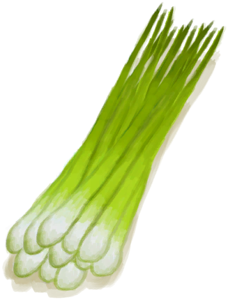

# Wetland Jungle  
> A shady and damp area of the jungle.  
  

<a href="Wetlands.md" style="color:black">Wetland Jungle</a>

<a href="DarkCave.md" style="color:black">Dark Cave</a>

<a href="DeepJungle.md" style="color:black">Deep Jungle</a>

<a href="Jungle.md" style="color:black">Jungle</a>

<a href="JungleHighlands.md" style="color:black">Jungle Highlands</a>

  
  
<table class="table table-bordered" data-toggle="table"  data-show-header="false"><thead style="display:none"><tr ><th  style="width:50%;text-align:left;vertical-align:top;"  >title</th><th  style="width:50%;text-align:left;vertical-align:top;"  ></th></tr></thead><tr ><td  style="width:50%;text-align:left;vertical-align:top;"  >** Unique On Board **  **Environment：**[Wetlands(Environment)](Env_Wetlands.md)  **Tag：**	[“Trees for Snare Traps”](tag_SnareCompatible.md)  ** EnvironmentEffect: ** [

[Rain Protection](RainProtection.md)](RainProtection.md)<b>+2</b> [

[Heat Insulation](InsulationHeat.md)](InsulationHeat.md)<b>+3</b> [

[Sun Protection](SunProtection.md)](SunProtection.md)<b>+4</b> [

[Bug Population](BugPopulation.md)](BugPopulation.md)<b>+4</b> [

[Hunter's Proximity](HuntersProximity.md)](HuntersProximity.md)<b>-0.5</b>  ** Improvements: ** [Path](Imp_Path.md) , [Irrigation System](Imp_Irrigation.md) , [Trapping Fences](Imp_TrappingFences.md)</td><td  style="width:50%;text-align:left;vertical-align:top;"  >"A damp and densely forested area deep inside the island.  In it you can find some natural water puddles that fill when it rains and many plants such as <b>Sago Palms</td></tr></tbody></table>  
  
## Exploration  
<table class="table table-bordered" data-toggle="table"  ><thead style=""><tr ><th  style="text-align:left;vertical-align:top;"  >Progress</th><th  style="text-align:left;vertical-align:top;"  >Target</th></tr></thead><tr ><td  style="text-align:left;vertical-align:top;"  >14%</td><td  style="text-align:left;vertical-align:top;"  >[Dry Puddle(Wetlands)](Puddle.md)</td></tr><tr ><td  style="text-align:left;vertical-align:top;"  >28%</td><td  style="text-align:left;vertical-align:top;"  >[Dry Puddle(Wetlands)](Puddle.md)</td></tr><tr ><td  style="text-align:left;vertical-align:top;"  >42%</td><td  style="text-align:left;vertical-align:top;"  >[Cave(Event)(Wetlands)](Event_CaveDarkFound.md)</td></tr><tr ><td  style="text-align:left;vertical-align:top;"  >56%</td><td  style="text-align:left;vertical-align:top;"  >[To Jungle Highlands(Wetlands)](Path_WetlandsToJungleHighlands.md)</td></tr><tr ><td  style="text-align:left;vertical-align:top;"  >70%</td><td  style="text-align:left;vertical-align:top;"  >[To Jungle Path(Wetlands)](Path_WetlandsToJungle.md)</td></tr><tr ><td  style="text-align:left;vertical-align:top;"  >84%</td><td  style="text-align:left;vertical-align:top;"  >[To Deep Jungle(Wetlands)](Path_WetlandsToDeepJungle.md)</td></tr><tr ><td  style="text-align:left;vertical-align:top;"  >100%</td><td  style="text-align:left;vertical-align:top;"  >[Area Explored(Event)(Wetlands)](Event_WetlandsExplored.md)</td></tr></tbody></table>  
  
## Action  

<table><tr><td rowspan="2" style="width:200px;text-align:center;font-size:1.3em;font-weight:bold">

Explore

15m

</td><td>[“LegAction(Group)”](LegAction.md)</td></tr><tr><td></td></tr><tr><td colspan="2"><b>Require：</b>[

[Light](Light.md)](Light.md): <b>10-100</b></td></tr><tr><td colspan="2"><b>StatChange：</b>[

[Foot Damage](FootDamage.md)](FootDamage.md)<b>+20</b>, [

[Stamina](Stamina.md)](Stamina.md)<b>-4</b>, [

[Stress](Stress.md)](Stress.md)<b>-10</b>, [

[Filth](Filth.md)](Filth.md)<b>+1</b>, [Exploration Wetlands](Exploration_Wetlands.md)<b>+1</b></td></tr><tr><td colspan="2">

<table style="margin-bottom:3px;"><tr><td rowspan=2 style="text-align:center" width="80px">
Base Weight

5000
</td><td style="font-size:0.6em;line-height:0.6em;font-weight:bold">Sticks First❗1 limit</td></tr><tr><td>[

[Sticks](Sticks.md)](Sticks.md)(<b>+1～+2</b>)</td></tr></table>

<table style="margin-bottom:3px;"><tr><td rowspan=2 style="text-align:center" width="80px">
Base Weight

1000
</td><td style="font-size:0.6em;line-height:0.6em;font-weight:bold">Sticks</td></tr><tr><td>[

[Sticks](Sticks.md)](Sticks.md)(<b>+1～+2</b>)</td></tr></table>

<table style="margin-bottom:3px;"><tr><td rowspan=2 style="text-align:center" width="80px">
Base Weight

600
</td><td style="font-size:0.6em;line-height:0.6em;font-weight:bold">Fronds</td></tr><tr><td>[

[Palm Fronds](PalmFronds.md)](PalmFronds.md)(<b>+3～+6</b>)</td></tr></table>

<table style="margin-bottom:3px;"><tr><td rowspan=2 style="text-align:center" width="80px">
Base Weight

250
</td><td style="font-size:0.6em;line-height:0.6em;font-weight:bold">Palm Bush</td></tr><tr><td>[

[Palm Bush](PalmBush.md)](PalmBush.md)(<b>+1</b>)</td></tr></table>

<table style="margin-bottom:3px;"><tr><td rowspan=2 style="text-align:center" width="80px">
Base Weight

800
</td><td style="font-size:0.6em;line-height:0.6em;font-weight:bold">Wood</td></tr><tr><td>[

[Wood](Wood.md)](Wood.md)(<b>+1</b>)</td></tr></table>

<table style="margin-bottom:3px;"><tr><td rowspan=2 style="text-align:center" width="80px">
Base Weight

1000
</td><td style="font-size:0.6em;line-height:0.6em;font-weight:bold">Stone❗5 limit</td></tr><tr><td>[

[Stone](Stone.md)](Stone.md)(<b>+1</b>)</td></tr></table>

<table style="margin-bottom:3px;"><tr><td rowspan=2 style="text-align:center" width="80px">
Base Weight

400
</td><td style="font-size:0.6em;line-height:0.6em;font-weight:bold">Heavy Stone❗3 limit</td></tr><tr><td>[

[Heavy Stone](StoneHeavy.md)](StoneHeavy.md)(<b>+1</b>)</td></tr></table>

<table style="margin-bottom:3px;"><tr><td rowspan=2 style="text-align:center" width="80px">
Base Weight

600
</td><td style="font-size:0.6em;line-height:0.6em;font-weight:bold">Long Sticks</td></tr><tr><td>[

[Long Stick](StickLong.md)](StickLong.md)(<b>+1</b>)</td></tr></table>

<table style="margin-bottom:3px;"><tr><td rowspan=2 style="text-align:center" width="80px">
Base Weight

200000
</td><td style="font-size:0.6em;line-height:0.6em;font-weight:bold">Small Tree</td></tr><tr><td>[

[Small Tree](SmallTree.md)](SmallTree.md)(<b>+1</b>)</td></tr></table>

<table style="margin-bottom:3px;"><tr><td rowspan=2 style="text-align:center" width="80px">
Base Weight

200000
</td><td style="font-size:0.6em;line-height:0.6em;font-weight:bold">Small Palm</td></tr><tr><td>[

[Small Palm](SmallPalm.md)](SmallPalm.md)(<b>+1</b>)</td></tr></table>

<table style="margin-bottom:3px;"><tr><td rowspan=2 style="text-align:center" width="80px">
Base Weight

600
</td><td style="font-size:0.6em;line-height:0.6em;font-weight:bold">Snake Grass</td></tr><tr><td>[

[Snakegrass Patch](SnakegrassPatch.md)](SnakegrassPatch.md)(<b>+1</b>)</td></tr><tr><td colspan=2><li>[

[Herbology(Skill)](Skill_Herbology.md)](Skill_Herbology.md) in <b>0～150</b>, weight<b>+0～+200</b></li></td></tr></table>

<table style="margin-bottom:3px;"><tr><td rowspan=2 style="text-align:center" width="80px">
Base Weight

300
</td><td style="font-size:0.6em;line-height:0.6em;font-weight:bold">Palm Bush</td></tr><tr><td>[

[Palm Bush](PalmBush.md)](PalmBush.md)(<b>+1</b>)</td></tr></table>

<table style="margin-bottom:3px;"><tr><td rowspan=2 style="text-align:center" width="80px">
Base Weight

300
</td><td style="font-size:0.6em;line-height:0.6em;font-weight:bold">Assorted Mushrooms</td></tr><tr><td>[

[Assorted Mushrooms](AssortedMushroomsPlant.md)](AssortedMushroomsPlant.md)(<b>+1～+2</b>)</td></tr></table>

<table style="margin-bottom:3px;"><tr><td rowspan=2 style="text-align:center" width="80px">
Base Weight

2000
</td><td style="font-size:0.6em;line-height:0.6em;font-weight:bold">Large Tree</td></tr><tr><td>[

[Large Tree](LargeTree.md)](LargeTree.md)(<b>+1</b>)</td></tr></table>

<table style="margin-bottom:3px;"><tr><td rowspan=2 style="text-align:center" width="80px">
Base Weight

0
</td><td style="font-size:0.6em;line-height:0.6em;font-weight:bold">Spider Lily</td></tr><tr><td>[

[Spider Lily](SpiderLily.md)](SpiderLily.md)(<b>+1</b>)[Wetlands Spider Lily](SpiderLily_WetlandsPop.md)<b>-1000</b></td></tr><tr><td colspan=2><li>[

[Herbology(Skill)](Skill_Herbology.md)](Skill_Herbology.md) in <b>0～150</b>, weight<b>-200～+0</b></li><li>[

[Eyesight](Myopia.md)](Myopia.md) in <b>1～3</b>, weight<b>-100～-300</b></li><li>[Wetlands Spider Lily](SpiderLily_WetlandsPop.md) in <b>1000～9000</b>, weight<b>+100～+500</b></li></td></tr></table>

<table style="margin-bottom:3px;"><tr><td rowspan=2 style="text-align:center" width="80px">
Base Weight

0
</td><td style="font-size:0.6em;line-height:0.6em;font-weight:bold">Banana</td></tr><tr><td>[

[Banana Tree](BananaTree.md)](BananaTree.md)(<b>+1</b>)[Outskirts Palm Trees](Bananas_WetlandsPop.md)<b>-1000</b></td></tr><tr><td colspan=2><li>[

[Herbology(Skill)](Skill_Herbology.md)](Skill_Herbology.md) in <b>0～150</b>, weight<b>-200～+0</b></li><li>[

[Eyesight](Myopia.md)](Myopia.md) in <b>1～3</b>, weight<b>-100～-300</b></li><li>[Outskirts Palm Trees](Bananas_WetlandsPop.md) in <b>1000～2000</b>, weight<b>+100～+400</b></li></td></tr></table>

<table style="margin-bottom:3px;"><tr><td rowspan=2 style="text-align:center" width="80px">
Base Weight

0
</td><td style="font-size:0.6em;line-height:0.6em;font-weight:bold">Sago Palm</td></tr><tr><td>[

[Sago Palm](SagoPalm.md)](SagoPalm.md)(<b>+1</b>)[Wetlands Sago](Sago_WetlandsPop.md)<b>-1000</b></td></tr><tr><td colspan=2><li>[

[Eyesight](Myopia.md)](Myopia.md) in <b>1～3</b>, weight<b>-100～-300</b></li><li>[

[Herbology(Skill)](Skill_Herbology.md)](Skill_Herbology.md) in <b>0～150</b>, weight<b>-100～+0</b></li><li>[Wetlands Sago](Sago_WetlandsPop.md) in <b>1000～9000</b>, weight<b>+100～+300</b></li></td></tr></table>

<table style="margin-bottom:3px;"><tr><td rowspan=2 style="text-align:center" width="80px">
Base Weight

0
</td><td style="font-size:0.6em;line-height:0.6em;font-weight:bold">Ginger</td></tr><tr><td>[

[Ginger Plant](GingerPlant.md)](GingerPlant.md)(<b>+1</b>)[Wetlands Ginger](Ginger_WetlandsPop.md)<b>-1000</b></td></tr><tr><td colspan=2><li>[

[Eyesight](Myopia.md)](Myopia.md) in <b>1～3</b>, weight<b>-100～-300</b></li><li>[

[Herbology(Skill)](Skill_Herbology.md)](Skill_Herbology.md) in <b>0～150</b>, weight<b>-100～+0</b></li><li>[Wetlands Ginger](Ginger_WetlandsPop.md) in <b>1000～15000</b>, weight<b>+100～+300</b></li></td></tr></table>

<table style="margin-bottom:3px;"><tr><td rowspan=2 style="text-align:center" width="80px">
Base Weight

0
</td><td style="font-size:0.6em;line-height:0.6em;font-weight:bold">Partridge Spotted</td></tr><tr><td>[

[A partridge!(Event)](Event_PartridgeFight.md)](Event_PartridgeFight.md)(<b>+1</b>)</td></tr><tr><td colspan=2><li>[Population Partridges](Pop_Partridge.md) in <b>1000～30000</b>, weight <b>+100～+200</b></li><li>[

[Eyesight](Myopia.md)](Myopia.md) in <b>1～3</b>, weight <b>-100～-200</b></li></td></tr></table>

<table style="margin-bottom:3px;"><tr><td rowspan=2 style="text-align:center" width="80px">
Base Weight

0
</td><td style="font-size:0.6em;line-height:0.6em;font-weight:bold">Macaque Spotted</td></tr><tr><td>[

[A Macaque!(Event)](Event_MacaqueFight.md)](Event_MacaqueFight.md)(<b>+1</b>)</td></tr><tr><td colspan=2><li>[Population Macaques](Pop_Macaque.md) in <b>1000～25000</b>, weight <b>+25～+175</b></li><li>[

[Eyesight](Myopia.md)](Myopia.md) in <b>1～3</b>, weight <b>-100～-125</b></li></td></tr></table>

<table style="margin-bottom:3px;"><tr><td rowspan=2 style="text-align:center" width="80px">
Base Weight

0
</td><td style="font-size:0.6em;line-height:0.6em;font-weight:bold">Partridge Nest</td></tr><tr><td>[

[A partridge nest!(Event)](Event_PartridgeNest.md)](Event_PartridgeNest.md)(<b>+1</b>)</td></tr><tr><td colspan=2><li>[Population Partridges](Pop_Partridge.md) in <b>2000～30000</b>, weight <b>+10～+100</b></li><li>[

[Eyesight](Myopia.md)](Myopia.md) in <b>1～3</b>, weight <b>-100～-200</b></li></td></tr></table>

<table style="margin-bottom:3px;"><tr><td rowspan=2 style="text-align:center" width="80px">
Base Weight

0
</td><td style="font-size:0.6em;line-height:0.6em;font-weight:bold">Boar Encounter</td></tr><tr><td>[

[I see a Boar!(Event)](Event_BoarFight.md)](Event_BoarFight.md)(<b>+1</b>)</td></tr><tr><td colspan=2><li>[Population Boars](Pop_Boar.md) in <b>1000～12000</b>, weight<b>+50～+200</b></li><li>[

[Eyesight](Myopia.md)](Myopia.md) in <b>1～3</b>, weight<b>-10～-200</b></li><li>[“Fight Event”](tag_FightEvent.md) On *Hand/Board*，Weight<b>-999999</b>(Stackable),</li></td></tr></table>

<table style="margin-bottom:3px;"><tr><td rowspan=2 style="text-align:center" width="80px">
Base Weight

0
</td><td style="font-size:0.6em;line-height:0.6em;font-weight:bold">Drone Encounter</td></tr><tr><td>[

[Attack Drone!(Event)](Event_DroneFight.md)](Event_DroneFight.md)(<b>+1</b>)</td></tr><tr><td colspan=2><li>[Island Drones](Pop_Drone.md) in <b>1000～4000</b>, weight<b>+5～+50</b></li><li>[

[Eyesight](Myopia.md)](Myopia.md) in <b>1～3</b>, weight<b>+0</b></li><li>[“Fight Event”](tag_FightEvent.md) On *Hand/Board*，Weight<b>-999999</b>(Stackable),</li></td></tr></table>

<table style="margin-bottom:3px;"><tr><td rowspan=2 style="text-align:center" width="80px">
Base Weight

100
</td><td style="font-size:0.6em;line-height:0.6em;font-weight:bold">Spider</td></tr><tr><td>[

[A spider!!(Event)](Event_Spider.md)](Event_Spider.md)(<b>+1</b>)</td></tr><tr><td colspan=2><li>[

[Eyesight](Myopia.md)](Myopia.md) in <b>1～3</b>, weight<b>+25～+100</b></li></td></tr></table>

<table style="margin-bottom:3px;"><tr><td rowspan=2 style="text-align:center" width="80px">
Base Weight

50
</td><td style="font-size:0.6em;line-height:0.6em;font-weight:bold">Fallen Tree</td></tr><tr><td>[

[Felled Large Tree](LargeTreeFelled.md)](LargeTreeFelled.md)(<b>+1</b>)</td></tr></table>

</td></tr></table>
  
  
  
## Drag With  

<table style="margin-bottom:0px;"><tr><td style="width:40%;text-align:left; background-color:#FEFEFE"><b>With：</b>[“Hammer”](tag_AxeAdv.md)</td><td style="width:40%;font-size:1em;font-weight:bold;background-color:#FEFEFE">Cut Wood (30m) [“HandAction(Group)”](HandAction.md)</td></tr><tr style="background-color:#FFFFFF"><td style=""><b>Receiving：</b>Usage  <b>-1</b></td><td style=""><b>Self：</b></td></tr><tr><td colspan="2"><b>StatChange：</b>[

[Stamina](Stamina.md)](Stamina.md)<b>-4</b>, [

[Hand Damage](HandDamage.md)](HandDamage.md)<b>+25</b>, [

[Woodworking(Skill)](Skill_Woodworking.md)](Skill_Woodworking.md)<b>+0.5</b></td></tr><tr><td colspan="2"><b>Require：</b>[

[Light](Light.md)](Light.md): <b>10-100</b>, [

[Stamina](Stamina.md)](Stamina.md): <b>11-32</b></td></tr><tr><td colspan="2">[

[Wood](Wood.md)](Wood.md)(<b>+2</b>), [

[Sticks](Sticks.md)](Sticks.md)(<b>+4</b>)</td></tr></table>
  

<table style="margin-bottom:0px;"><tr><td style="width:40%;text-align:left; background-color:#FEFEFE"><b>With：</b>[“Axe”](tag_Axe.md)</td><td style="width:40%;font-size:1em;font-weight:bold;background-color:#FEFEFE">Cut Wood (30m) [“HandAction(Group)”](HandAction.md)</td></tr><tr style="background-color:#FFFFFF"><td style=""><b>Receiving：</b>Usage  <b>-1</b></td><td style=""><b>Self：</b></td></tr><tr><td colspan="2"><b>StatChange：</b>[

[Stamina](Stamina.md)](Stamina.md)<b>-4</b>, [

[Hand Damage](HandDamage.md)](HandDamage.md)<b>+25</b>, [

[Woodworking(Skill)](Skill_Woodworking.md)](Skill_Woodworking.md)<b>+0.5</b></td></tr><tr><td colspan="2"><b>Require：</b>[

[Light](Light.md)](Light.md): <b>10-100</b>, [

[Stamina](Stamina.md)](Stamina.md): <b>11-32</b></td></tr><tr><td colspan="2">[

[Wood](Wood.md)](Wood.md)(<b>+1</b>), [

[Sticks](Sticks.md)](Sticks.md)(<b>+1</b>)</td></tr></table>
  
  

