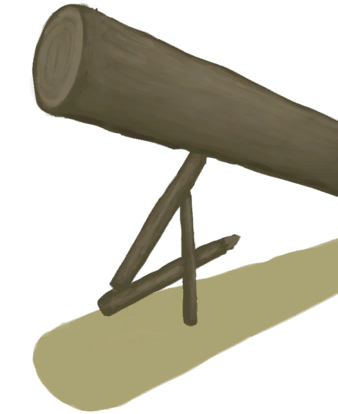
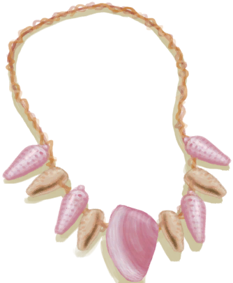
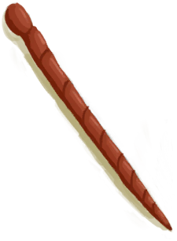

# BluePrint  
## “Base”  
### “Camp”  

<a href="Bp_Fire.md" style="color:black">Fire</a>

<a href="Bp_WoodShavings.md" style="color:black">Wood Shavings</a>

<a href="Bp_Campfire.md" style="color:black">Campfire</a>

<a href="Bp_Shelter.md" style="color:black">Shelter</a>

<a href="Bp_MermaidNest.md" style="color:black">Mermaid Nest</a>

<a href="Bp_Leafbed.md" style="color:black">Leaf Bed</a>

<a href="Bp_DryingRack.md" style="color:black">Drying Rack</a>

<a href="Bp_WoodCarvings.md" style="color:black">Wood Carvings</a>

<a href="Bp_Raincatcher.md" style="color:black">Raincatcher</a>

<a href="Bp_SolarStill.md" style="color:black">Solar Still</a>

  
  
  
### “Structures”  

<a href="Bp_WaterReservoir.md" style="color:black">Water Reservoir</a>

<a href="Bp_WaterFilter.md" style="color:black">Water Filter</a>

<a href="Bp_Cistern.md" style="color:black">Cistern</a>

<a href="Bp_Shed.md" style="color:black">Shed</a>

<a href="Bp_MudHut.md" style="color:black">Mud Hut</a>

<a href="Bp_StoneHut.md" style="color:black">Stone Hut</a>

<a href="Bp_Cellar.md" style="color:black">Cellar</a>

<a href="Bp_Raft.md" style="color:black">Raft</a>

<a href="Bp_RaftShelter.md" style="color:black">Raft Shelter</a>

  
  
  
### “Storage”  

<a href="Bp_WovenBasket.md" style="color:black">Woven Basket</a>

<a href="Bp_WovenBackpack.md" style="color:black">Woven Backpack</a>

<a href="Bp_Chest.md" style="color:black">Chest</a>

<a href="Bp_Shelf.md" style="color:black">Shelf</a>

<a href="Bp_Bookshelf.md" style="color:black">Bookshelf</a>

<a href="Bp_SupplyChest.md" style="color:black">Supply Chest</a>

  
  
  
### “House”  

<a href="Bp_Stove.md" style="color:black">Stove</a>

<a href="Bp_Chair.md" style="color:black">Chair</a>

<a href="Bp_Table.md" style="color:black">Table</a>

<a href="Bp_BedWooden.md" style="color:black">Wooden Bed</a>

<a href="Bp_BedRustic.md" style="color:black">Rustic Bed</a>

  
  
  
### “Materials”  

<a href="Bp_Planks.md" style="color:black">Wooden Planks</a>

<a href="Bp_Treenails.md" style="color:black">Treenails</a>

<a href="Bp_Mortar.md" style="color:black">Mortar</a>

<a href="Bp_Glue.md" style="color:black">Glue</a>

<a href="Bp_Vitriol.md" style="color:black">Vitriol</a>

  
  
  
  
## “Tools”  
### “Basic”  

<a href="Bp_SharpenedStone.md" style="color:black">Sharpened Stone</a>

<a href="Bp_FlintKnife.md" style="color:black">Flint Knife</a>

<a href="Bp_StoneAxe.md" style="color:black">Stone Axe</a>

<a href="Bp_BoneKnife.md" style="color:black">Bone Knife</a>

<a href="Bp_ObsidianKnife.md" style="color:black">Obsidian Knife</a>

<a href="Bp_FlintAxe.md" style="color:black">Flint Axe</a>

<a href="Bp_WoodenShovel.md" style="color:black">Wooden Shovel</a>

  
  
  
### “Fire”  

<a href="Bp_HandDrill.md" style="color:black">Hand Drill</a>

<a href="Bp_BowDrill.md" style="color:black">Bow Drill</a>

<a href="Bp_Torch.md" style="color:black">Torch</a>

<a href="Bp_Candles.md" style="color:black">Candles</a>

<a href="Bp_CandlesCitronella.md" style="color:black">Citronella Candles</a>

<a href="Bp_CandlesJasmine.md" style="color:black">Jasmine Candles</a>

<a href="Bp_Bellows.md" style="color:black">Bellows</a>

<a href="Bp_Dynamite.md" style="color:black">Dynamite</a>

  
  
  
### “Metal”  

<a href="Bp_CopperAxe.md" style="color:black">Copper Axe</a>

<a href="Bp_CopperShovel.md" style="color:black">Copper Shovel</a>

<a href="Bp_ScrapKnife.md" style="color:black">Scrap Knife</a>

<a href="Bp_ScrapAxe.md" style="color:black">Scrap Axe</a>

<a href="Bp_ScrapShovel.md" style="color:black">Scrap Shovel</a>

  
  
  
### “Miscellaneous”  

<a href="Bp_Broom.md" style="color:black">Broom</a>

<a href="Bp_Travois.md" style="color:black">Travois</a>

<a href="Bp_EatingUtensilsWooden.md" style="color:black">Wooden Eating Utensils</a>

<a href="Bp_Drum.md" style="color:black">Drum</a>

  
  
  
  
## “Hunting”  
### “Fishing”  

<a href="Bp_FishingLine.md" style="color:black">Fishing Line</a>

<a href="Bp_FishingSpear.md" style="color:black">Fishing Spear</a>

<a href="Bp_FishBait.md" style="color:black">Fish Bait</a>

<a href="Bp_FishingRod.md" style="color:black">Fishing Rod</a>

<a href="Bp_FishTrap.md" style="color:black">Fish Trap</a>

<a href="Bp_Harpoon.md" style="color:black">Harpoon</a>

  
  
  
### “Trapping”  

<a href="Bp_DeadfallTrap.md" style="color:black">Deadfall Trap</a>

<a href="Bp_SnareTrap.md" style="color:black">Snare Trap</a>

<a href="Bp_FishTrap.md" style="color:black">Fish Trap</a>

<a href="Bp_LogTrap.md" style="color:black">Log Trap</a>

<a href="Bp_CageTrap.md" style="color:black">Cage Trap</a>

<a href="Bp_TrappingPit.md" style="color:black">Trapping Pit</a>

<a href="Bp_RaftFishTrap.md" style="color:black">Fish Trap</a>

  
  
  
### “Melee”  

<a href="Bp_RusticSpear.md" style="color:black">Rustic Spear</a>

<a href="Bp_FlintSpear.md" style="color:black">Flint Spear</a>

<a href="Bp_ScrapSpear.md" style="color:black">Scrap Spear</a>

<a href="Bp_CopperSpear.md" style="color:black">Copper Spear</a>

<a href="Bp_ObsidianSpear.md" style="color:black">Obsidian Spear</a>

<a href="Bp_Shield.md" style="color:black">Shield</a>

  
  
  
### “Ranged”  

<a href="Bp_Arrow.md" style="color:black">Arrows</a>

<a href="Bp_Bow.md" style="color:black">Bow</a>

<a href="Bp_Quiver.md" style="color:black">Quiver</a>

<a href="Bp_Sling.md" style="color:black">Sling</a>

  
  
  
  
## “Tailoring”  
### “Basics”  

<a href="Bp_CoconutSandals.md" style="color:black">Coconut Sandals</a>

<a href="Bp_LeafSkirt.md" style="color:black">Leaf Skirt</a>

<a href="Bp_SeashellNecklace.md" style="color:black">Seashell Necklace</a>

<a href="Bp_FlowerNecklace.md" style="color:black">Flower Necklace</a>

<a href="Bp_WovenHat.md" style="color:black">Woven Hat</a>

<a href="Bp_PearlNecklace.md" style="color:black">Pearl Necklace</a>

  
  
  
### “Advanced”  

<a href="Bp_Shirt.md" style="color:black">Shirt</a>

<a href="Bp_LeatherShoes.md" style="color:black">Leather Shoes</a>

<a href="Bp_LeatherGloves.md" style="color:black">Leather Gloves</a>

<a href="Bp_LeatherPants.md" style="color:black">Leather Pants</a>

<a href="Bp_StrawCape.md" style="color:black">Straw Cape</a>

<a href="Bp_Raincoat.md" style="color:black">Raincoat</a>

  
  
  
### “Utilities”  

<a href="Bp_Sack.md" style="color:black">Sack</a>

<a href="Bp_Waterskin.md" style="color:black">Waterskin</a>

<a href="Bp_Satchel.md" style="color:black">Satchel</a>

<a href="Bp_LeatherBackpack.md" style="color:black">Leather Backpack</a>

<a href="Bp_Hammock.md" style="color:black">Hammock</a>

<a href="Bp_Bedroll.md" style="color:black">Bedroll</a>

  
  
  
### “Special”  

<a href="Bp_WoodenNeedles.md" style="color:black">Wooden Needles</a>

<a href="Bp_Spindle.md" style="color:black">Spindle</a>

<a href="Bp_Loom.md" style="color:black">Loom</a>

  
  
  
  
## “Metal & Clay”  
### “Containers”  

<a href="Bp_ClayBowl.md" style="color:black">Clay Bowl</a>

<a href="Bp_ClayJar.md" style="color:black">Clay Jar</a>

<a href="Bp_ClayVase.md" style="color:black">Clay Vase</a>

<a href="Bp_CookingPot.md" style="color:black">Cooking Pot</a>

<a href="Bp_GlazedVase.md" style="color:black">Glazed Vase</a>

<a href="Bp_CopperJar.md" style="color:black">Copper Jar</a>

<a href="Bp_CopperBottle.md" style="color:black">Copper Bottle</a>

  
  
  
### “Utilities”  

<a href="Bp_CopperSheet.md" style="color:black">Copper Sheet</a>

<a href="Bp_CopperNeedles.md" style="color:black">Copper Needles</a>

<a href="Bp_EatingUtensilsCopper.md" style="color:black">Copper Eating Utensils</a>

<a href="Bp_ClayPotCooler.md" style="color:black">Clay Pot Cooler</a>

<a href="Bp_Alembic.md" style="color:black">Alembic</a>

<a href="Bp_ClayFirePit.md" style="color:black">Clay Fire Pit</a>

<a href="Bp_Kiln.md" style="color:black">Kiln</a>

<a href="Bp_Forge.md" style="color:black">Forge</a>

<a href="Bp_PotteryWheel.md" style="color:black">Pottery Wheel</a>

<a href="Bp_KilnAdvanced.md" style="color:black">Advanced Kiln</a>

<a href="Bp_CopperNecklace.md" style="color:black">Copper Necklace</a>

  
  
  
### “Molds”  

<a href="Bp_MoldKnife.md" style="color:black">Knife Mold</a>

<a href="Bp_MoldAxe.md" style="color:black">Axe Mold</a>

<a href="Bp_MoldShovel.md" style="color:black">Shovel Mold</a>

<a href="Bp_MoldSpear.md" style="color:black">Spear Mold</a>

<a href="Bp_MoldDecoration.md" style="color:black">Decoration Mold</a>

  
  
  
  
## “Cooking”  
### “Basics”  

<a href="Bp_ChickenSandwich.md" style="color:black">Chicken Sandwich</a>

<a href="Bp_CoconutFish.md" style="color:black">Coconut Fish</a>

<a href="Bp_IslandChicken.md" style="color:black">Island Chicken</a>

<a href="Bp_FriedPuffballs.md" style="color:black">Fried Puffballs</a>

<a href="Bp_FishNChips.md" style="color:black">Fish N' Chips</a>

<a href="Bp_MacaqueSkewers.md" style="color:black">Macaque Skewers</a>

<a href="Bp_LizardFry.md" style="color:black">Lizard Fry</a>

<a href="Bp_SagoSlime.md" style="color:black">Sago Slime</a>

<a href="Bp_FishTaco.md" style="color:black">Fish Taco</a>

  
  
  
### “Advanced”  

<a href="Bp_SeafoodCup.md" style="color:black">Seafood Cup</a>

<a href="Bp_DrunkenCrab.md" style="color:black">Drunken Crab</a>

<a href="Bp_EggFriedRice.md" style="color:black">Egg Fried Rice</a>

<a href="Bp_Sushi.md" style="color:black">Sushi</a>

<a href="Bp_ButterBakedOysters.md" style="color:black">Butter Baked Oysters</a>

<a href="Bp_JungleSalad.md" style="color:black">Jungle Salad</a>

<a href="Bp_FishOmelette.md" style="color:black">Fish Omelette</a>

<a href="Bp_HoneyGlazedPork.md" style="color:black">Honey Glazed Pork</a>

<a href="Bp_GoatStew.md" style="color:black">Goat Stew</a>

<a href="Bp_YamCurry.md" style="color:black">Yam Curry</a>

<a href="Bp_HeartyFeast.md" style="color:black">Hearty Feast</a>

  
  
  
### “Sweet”  

<a href="Bp_CandiedGinger.md" style="color:black">Candied Ginger</a>

<a href="Bp_HoneyCandy.md" style="color:black">Honey Candy</a>

<a href="Bp_YamJam.md" style="color:black">Yam Jam</a>

<a href="Bp_FriedBananas.md" style="color:black">Fried Bananas</a>

<a href="Bp_SagoCake.md" style="color:black">Sago Cake</a>

  
  
  
### “Special”  

<a href="Bp_CoconutMilk.md" style="color:black">Coconut Milk</a>

<a href="Bp_Honey.md" style="color:black">Honey</a>

<a href="Bp_TonicWater.md" style="color:black">Tonic Water</a>

<a href="Bp_Cheese.md" style="color:black">Cheese</a>

<a href="Bp_Butter.md" style="color:black">Butter</a>

<a href="Bp_BoneBroth.md" style="color:black">Bone Broth</a>

<a href="Bp_ProteinBar.md" style="color:black">Protein Bar</a>

  
  
  
  
## “Medical”  
### “Medicine”  

<a href="Bp_AloeGel.md" style="color:black">Aloe Gel</a>

<a href="Bp_BrimstoneGel.md" style="color:black">Brimstone Gel</a>

<a href="Bp_BugRepellent.md" style="color:black">Bug Repellant</a>

<a href="Bp_Soap.md" style="color:black">Soap</a>

<a href="Bp_Quinine.md" style="color:black">Cinchona Powder</a>

<a href="Bp_QuinineSulfate.md" style="color:black">Quinine Sulfate</a>

  
  
  
### “Equipment”  

<a href="Bp_AshDressing.md" style="color:black">Ash Dressing</a>

<a href="Bp_TourniquetRustic.md" style="color:black">Improvised Tourniquet</a>

<a href="Bp_Tourniquet.md" style="color:black">Tourniquet</a>

<a href="Bp_Splint.md" style="color:black">Splint</a>

<a href="Bp_GasMask.md" style="color:black">Gas Mask</a>

  
  
  
### “Spiritual”  

<a href="Bp_Weston.md" style="color:black">Weston</a>

<a href="Bp_LizardDrum.md" style="color:black">Lizard Drum</a>

<a href="Bp_SeagullCharm.md" style="color:black">Seagull Charm</a>

<a href="Bp_CeremonialDagger.md" style="color:black">Ceremonial Dagger</a>

<a href="Bp_SharkHeadpiece.md" style="color:black">Shark Headpiece</a>

  
  
  
  
## “Farming”  
### “Plants”  

<a href="Bp_CropPlot.md" style="color:black">Crop Plot</a>

<a href="Bp_MushroomBed.md" style="color:black">Mushroom Bed</a>

<a href="Bp_RicePaddy.md" style="color:black">Rice Paddy</a>

<a href="Bp_PesticideChilli.md" style="color:black">Chilli Pesticide</a>

<a href="Bp_PesticideBrimstone.md" style="color:black">Brimstone Pesticide</a>

<a href="Bp_CompostBin.md" style="color:black">Compost Bin</a>

<a href="Bp_NiterBed.md" style="color:black">Niter Bed</a>

<a href="Bp_Scarecrow.md" style="color:black">Scarecrow</a>

<a href="Bp_Well.md" style="color:black">Well</a>

  
  
  
### “Animals”  

<a href="Bp_FeedBird.md" style="color:black">Bird Feed</a>

<a href="Bp_FeedGoat.md" style="color:black">Goat Feed</a>

<a href="Bp_FeedBoar.md" style="color:black">Bp_FeedBoar_CardName</a>

<a href="Bp_Enclosure.md" style="color:black">Enclosure</a>

<a href="Bp_PartridgeFeeder.md" style="color:black">Partridge Feeder</a>

<a href="Bp_GoatFeeder.md" style="color:black">Goat Feeder</a>

<a href="Bp_WateringTrough.md" style="color:black">Watering Trough</a>

<a href="Bp_BoarFeeder.md" style="color:black">Boar Feeder</a>

<a href="Bp_BeeSkepEmpty.md" style="color:black">Empty Skep</a>

<a href="Bp_BeeSkep.md" style="color:black">Bee Skep</a>

<a href="Bp_BeeSuit.md" style="color:black">Bee Suit</a>

<a href="Bp_BeeSmoker.md" style="color:black">Bee Smoker</a>

  
  
  
  

