#  Crop  
### 1. Basic Info  
<table class="table table-bordered" data-toggle="table"  ><thead style=""><tr ><th  style="text-align:left;vertical-align:top;"  >Name</th><th  style="text-align:left;vertical-align:top;"  >Seed</th><th  style="text-align:left;vertical-align:top;"  >Product</th><th  style="text-align:left;vertical-align:top;"  >Base Speed</th><th  style="text-align:left;vertical-align:top;"  >[“Humid Environment”](tag_EnvHumid.md)</th><th  style="text-align:left;vertical-align:top;"  >[“Dry Environment”](tag_EnvDry.md)</th><th  style="text-align:left;vertical-align:top;"  >[“Fertile Environment”](tag_EnvFertile.md)</th><th  style="text-align:left;vertical-align:top;"  >Dark</th></tr></thead><tr ><td  style="text-align:left;vertical-align:top;"  >[

[Rice Paddy](RicePaddy.md)](RicePaddy.md)</td><td  style="text-align:left;vertical-align:top;"  >[

[Rice Grain](RiceGrains.md)](RiceGrains.md)</td><td  style="text-align:left;vertical-align:top;"  >[

[Rice](RicePlant.md)](RicePlant.md)(<b>+20</b>)</td><td  style="text-align:left;vertical-align:top;"  >-1 (7d)</td><td  style="text-align:left;vertical-align:top;"  ></td><td  style="text-align:left;vertical-align:top;"  ></td><td  style="text-align:left;vertical-align:top;"  >🟢+0.25</td><td  style="text-align:left;vertical-align:top;"  ></td></tr><tr ><td  style="text-align:left;vertical-align:top;"  >[

[Almond Tree Crop Plot](CropPlotAlmondTree.md)](CropPlotAlmondTree.md)</td><td  style="text-align:left;vertical-align:top;"  >[

[Tropical Almonds](TropicalAlmonds.md)](TropicalAlmonds.md)</td><td  style="text-align:left;vertical-align:top;"  >[

[Young Almond Tree](TropicalAlmondTreeYoung.md)](TropicalAlmondTreeYoung.md)(<b>+1</b>)</td><td  style="text-align:left;vertical-align:top;"  >+0.5 (14d)</td><td  style="text-align:left;vertical-align:top;"  >🔴-0.25</td><td  style="text-align:left;vertical-align:top;"  >🟢+0.25</td><td  style="text-align:left;vertical-align:top;"  >🟢+0.25</td><td  style="text-align:left;vertical-align:top;"  ></td></tr><tr ><td  style="text-align:left;vertical-align:top;"  >[

[Aloe Vera Crop Plot](CropPlotAloeVera.md)](CropPlotAloeVera.md)</td><td  style="text-align:left;vertical-align:top;"  >[
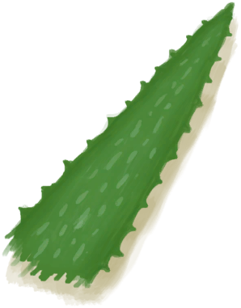
[Aloe Vera Leaf](AloeVeraLeaf.md)](AloeVeraLeaf.md)</td><td  style="text-align:left;vertical-align:top;"  >[

[Aloe Vera](AloeVera.md)](AloeVera.md)(<b>+4</b>)</td><td  style="text-align:left;vertical-align:top;"  >+1 (7d)</td><td  style="text-align:left;vertical-align:top;"  >🔴-0.25</td><td  style="text-align:left;vertical-align:top;"  >🟢+0.25</td><td  style="text-align:left;vertical-align:top;"  >🟢+0.25</td><td  style="text-align:left;vertical-align:top;"  ></td></tr><tr ><td  style="text-align:left;vertical-align:top;"  >[

[Banana Crop Plot](CropPlotBananaTree.md)](CropPlotBananaTree.md)</td><td  style="text-align:left;vertical-align:top;"  >[

[Banana](Banana.md)](Banana.md)</td><td  style="text-align:left;vertical-align:top;"  >[

[Banana Tree](BananaTree.md)](BananaTree.md)(<b>+2</b>)</td><td  style="text-align:left;vertical-align:top;"  >+0.5 (14d)</td><td  style="text-align:left;vertical-align:top;"  >🟢+0.25</td><td  style="text-align:left;vertical-align:top;"  >🔴-0.25</td><td  style="text-align:left;vertical-align:top;"  >🟢+0.25</td><td  style="text-align:left;vertical-align:top;"  ></td></tr><tr ><td  style="text-align:left;vertical-align:top;"  >[

[Chili Crop Plot](CropPlotChilies.md)](CropPlotChilies.md)</td><td  style="text-align:left;vertical-align:top;"  >[

[Chillies](Chilies.md)](Chilies.md)</td><td  style="text-align:left;vertical-align:top;"  >[
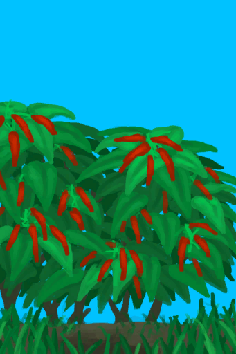
[Chilli Plant](ChiliPlant.md)](ChiliPlant.md)(<b>+6</b>)</td><td  style="text-align:left;vertical-align:top;"  >+1 (7d)</td><td  style="text-align:left;vertical-align:top;"  >🔴-0.25</td><td  style="text-align:left;vertical-align:top;"  >🟢+0.25</td><td  style="text-align:left;vertical-align:top;"  >🟢+0.25</td><td  style="text-align:left;vertical-align:top;"  ></td></tr><tr ><td  style="text-align:left;vertical-align:top;"  >[

[China Rose Crop Plot](CropPlotChinaRose.md)](CropPlotChinaRose.md)</td><td  style="text-align:left;vertical-align:top;"  >[

[China Rose](ChinaRoseFlowers.md)](ChinaRoseFlowers.md)</td><td  style="text-align:left;vertical-align:top;"  >[

[China Rose](ChinaRosePlant.md)](ChinaRosePlant.md)(<b>+6</b>)</td><td  style="text-align:left;vertical-align:top;"  >+1 (7d)</td><td  style="text-align:left;vertical-align:top;"  >🟢+0.25</td><td  style="text-align:left;vertical-align:top;"  >🔴-0.25</td><td  style="text-align:left;vertical-align:top;"  >🟢+0.25</td><td  style="text-align:left;vertical-align:top;"  ></td></tr><tr ><td  style="text-align:left;vertical-align:top;"  >[

[Cinchona Crop Plot](CropPlotCinchonaTree.md)](CropPlotCinchonaTree.md)</td><td  style="text-align:left;vertical-align:top;"  >[
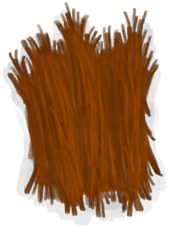
[Cinchona Bark](BarkCinchona.md)](BarkCinchona.md)</td><td  style="text-align:left;vertical-align:top;"  >[
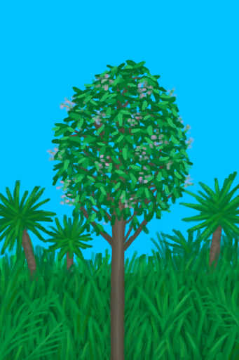
[Cinchona Tree](CinchonaTree.md)](CinchonaTree.md)(<b>+2</b>)</td><td  style="text-align:left;vertical-align:top;"  >+0.5 (14d)</td><td  style="text-align:left;vertical-align:top;"  >🔴-0.25</td><td  style="text-align:left;vertical-align:top;"  >🟢+0.25</td><td  style="text-align:left;vertical-align:top;"  >🟢+0.25</td><td  style="text-align:left;vertical-align:top;"  ></td></tr><tr ><td  style="text-align:left;vertical-align:top;"  >[

[Coffee Crop Plot](CropPlotCoffee.md)](CropPlotCoffee.md)</td><td  style="text-align:left;vertical-align:top;"  >[

[Coffee Beans](CoffeeBeans.md)](CoffeeBeans.md)</td><td  style="text-align:left;vertical-align:top;"  >[
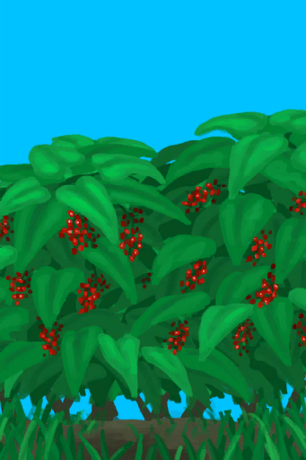
[Coffee Bush](CoffeePlant.md)](CoffeePlant.md)(<b>+5</b>)</td><td  style="text-align:left;vertical-align:top;"  >+1 (7d)</td><td  style="text-align:left;vertical-align:top;"  >🔴-0.25</td><td  style="text-align:left;vertical-align:top;"  >🟢+0.25</td><td  style="text-align:left;vertical-align:top;"  >🟢+0.25</td><td  style="text-align:left;vertical-align:top;"  ></td></tr><tr ><td  style="text-align:left;vertical-align:top;"  >[

[Ginger Crop Plot](CropPlotGinger.md)](CropPlotGinger.md)</td><td  style="text-align:left;vertical-align:top;"  >[
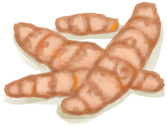
[Ginger](Ginger.md)](Ginger.md)</td><td  style="text-align:left;vertical-align:top;"  >[

[Ginger Plant](GingerPlant.md)](GingerPlant.md)(<b>+8</b>)</td><td  style="text-align:left;vertical-align:top;"  >+1 (7d)</td><td  style="text-align:left;vertical-align:top;"  >🟢+0.5</td><td  style="text-align:left;vertical-align:top;"  >🔴-0.25</td><td  style="text-align:left;vertical-align:top;"  >🟢+0.25</td><td  style="text-align:left;vertical-align:top;"  ></td></tr><tr ><td  style="text-align:left;vertical-align:top;"  >[

[Jasmine Crop Plot](CropPlotJasmine.md)](CropPlotJasmine.md)</td><td  style="text-align:left;vertical-align:top;"  >[

[Jasmine Flowers](JasmineFlowers.md)](JasmineFlowers.md)</td><td  style="text-align:left;vertical-align:top;"  >[

[Jasmine Flowers](JasminePlant.md)](JasminePlant.md)(<b>+8</b>)</td><td  style="text-align:left;vertical-align:top;"  >+1 (7d)</td><td  style="text-align:left;vertical-align:top;"  >🟢+0.25</td><td  style="text-align:left;vertical-align:top;"  >🔴-0.25</td><td  style="text-align:left;vertical-align:top;"  >🟢+0.25</td><td  style="text-align:left;vertical-align:top;"  ></td></tr><tr ><td  style="text-align:left;vertical-align:top;"  >[

[Kava Crop Plot](CropPlotKava.md)](CropPlotKava.md)</td><td  style="text-align:left;vertical-align:top;"  >[
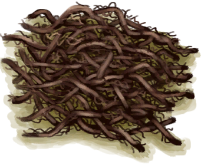
[Kava Root](KavaRoot.md)](KavaRoot.md)</td><td  style="text-align:left;vertical-align:top;"  >[

[Kava Plant](KavaPlant.md)](KavaPlant.md)(<b>+8</b>)</td><td  style="text-align:left;vertical-align:top;"  >+1 (7d)</td><td  style="text-align:left;vertical-align:top;"  >🟢+0.25</td><td  style="text-align:left;vertical-align:top;"  >🔴-0.25</td><td  style="text-align:left;vertical-align:top;"  >🟢+0.25</td><td  style="text-align:left;vertical-align:top;"  ></td></tr><tr ><td  style="text-align:left;vertical-align:top;"  >[

[Lemon Grass Crop Plot](CropPlotLemonGrass.md)](CropPlotLemonGrass.md)</td><td  style="text-align:left;vertical-align:top;"  >[

[Lemongrass](LemongrassStalks.md)](LemongrassStalks.md)</td><td  style="text-align:left;vertical-align:top;"  >[
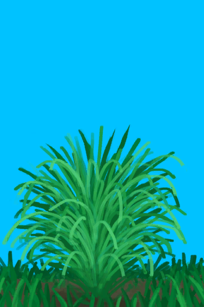
[Lemongrass](Lemongrass.md)](Lemongrass.md)(<b>+12</b>)</td><td  style="text-align:left;vertical-align:top;"  >+1 (7d)</td><td  style="text-align:left;vertical-align:top;"  >🔴-0.25</td><td  style="text-align:left;vertical-align:top;"  >🟢+0.25</td><td  style="text-align:left;vertical-align:top;"  >🟢+0.25</td><td  style="text-align:left;vertical-align:top;"  ></td></tr><tr ><td  style="text-align:left;vertical-align:top;"  >[

[Mango Crop Plot](CropPlotMangoTree.md)](CropPlotMangoTree.md)</td><td  style="text-align:left;vertical-align:top;"  >[

[Mango](Mango.md)](Mango.md)</td><td  style="text-align:left;vertical-align:top;"  >[

[Young Mango Tree](MangoTreeYoung.md)](MangoTreeYoung.md)(<b>+1</b>)</td><td  style="text-align:left;vertical-align:top;"  >+0.5 (14d)</td><td  style="text-align:left;vertical-align:top;"  >🔴-0.25</td><td  style="text-align:left;vertical-align:top;"  >🟢+0.25</td><td  style="text-align:left;vertical-align:top;"  >🟢+0.25</td><td  style="text-align:left;vertical-align:top;"  ></td></tr><tr ><td  style="text-align:left;vertical-align:top;"  >[

[Nipa Palm Crop Plot](CropPlotNipaPalm.md)](CropPlotNipaPalm.md)</td><td  style="text-align:left;vertical-align:top;"  >[

[Nipa Seeds](NipaSeeds.md)](NipaSeeds.md)</td><td  style="text-align:left;vertical-align:top;"  >[

[Nipa Palm](NipaPalm.md)](NipaPalm.md)(<b>+3</b>)</td><td  style="text-align:left;vertical-align:top;"  >+0.5 (14d)</td><td  style="text-align:left;vertical-align:top;"  >🟢+0.25</td><td  style="text-align:left;vertical-align:top;"  >🔴-0.25</td><td  style="text-align:left;vertical-align:top;"  >🟢+0.25</td><td  style="text-align:left;vertical-align:top;"  ></td></tr><tr ><td  style="text-align:left;vertical-align:top;"  >[

[Palm Bush Crop Plot](CropPlotPalmBush.md)](CropPlotPalmBush.md)</td><td  style="text-align:left;vertical-align:top;"  >[

[Palm Bush Seeds](PalmBushSeeds.md)](PalmBushSeeds.md)</td><td  style="text-align:left;vertical-align:top;"  >[
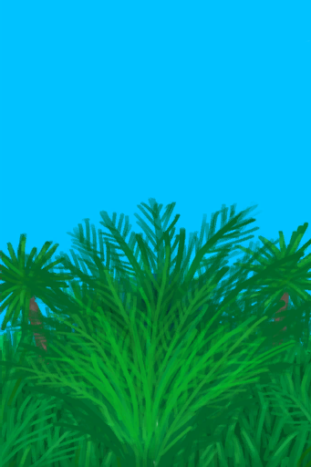
[Palm Bush](PalmBush.md)](PalmBush.md)(<b>+4</b>)</td><td  style="text-align:left;vertical-align:top;"  >+0.5 (14d)</td><td  style="text-align:left;vertical-align:top;"  >🔴-0.25</td><td  style="text-align:left;vertical-align:top;"  >🟢+0.25</td><td  style="text-align:left;vertical-align:top;"  >🟢+0.25</td><td  style="text-align:left;vertical-align:top;"  ></td></tr><tr ><td  style="text-align:left;vertical-align:top;"  >[

[Palm Tree Crop Plot](CropPlotPalmTree.md)](CropPlotPalmTree.md)</td><td  style="text-align:left;vertical-align:top;"  >[

[Coconut](Coconut.md)](Coconut.md)[

[Husked Coconut](CoconutHusked.md)](CoconutHusked.md)</td><td  style="text-align:left;vertical-align:top;"  >[

[Young palm Tree](PalmTreeYoung.md)](PalmTreeYoung.md)(<b>+1</b>)</td><td  style="text-align:left;vertical-align:top;"  >+0.5 (14d)</td><td  style="text-align:left;vertical-align:top;"  >🔴-0.25</td><td  style="text-align:left;vertical-align:top;"  >🟢+0.25</td><td  style="text-align:left;vertical-align:top;"  >🟢+0.25</td><td  style="text-align:left;vertical-align:top;"  ></td></tr><tr ><td  style="text-align:left;vertical-align:top;"  >[

[Rice Crop Plot](CropPlotRice.md)](CropPlotRice.md)</td><td  style="text-align:left;vertical-align:top;"  >[

[Rice Grain](RiceGrains.md)](RiceGrains.md)</td><td  style="text-align:left;vertical-align:top;"  >[

[Rice](RicePlant.md)](RicePlant.md)(<b>+4</b>)</td><td  style="text-align:left;vertical-align:top;"  >+1 (7d)</td><td  style="text-align:left;vertical-align:top;"  >🔴-0.25</td><td  style="text-align:left;vertical-align:top;"  >🟢+0.25</td><td  style="text-align:left;vertical-align:top;"  >🟢+0.25</td><td  style="text-align:left;vertical-align:top;"  ></td></tr><tr ><td  style="text-align:left;vertical-align:top;"  >[

[Sago Palm Crop Plot](CropPlotSagoPalm.md)](CropPlotSagoPalm.md)</td><td  style="text-align:left;vertical-align:top;"  >[

[Sago Seeds](SagoSeeds.md)](SagoSeeds.md)</td><td  style="text-align:left;vertical-align:top;"  >[

[Sago Palm](SagoPalm.md)](SagoPalm.md)(<b>+2</b>)</td><td  style="text-align:left;vertical-align:top;"  >+0.5 (14d)</td><td  style="text-align:left;vertical-align:top;"  >🟢+0.25</td><td  style="text-align:left;vertical-align:top;"  >🔴-0.25</td><td  style="text-align:left;vertical-align:top;"  >🟢+0.25</td><td  style="text-align:left;vertical-align:top;"  ></td></tr><tr ><td  style="text-align:left;vertical-align:top;"  >[

[Snake Grass Crop Plot](CropPlotSnakeGrass.md)](CropPlotSnakeGrass.md)</td><td  style="text-align:left;vertical-align:top;"  >[

[Snake Grass](SnakeGrass.md)](SnakeGrass.md)</td><td  style="text-align:left;vertical-align:top;"  >[

[Snakegrass Patch](SnakegrassPatch.md)](SnakegrassPatch.md)(<b>+3</b>)</td><td  style="text-align:left;vertical-align:top;"  >+1 (7d)</td><td  style="text-align:left;vertical-align:top;"  >🟢+0.25</td><td  style="text-align:left;vertical-align:top;"  >🔴-0.25</td><td  style="text-align:left;vertical-align:top;"  >🟢+0.25</td><td  style="text-align:left;vertical-align:top;"  ></td></tr><tr ><td  style="text-align:left;vertical-align:top;"  >[

[Spider Lily Crop Plot](CropPlotSpiderLily.md)](CropPlotSpiderLily.md)</td><td  style="text-align:left;vertical-align:top;"  >[

[Spider Lily Leaves](SpiderLilyLeaves.md)](SpiderLilyLeaves.md)</td><td  style="text-align:left;vertical-align:top;"  >[

[Spider Lily](SpiderLily.md)](SpiderLily.md)(<b>+6</b>)</td><td  style="text-align:left;vertical-align:top;"  >+1 (7d)</td><td  style="text-align:left;vertical-align:top;"  >🟢+0.25</td><td  style="text-align:left;vertical-align:top;"  >🔴-0.25</td><td  style="text-align:left;vertical-align:top;"  >🟢+0.25</td><td  style="text-align:left;vertical-align:top;"  ></td></tr><tr ><td  style="text-align:left;vertical-align:top;"  >[

[Weevil Lily Crop Plot](CropPlotWeevilLily.md)](CropPlotWeevilLily.md)</td><td  style="text-align:left;vertical-align:top;"  >[

[Weevil Lily Leaves](WeevilLilyLeaves.md)](WeevilLilyLeaves.md)</td><td  style="text-align:left;vertical-align:top;"  >[
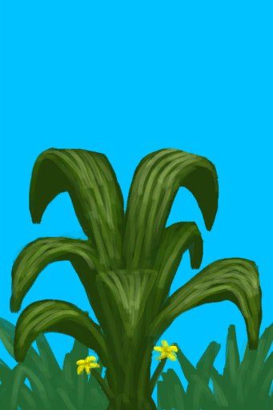
[Weevil Lily](WeevilLily.md)](WeevilLily.md)(<b>+5</b>)</td><td  style="text-align:left;vertical-align:top;"  >+1 (7d)</td><td  style="text-align:left;vertical-align:top;"  >🟢+0.25</td><td  style="text-align:left;vertical-align:top;"  >🔴-0.25</td><td  style="text-align:left;vertical-align:top;"  >🟢+0.25</td><td  style="text-align:left;vertical-align:top;"  ></td></tr><tr ><td  style="text-align:left;vertical-align:top;"  >[

[Wild Jujube Crop Plot](CropPlotWildJujube.md)](CropPlotWildJujube.md)</td><td  style="text-align:left;vertical-align:top;"  >[
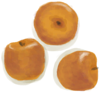
[Jujube Fruits](JujubeFruits.md)](JujubeFruits.md)</td><td  style="text-align:left;vertical-align:top;"  >[
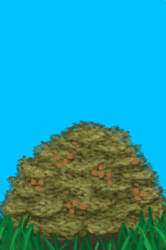
[Wild Jujube](WildJujube.md)](WildJujube.md)(<b>+3</b>)</td><td  style="text-align:left;vertical-align:top;"  >+1 (7d)</td><td  style="text-align:left;vertical-align:top;"  >🔴-0.5</td><td  style="text-align:left;vertical-align:top;"  >🟢+0.5</td><td  style="text-align:left;vertical-align:top;"  >🟢+0.25</td><td  style="text-align:left;vertical-align:top;"  ></td></tr><tr ><td  style="text-align:left;vertical-align:top;"  >[

[Yam Crop Plot](CropPlotYam.md)](CropPlotYam.md)</td><td  style="text-align:left;vertical-align:top;"  >[
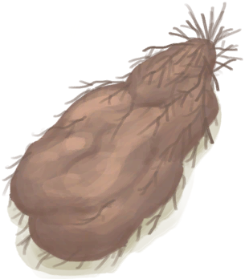
[Yam](Yam.md)](Yam.md)</td><td  style="text-align:left;vertical-align:top;"  >[

[Wild Yam](YamPlant.md)](YamPlant.md)(<b>+4</b>)</td><td  style="text-align:left;vertical-align:top;"  >+1 (7d)</td><td  style="text-align:left;vertical-align:top;"  >🟢+0.25</td><td  style="text-align:left;vertical-align:top;"  >🔴-0.25</td><td  style="text-align:left;vertical-align:top;"  >🟢+0.25</td><td  style="text-align:left;vertical-align:top;"  ></td></tr><tr ><td  style="text-align:left;vertical-align:top;"  >[

[Assorted Mushrooms Bed](MushroomBedAssorted.md)](MushroomBedAssorted.md)</td><td  style="text-align:left;vertical-align:top;"  >[
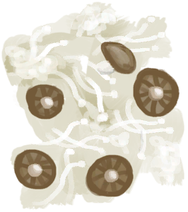
[Assorted Mushrooms](AssortedMushrooms.md)](AssortedMushrooms.md)</td><td  style="text-align:left;vertical-align:top;"  >[
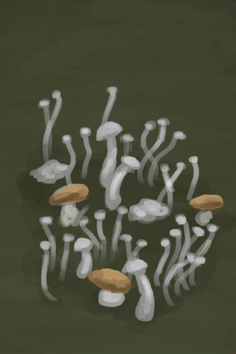
[Assorted Mushrooms](AssortedMushroomsPlant.md)](AssortedMushroomsPlant.md)(<b>+12～+20</b>), [

[Wooden Plank](Plank.md)](Plank.md)(<b>+4</b>)</td><td  style="text-align:left;vertical-align:top;"  >+1 (7d)</td><td  style="text-align:left;vertical-align:top;"  >🟢+0.25</td><td  style="text-align:left;vertical-align:top;"  >🔴-0.5</td><td  style="text-align:left;vertical-align:top;"  ></td><td  style="text-align:left;vertical-align:top;"  >🟢+0.25</td></tr><tr ><td  style="text-align:left;vertical-align:top;"  >[

[Magic Mushroom Bed](MushroomBedMagic.md)](MushroomBedMagic.md)</td><td  style="text-align:left;vertical-align:top;"  >[

[Magic Mushrooms](MagicMushrooms.md)](MagicMushrooms.md)</td><td  style="text-align:left;vertical-align:top;"  >[

[Magic Mushrooms](MagicMushroomsPlant.md)](MagicMushroomsPlant.md)(<b>+4</b>), [

[Wooden Plank](Plank.md)](Plank.md)(<b>+4</b>)</td><td  style="text-align:left;vertical-align:top;"  >+1 (7d)</td><td  style="text-align:left;vertical-align:top;"  >🟢+0.25</td><td  style="text-align:left;vertical-align:top;"  >🔴-0.5</td><td  style="text-align:left;vertical-align:top;"  ></td><td  style="text-align:left;vertical-align:top;"  >🟢+0.25</td></tr><tr ><td  style="text-align:left;vertical-align:top;"  >[

[Puffball Bed](MushroomBedPuffballs.md)](MushroomBedPuffballs.md)</td><td  style="text-align:left;vertical-align:top;"  >[

[Puffballs](Puffballs.md)](Puffballs.md)</td><td  style="text-align:left;vertical-align:top;"  >[

[Puffballs](PuffballsPlant.md)](PuffballsPlant.md)(<b>+8</b>), [

[Wooden Plank](Plank.md)](Plank.md)(<b>+4</b>)</td><td  style="text-align:left;vertical-align:top;"  >+1 (7d)</td><td  style="text-align:left;vertical-align:top;"  >🟢+0.25</td><td  style="text-align:left;vertical-align:top;"  >🔴-0.5</td><td  style="text-align:left;vertical-align:top;"  ></td><td  style="text-align:left;vertical-align:top;"  >🟢+0.25</td></tr></tbody></table>  
  
### 2. Growth  
<table class="table table-bordered" data-toggle="table"  ><thead style=""><tr ><th  style="text-align:left;vertical-align:top;"  >Name</th><th  style="text-align:left;vertical-align:top;"  >[Eastern Grasslands](GrasslandsE.md)</th><th  style="text-align:left;vertical-align:top;"  >[Western Grasslands](GrasslandsW.md)</th><th  style="text-align:left;vertical-align:top;"  >[Secret Valley](SecretValley.md)</th><th  style="text-align:left;vertical-align:top;"  >[Deep Jungle(Jungle)](DeepJungle.md)</th><th  style="text-align:left;vertical-align:top;"  >[Jungle](Jungle.md)</th><th  style="text-align:left;vertical-align:top;"  >[Jungle Highlands](JungleHighlands.md)</th><th  style="text-align:left;vertical-align:top;"  >[Mangrove Forest](Mangroves.md)</th><th  style="text-align:left;vertical-align:top;"  >[Wetland Jungle(Wetlands)](Wetlands.md)</th><th  style="text-align:left;vertical-align:top;"  >[Acid Lake(Volcano)](AcidLake.md)</th><th  style="text-align:left;vertical-align:top;"  >[Atoll](Atoll.md)</th><th  style="text-align:left;vertical-align:top;"  >[Bay](Bay.md)</th><th  style="text-align:left;vertical-align:top;"  >[Beach](Beach.md)</th><th  style="text-align:left;vertical-align:top;"  >[Bird Rock](BirdRock.md)</th><th  style="text-align:left;vertical-align:top;"  >[Secret Cove(Beach)](Cove.md)</th><th  style="text-align:left;vertical-align:top;"  >[Desolate Beach](DesolateBeach.md)</th><th  style="text-align:left;vertical-align:top;"  >[Eastern Highlands](HighlandsEastern.md)</th><th  style="text-align:left;vertical-align:top;"  >[Western Highlands](HighlandsWestern.md)</th><th  style="text-align:left;vertical-align:top;"  >[Jungle Outskirts(Outskirts)](Outskirts.md)</th><th  style="text-align:left;vertical-align:top;"  >[Rocks](Rocks.md)</th><th  style="text-align:left;vertical-align:top;"  >[Volcano](Volcano.md)</th></tr></thead><tr ><td  style="text-align:left;vertical-align:top;"  >[

[Rice Paddy](RicePaddy.md)](RicePaddy.md)</td><td  style="text-align:left;vertical-align:top;"  >▲</td><td  style="text-align:left;vertical-align:top;"  >▲</td><td  style="text-align:left;vertical-align:top;"  >▲</td><td  style="text-align:left;vertical-align:top;"  ></td><td  style="text-align:left;vertical-align:top;"  ></td><td  style="text-align:left;vertical-align:top;"  ></td><td  style="text-align:left;vertical-align:top;"  ></td><td  style="text-align:left;vertical-align:top;"  ></td><td  style="text-align:left;vertical-align:top;"  ></td><td  style="text-align:left;vertical-align:top;"  ></td><td  style="text-align:left;vertical-align:top;"  ></td><td  style="text-align:left;vertical-align:top;"  ></td><td  style="text-align:left;vertical-align:top;"  ></td><td  style="text-align:left;vertical-align:top;"  ></td><td  style="text-align:left;vertical-align:top;"  ></td><td  style="text-align:left;vertical-align:top;"  ></td><td  style="text-align:left;vertical-align:top;"  ></td><td  style="text-align:left;vertical-align:top;"  ></td><td  style="text-align:left;vertical-align:top;"  ></td><td  style="text-align:left;vertical-align:top;"  ></td></tr><tr ><td  style="text-align:left;vertical-align:top;"  >[

[Almond Tree Crop Plot](CropPlotAlmondTree.md)](CropPlotAlmondTree.md)</td><td  style="text-align:left;vertical-align:top;"  >▲▲</td><td  style="text-align:left;vertical-align:top;"  >▲▲</td><td  style="text-align:left;vertical-align:top;"  >▲</td><td  style="text-align:left;vertical-align:top;"  >▼</td><td  style="text-align:left;vertical-align:top;"  >▼</td><td  style="text-align:left;vertical-align:top;"  >▼</td><td  style="text-align:left;vertical-align:top;"  >▼</td><td  style="text-align:left;vertical-align:top;"  >▼</td><td  style="text-align:left;vertical-align:top;"  >▲</td><td  style="text-align:left;vertical-align:top;"  >▲</td><td  style="text-align:left;vertical-align:top;"  >▲</td><td  style="text-align:left;vertical-align:top;"  >▲</td><td  style="text-align:left;vertical-align:top;"  >▲</td><td  style="text-align:left;vertical-align:top;"  >▲</td><td  style="text-align:left;vertical-align:top;"  >▲</td><td  style="text-align:left;vertical-align:top;"  >▲</td><td  style="text-align:left;vertical-align:top;"  >▲</td><td  style="text-align:left;vertical-align:top;"  >▲</td><td  style="text-align:left;vertical-align:top;"  >▲</td><td  style="text-align:left;vertical-align:top;"  >▲</td></tr><tr ><td  style="text-align:left;vertical-align:top;"  >[

[Aloe Vera Crop Plot](CropPlotAloeVera.md)](CropPlotAloeVera.md)</td><td  style="text-align:left;vertical-align:top;"  >▲▲</td><td  style="text-align:left;vertical-align:top;"  >▲▲</td><td  style="text-align:left;vertical-align:top;"  >▲</td><td  style="text-align:left;vertical-align:top;"  >▼</td><td  style="text-align:left;vertical-align:top;"  >▼</td><td  style="text-align:left;vertical-align:top;"  >▼</td><td  style="text-align:left;vertical-align:top;"  >▼</td><td  style="text-align:left;vertical-align:top;"  >▼</td><td  style="text-align:left;vertical-align:top;"  >▲</td><td  style="text-align:left;vertical-align:top;"  >▲</td><td  style="text-align:left;vertical-align:top;"  >▲</td><td  style="text-align:left;vertical-align:top;"  >▲</td><td  style="text-align:left;vertical-align:top;"  >▲</td><td  style="text-align:left;vertical-align:top;"  >▲</td><td  style="text-align:left;vertical-align:top;"  >▲</td><td  style="text-align:left;vertical-align:top;"  >▲</td><td  style="text-align:left;vertical-align:top;"  >▲</td><td  style="text-align:left;vertical-align:top;"  >▲</td><td  style="text-align:left;vertical-align:top;"  >▲</td><td  style="text-align:left;vertical-align:top;"  >▲</td></tr><tr ><td  style="text-align:left;vertical-align:top;"  >[

[Banana Crop Plot](CropPlotBananaTree.md)](CropPlotBananaTree.md)</td><td  style="text-align:left;vertical-align:top;"  > </td><td  style="text-align:left;vertical-align:top;"  > </td><td  style="text-align:left;vertical-align:top;"  >▲</td><td  style="text-align:left;vertical-align:top;"  >▲</td><td  style="text-align:left;vertical-align:top;"  >▲</td><td  style="text-align:left;vertical-align:top;"  >▲</td><td  style="text-align:left;vertical-align:top;"  >▲</td><td  style="text-align:left;vertical-align:top;"  >▲</td><td  style="text-align:left;vertical-align:top;"  >▼</td><td  style="text-align:left;vertical-align:top;"  >▼</td><td  style="text-align:left;vertical-align:top;"  >▼</td><td  style="text-align:left;vertical-align:top;"  >▼</td><td  style="text-align:left;vertical-align:top;"  >▼</td><td  style="text-align:left;vertical-align:top;"  >▼</td><td  style="text-align:left;vertical-align:top;"  >▼</td><td  style="text-align:left;vertical-align:top;"  >▼</td><td  style="text-align:left;vertical-align:top;"  >▼</td><td  style="text-align:left;vertical-align:top;"  >▼</td><td  style="text-align:left;vertical-align:top;"  >▼</td><td  style="text-align:left;vertical-align:top;"  >▼</td></tr><tr ><td  style="text-align:left;vertical-align:top;"  >[

[Chili Crop Plot](CropPlotChilies.md)](CropPlotChilies.md)</td><td  style="text-align:left;vertical-align:top;"  >▲▲</td><td  style="text-align:left;vertical-align:top;"  >▲▲</td><td  style="text-align:left;vertical-align:top;"  >▲</td><td  style="text-align:left;vertical-align:top;"  >▼</td><td  style="text-align:left;vertical-align:top;"  >▼</td><td  style="text-align:left;vertical-align:top;"  >▼</td><td  style="text-align:left;vertical-align:top;"  >▼</td><td  style="text-align:left;vertical-align:top;"  >▼</td><td  style="text-align:left;vertical-align:top;"  >▲</td><td  style="text-align:left;vertical-align:top;"  >▲</td><td  style="text-align:left;vertical-align:top;"  >▲</td><td  style="text-align:left;vertical-align:top;"  >▲</td><td  style="text-align:left;vertical-align:top;"  >▲</td><td  style="text-align:left;vertical-align:top;"  >▲</td><td  style="text-align:left;vertical-align:top;"  >▲</td><td  style="text-align:left;vertical-align:top;"  >▲</td><td  style="text-align:left;vertical-align:top;"  >▲</td><td  style="text-align:left;vertical-align:top;"  >▲</td><td  style="text-align:left;vertical-align:top;"  >▲</td><td  style="text-align:left;vertical-align:top;"  >▲</td></tr><tr ><td  style="text-align:left;vertical-align:top;"  >[

[China Rose Crop Plot](CropPlotChinaRose.md)](CropPlotChinaRose.md)</td><td  style="text-align:left;vertical-align:top;"  > </td><td  style="text-align:left;vertical-align:top;"  > </td><td  style="text-align:left;vertical-align:top;"  >▲</td><td  style="text-align:left;vertical-align:top;"  >▲</td><td  style="text-align:left;vertical-align:top;"  >▲</td><td  style="text-align:left;vertical-align:top;"  >▲</td><td  style="text-align:left;vertical-align:top;"  >▲</td><td  style="text-align:left;vertical-align:top;"  >▲</td><td  style="text-align:left;vertical-align:top;"  >▼</td><td  style="text-align:left;vertical-align:top;"  >▼</td><td  style="text-align:left;vertical-align:top;"  >▼</td><td  style="text-align:left;vertical-align:top;"  >▼</td><td  style="text-align:left;vertical-align:top;"  >▼</td><td  style="text-align:left;vertical-align:top;"  >▼</td><td  style="text-align:left;vertical-align:top;"  >▼</td><td  style="text-align:left;vertical-align:top;"  >▼</td><td  style="text-align:left;vertical-align:top;"  >▼</td><td  style="text-align:left;vertical-align:top;"  >▼</td><td  style="text-align:left;vertical-align:top;"  >▼</td><td  style="text-align:left;vertical-align:top;"  >▼</td></tr><tr ><td  style="text-align:left;vertical-align:top;"  >[

[Cinchona Crop Plot](CropPlotCinchonaTree.md)](CropPlotCinchonaTree.md)</td><td  style="text-align:left;vertical-align:top;"  >▲▲</td><td  style="text-align:left;vertical-align:top;"  >▲▲</td><td  style="text-align:left;vertical-align:top;"  >▲</td><td  style="text-align:left;vertical-align:top;"  >▼</td><td  style="text-align:left;vertical-align:top;"  >▼</td><td  style="text-align:left;vertical-align:top;"  >▼</td><td  style="text-align:left;vertical-align:top;"  >▼</td><td  style="text-align:left;vertical-align:top;"  >▼</td><td  style="text-align:left;vertical-align:top;"  >▲</td><td  style="text-align:left;vertical-align:top;"  >▲</td><td  style="text-align:left;vertical-align:top;"  >▲</td><td  style="text-align:left;vertical-align:top;"  >▲</td><td  style="text-align:left;vertical-align:top;"  >▲</td><td  style="text-align:left;vertical-align:top;"  >▲</td><td  style="text-align:left;vertical-align:top;"  >▲</td><td  style="text-align:left;vertical-align:top;"  >▲</td><td  style="text-align:left;vertical-align:top;"  >▲</td><td  style="text-align:left;vertical-align:top;"  >▲</td><td  style="text-align:left;vertical-align:top;"  >▲</td><td  style="text-align:left;vertical-align:top;"  >▲</td></tr><tr ><td  style="text-align:left;vertical-align:top;"  >[

[Coffee Crop Plot](CropPlotCoffee.md)](CropPlotCoffee.md)</td><td  style="text-align:left;vertical-align:top;"  >▲▲</td><td  style="text-align:left;vertical-align:top;"  >▲▲</td><td  style="text-align:left;vertical-align:top;"  >▲</td><td  style="text-align:left;vertical-align:top;"  >▼</td><td  style="text-align:left;vertical-align:top;"  >▼</td><td  style="text-align:left;vertical-align:top;"  >▼</td><td  style="text-align:left;vertical-align:top;"  >▼</td><td  style="text-align:left;vertical-align:top;"  >▼</td><td  style="text-align:left;vertical-align:top;"  >▲</td><td  style="text-align:left;vertical-align:top;"  >▲</td><td  style="text-align:left;vertical-align:top;"  >▲</td><td  style="text-align:left;vertical-align:top;"  >▲</td><td  style="text-align:left;vertical-align:top;"  >▲</td><td  style="text-align:left;vertical-align:top;"  >▲</td><td  style="text-align:left;vertical-align:top;"  >▲</td><td  style="text-align:left;vertical-align:top;"  >▲</td><td  style="text-align:left;vertical-align:top;"  >▲</td><td  style="text-align:left;vertical-align:top;"  >▲</td><td  style="text-align:left;vertical-align:top;"  >▲</td><td  style="text-align:left;vertical-align:top;"  >▲</td></tr><tr ><td  style="text-align:left;vertical-align:top;"  >[

[Ginger Crop Plot](CropPlotGinger.md)](CropPlotGinger.md)</td><td  style="text-align:left;vertical-align:top;"  > </td><td  style="text-align:left;vertical-align:top;"  > </td><td  style="text-align:left;vertical-align:top;"  >▲</td><td  style="text-align:left;vertical-align:top;"  >▲▲</td><td  style="text-align:left;vertical-align:top;"  >▲▲</td><td  style="text-align:left;vertical-align:top;"  >▲▲</td><td  style="text-align:left;vertical-align:top;"  >▲▲</td><td  style="text-align:left;vertical-align:top;"  >▲▲</td><td  style="text-align:left;vertical-align:top;"  >▼</td><td  style="text-align:left;vertical-align:top;"  >▼</td><td  style="text-align:left;vertical-align:top;"  >▼</td><td  style="text-align:left;vertical-align:top;"  >▼</td><td  style="text-align:left;vertical-align:top;"  >▼</td><td  style="text-align:left;vertical-align:top;"  >▼</td><td  style="text-align:left;vertical-align:top;"  >▼</td><td  style="text-align:left;vertical-align:top;"  >▼</td><td  style="text-align:left;vertical-align:top;"  >▼</td><td  style="text-align:left;vertical-align:top;"  >▼</td><td  style="text-align:left;vertical-align:top;"  >▼</td><td  style="text-align:left;vertical-align:top;"  >▼</td></tr><tr ><td  style="text-align:left;vertical-align:top;"  >[

[Jasmine Crop Plot](CropPlotJasmine.md)](CropPlotJasmine.md)</td><td  style="text-align:left;vertical-align:top;"  > </td><td  style="text-align:left;vertical-align:top;"  > </td><td  style="text-align:left;vertical-align:top;"  >▲</td><td  style="text-align:left;vertical-align:top;"  >▲</td><td  style="text-align:left;vertical-align:top;"  >▲</td><td  style="text-align:left;vertical-align:top;"  >▲</td><td  style="text-align:left;vertical-align:top;"  >▲</td><td  style="text-align:left;vertical-align:top;"  >▲</td><td  style="text-align:left;vertical-align:top;"  >▼</td><td  style="text-align:left;vertical-align:top;"  >▼</td><td  style="text-align:left;vertical-align:top;"  >▼</td><td  style="text-align:left;vertical-align:top;"  >▼</td><td  style="text-align:left;vertical-align:top;"  >▼</td><td  style="text-align:left;vertical-align:top;"  >▼</td><td  style="text-align:left;vertical-align:top;"  >▼</td><td  style="text-align:left;vertical-align:top;"  >▼</td><td  style="text-align:left;vertical-align:top;"  >▼</td><td  style="text-align:left;vertical-align:top;"  >▼</td><td  style="text-align:left;vertical-align:top;"  >▼</td><td  style="text-align:left;vertical-align:top;"  >▼</td></tr><tr ><td  style="text-align:left;vertical-align:top;"  >[

[Kava Crop Plot](CropPlotKava.md)](CropPlotKava.md)</td><td  style="text-align:left;vertical-align:top;"  > </td><td  style="text-align:left;vertical-align:top;"  > </td><td  style="text-align:left;vertical-align:top;"  >▲</td><td  style="text-align:left;vertical-align:top;"  >▲</td><td  style="text-align:left;vertical-align:top;"  >▲</td><td  style="text-align:left;vertical-align:top;"  >▲</td><td  style="text-align:left;vertical-align:top;"  >▲</td><td  style="text-align:left;vertical-align:top;"  >▲</td><td  style="text-align:left;vertical-align:top;"  >▼</td><td  style="text-align:left;vertical-align:top;"  >▼</td><td  style="text-align:left;vertical-align:top;"  >▼</td><td  style="text-align:left;vertical-align:top;"  >▼</td><td  style="text-align:left;vertical-align:top;"  >▼</td><td  style="text-align:left;vertical-align:top;"  >▼</td><td  style="text-align:left;vertical-align:top;"  >▼</td><td  style="text-align:left;vertical-align:top;"  >▼</td><td  style="text-align:left;vertical-align:top;"  >▼</td><td  style="text-align:left;vertical-align:top;"  >▼</td><td  style="text-align:left;vertical-align:top;"  >▼</td><td  style="text-align:left;vertical-align:top;"  >▼</td></tr><tr ><td  style="text-align:left;vertical-align:top;"  >[

[Lemon Grass Crop Plot](CropPlotLemonGrass.md)](CropPlotLemonGrass.md)</td><td  style="text-align:left;vertical-align:top;"  >▲▲</td><td  style="text-align:left;vertical-align:top;"  >▲▲</td><td  style="text-align:left;vertical-align:top;"  >▲</td><td  style="text-align:left;vertical-align:top;"  >▼</td><td  style="text-align:left;vertical-align:top;"  >▼</td><td  style="text-align:left;vertical-align:top;"  >▼</td><td  style="text-align:left;vertical-align:top;"  >▼</td><td  style="text-align:left;vertical-align:top;"  >▼</td><td  style="text-align:left;vertical-align:top;"  >▲</td><td  style="text-align:left;vertical-align:top;"  >▲</td><td  style="text-align:left;vertical-align:top;"  >▲</td><td  style="text-align:left;vertical-align:top;"  >▲</td><td  style="text-align:left;vertical-align:top;"  >▲</td><td  style="text-align:left;vertical-align:top;"  >▲</td><td  style="text-align:left;vertical-align:top;"  >▲</td><td  style="text-align:left;vertical-align:top;"  >▲</td><td  style="text-align:left;vertical-align:top;"  >▲</td><td  style="text-align:left;vertical-align:top;"  >▲</td><td  style="text-align:left;vertical-align:top;"  >▲</td><td  style="text-align:left;vertical-align:top;"  >▲</td></tr><tr ><td  style="text-align:left;vertical-align:top;"  >[

[Mango Crop Plot](CropPlotMangoTree.md)](CropPlotMangoTree.md)</td><td  style="text-align:left;vertical-align:top;"  >▲▲</td><td  style="text-align:left;vertical-align:top;"  >▲▲</td><td  style="text-align:left;vertical-align:top;"  >▲</td><td  style="text-align:left;vertical-align:top;"  >▼</td><td  style="text-align:left;vertical-align:top;"  >▼</td><td  style="text-align:left;vertical-align:top;"  >▼</td><td  style="text-align:left;vertical-align:top;"  >▼</td><td  style="text-align:left;vertical-align:top;"  >▼</td><td  style="text-align:left;vertical-align:top;"  >▲</td><td  style="text-align:left;vertical-align:top;"  >▲</td><td  style="text-align:left;vertical-align:top;"  >▲</td><td  style="text-align:left;vertical-align:top;"  >▲</td><td  style="text-align:left;vertical-align:top;"  >▲</td><td  style="text-align:left;vertical-align:top;"  >▲</td><td  style="text-align:left;vertical-align:top;"  >▲</td><td  style="text-align:left;vertical-align:top;"  >▲</td><td  style="text-align:left;vertical-align:top;"  >▲</td><td  style="text-align:left;vertical-align:top;"  >▲</td><td  style="text-align:left;vertical-align:top;"  >▲</td><td  style="text-align:left;vertical-align:top;"  >▲</td></tr><tr ><td  style="text-align:left;vertical-align:top;"  >[

[Nipa Palm Crop Plot](CropPlotNipaPalm.md)](CropPlotNipaPalm.md)</td><td  style="text-align:left;vertical-align:top;"  > </td><td  style="text-align:left;vertical-align:top;"  > </td><td  style="text-align:left;vertical-align:top;"  >▲</td><td  style="text-align:left;vertical-align:top;"  >▲</td><td  style="text-align:left;vertical-align:top;"  >▲</td><td  style="text-align:left;vertical-align:top;"  >▲</td><td  style="text-align:left;vertical-align:top;"  >▲</td><td  style="text-align:left;vertical-align:top;"  >▲</td><td  style="text-align:left;vertical-align:top;"  >▼</td><td  style="text-align:left;vertical-align:top;"  >▼</td><td  style="text-align:left;vertical-align:top;"  >▼</td><td  style="text-align:left;vertical-align:top;"  >▼</td><td  style="text-align:left;vertical-align:top;"  >▼</td><td  style="text-align:left;vertical-align:top;"  >▼</td><td  style="text-align:left;vertical-align:top;"  >▼</td><td  style="text-align:left;vertical-align:top;"  >▼</td><td  style="text-align:left;vertical-align:top;"  >▼</td><td  style="text-align:left;vertical-align:top;"  >▼</td><td  style="text-align:left;vertical-align:top;"  >▼</td><td  style="text-align:left;vertical-align:top;"  >▼</td></tr><tr ><td  style="text-align:left;vertical-align:top;"  >[

[Palm Bush Crop Plot](CropPlotPalmBush.md)](CropPlotPalmBush.md)</td><td  style="text-align:left;vertical-align:top;"  >▲▲</td><td  style="text-align:left;vertical-align:top;"  >▲▲</td><td  style="text-align:left;vertical-align:top;"  >▲</td><td  style="text-align:left;vertical-align:top;"  >▼</td><td  style="text-align:left;vertical-align:top;"  >▼</td><td  style="text-align:left;vertical-align:top;"  >▼</td><td  style="text-align:left;vertical-align:top;"  >▼</td><td  style="text-align:left;vertical-align:top;"  >▼</td><td  style="text-align:left;vertical-align:top;"  >▲</td><td  style="text-align:left;vertical-align:top;"  >▲</td><td  style="text-align:left;vertical-align:top;"  >▲</td><td  style="text-align:left;vertical-align:top;"  >▲</td><td  style="text-align:left;vertical-align:top;"  >▲</td><td  style="text-align:left;vertical-align:top;"  >▲</td><td  style="text-align:left;vertical-align:top;"  >▲</td><td  style="text-align:left;vertical-align:top;"  >▲</td><td  style="text-align:left;vertical-align:top;"  >▲</td><td  style="text-align:left;vertical-align:top;"  >▲</td><td  style="text-align:left;vertical-align:top;"  >▲</td><td  style="text-align:left;vertical-align:top;"  >▲</td></tr><tr ><td  style="text-align:left;vertical-align:top;"  >[

[Palm Tree Crop Plot](CropPlotPalmTree.md)](CropPlotPalmTree.md)</td><td  style="text-align:left;vertical-align:top;"  >▲▲</td><td  style="text-align:left;vertical-align:top;"  >▲▲</td><td  style="text-align:left;vertical-align:top;"  >▲</td><td  style="text-align:left;vertical-align:top;"  >▼</td><td  style="text-align:left;vertical-align:top;"  >▼</td><td  style="text-align:left;vertical-align:top;"  >▼</td><td  style="text-align:left;vertical-align:top;"  >▼</td><td  style="text-align:left;vertical-align:top;"  >▼</td><td  style="text-align:left;vertical-align:top;"  >▲</td><td  style="text-align:left;vertical-align:top;"  >▲</td><td  style="text-align:left;vertical-align:top;"  >▲</td><td  style="text-align:left;vertical-align:top;"  >▲</td><td  style="text-align:left;vertical-align:top;"  >▲</td><td  style="text-align:left;vertical-align:top;"  >▲</td><td  style="text-align:left;vertical-align:top;"  >▲</td><td  style="text-align:left;vertical-align:top;"  >▲</td><td  style="text-align:left;vertical-align:top;"  >▲</td><td  style="text-align:left;vertical-align:top;"  >▲</td><td  style="text-align:left;vertical-align:top;"  >▲</td><td  style="text-align:left;vertical-align:top;"  >▲</td></tr><tr ><td  style="text-align:left;vertical-align:top;"  >[

[Rice Crop Plot](CropPlotRice.md)](CropPlotRice.md)</td><td  style="text-align:left;vertical-align:top;"  >▲▲</td><td  style="text-align:left;vertical-align:top;"  >▲▲</td><td  style="text-align:left;vertical-align:top;"  >▲</td><td  style="text-align:left;vertical-align:top;"  >▼</td><td  style="text-align:left;vertical-align:top;"  >▼</td><td  style="text-align:left;vertical-align:top;"  >▼</td><td  style="text-align:left;vertical-align:top;"  >▼</td><td  style="text-align:left;vertical-align:top;"  >▼</td><td  style="text-align:left;vertical-align:top;"  >▲</td><td  style="text-align:left;vertical-align:top;"  >▲</td><td  style="text-align:left;vertical-align:top;"  >▲</td><td  style="text-align:left;vertical-align:top;"  >▲</td><td  style="text-align:left;vertical-align:top;"  >▲</td><td  style="text-align:left;vertical-align:top;"  >▲</td><td  style="text-align:left;vertical-align:top;"  >▲</td><td  style="text-align:left;vertical-align:top;"  >▲</td><td  style="text-align:left;vertical-align:top;"  >▲</td><td  style="text-align:left;vertical-align:top;"  >▲</td><td  style="text-align:left;vertical-align:top;"  >▲</td><td  style="text-align:left;vertical-align:top;"  >▲</td></tr><tr ><td  style="text-align:left;vertical-align:top;"  >[

[Sago Palm Crop Plot](CropPlotSagoPalm.md)](CropPlotSagoPalm.md)</td><td  style="text-align:left;vertical-align:top;"  > </td><td  style="text-align:left;vertical-align:top;"  > </td><td  style="text-align:left;vertical-align:top;"  >▲</td><td  style="text-align:left;vertical-align:top;"  >▲</td><td  style="text-align:left;vertical-align:top;"  >▲</td><td  style="text-align:left;vertical-align:top;"  >▲</td><td  style="text-align:left;vertical-align:top;"  >▲</td><td  style="text-align:left;vertical-align:top;"  >▲</td><td  style="text-align:left;vertical-align:top;"  >▼</td><td  style="text-align:left;vertical-align:top;"  >▼</td><td  style="text-align:left;vertical-align:top;"  >▼</td><td  style="text-align:left;vertical-align:top;"  >▼</td><td  style="text-align:left;vertical-align:top;"  >▼</td><td  style="text-align:left;vertical-align:top;"  >▼</td><td  style="text-align:left;vertical-align:top;"  >▼</td><td  style="text-align:left;vertical-align:top;"  >▼</td><td  style="text-align:left;vertical-align:top;"  >▼</td><td  style="text-align:left;vertical-align:top;"  >▼</td><td  style="text-align:left;vertical-align:top;"  >▼</td><td  style="text-align:left;vertical-align:top;"  >▼</td></tr><tr ><td  style="text-align:left;vertical-align:top;"  >[

[Snake Grass Crop Plot](CropPlotSnakeGrass.md)](CropPlotSnakeGrass.md)</td><td  style="text-align:left;vertical-align:top;"  > </td><td  style="text-align:left;vertical-align:top;"  > </td><td  style="text-align:left;vertical-align:top;"  >▲</td><td  style="text-align:left;vertical-align:top;"  >▲</td><td  style="text-align:left;vertical-align:top;"  >▲</td><td  style="text-align:left;vertical-align:top;"  >▲</td><td  style="text-align:left;vertical-align:top;"  >▲</td><td  style="text-align:left;vertical-align:top;"  >▲</td><td  style="text-align:left;vertical-align:top;"  >▼</td><td  style="text-align:left;vertical-align:top;"  >▼</td><td  style="text-align:left;vertical-align:top;"  >▼</td><td  style="text-align:left;vertical-align:top;"  >▼</td><td  style="text-align:left;vertical-align:top;"  >▼</td><td  style="text-align:left;vertical-align:top;"  >▼</td><td  style="text-align:left;vertical-align:top;"  >▼</td><td  style="text-align:left;vertical-align:top;"  >▼</td><td  style="text-align:left;vertical-align:top;"  >▼</td><td  style="text-align:left;vertical-align:top;"  >▼</td><td  style="text-align:left;vertical-align:top;"  >▼</td><td  style="text-align:left;vertical-align:top;"  >▼</td></tr><tr ><td  style="text-align:left;vertical-align:top;"  >[

[Spider Lily Crop Plot](CropPlotSpiderLily.md)](CropPlotSpiderLily.md)</td><td  style="text-align:left;vertical-align:top;"  > </td><td  style="text-align:left;vertical-align:top;"  > </td><td  style="text-align:left;vertical-align:top;"  >▲</td><td  style="text-align:left;vertical-align:top;"  >▲</td><td  style="text-align:left;vertical-align:top;"  >▲</td><td  style="text-align:left;vertical-align:top;"  >▲</td><td  style="text-align:left;vertical-align:top;"  >▲</td><td  style="text-align:left;vertical-align:top;"  >▲</td><td  style="text-align:left;vertical-align:top;"  >▼</td><td  style="text-align:left;vertical-align:top;"  >▼</td><td  style="text-align:left;vertical-align:top;"  >▼</td><td  style="text-align:left;vertical-align:top;"  >▼</td><td  style="text-align:left;vertical-align:top;"  >▼</td><td  style="text-align:left;vertical-align:top;"  >▼</td><td  style="text-align:left;vertical-align:top;"  >▼</td><td  style="text-align:left;vertical-align:top;"  >▼</td><td  style="text-align:left;vertical-align:top;"  >▼</td><td  style="text-align:left;vertical-align:top;"  >▼</td><td  style="text-align:left;vertical-align:top;"  >▼</td><td  style="text-align:left;vertical-align:top;"  >▼</td></tr><tr ><td  style="text-align:left;vertical-align:top;"  >[

[Weevil Lily Crop Plot](CropPlotWeevilLily.md)](CropPlotWeevilLily.md)</td><td  style="text-align:left;vertical-align:top;"  > </td><td  style="text-align:left;vertical-align:top;"  > </td><td  style="text-align:left;vertical-align:top;"  >▲</td><td  style="text-align:left;vertical-align:top;"  >▲</td><td  style="text-align:left;vertical-align:top;"  >▲</td><td  style="text-align:left;vertical-align:top;"  >▲</td><td  style="text-align:left;vertical-align:top;"  >▲</td><td  style="text-align:left;vertical-align:top;"  >▲</td><td  style="text-align:left;vertical-align:top;"  >▼</td><td  style="text-align:left;vertical-align:top;"  >▼</td><td  style="text-align:left;vertical-align:top;"  >▼</td><td  style="text-align:left;vertical-align:top;"  >▼</td><td  style="text-align:left;vertical-align:top;"  >▼</td><td  style="text-align:left;vertical-align:top;"  >▼</td><td  style="text-align:left;vertical-align:top;"  >▼</td><td  style="text-align:left;vertical-align:top;"  >▼</td><td  style="text-align:left;vertical-align:top;"  >▼</td><td  style="text-align:left;vertical-align:top;"  >▼</td><td  style="text-align:left;vertical-align:top;"  >▼</td><td  style="text-align:left;vertical-align:top;"  >▼</td></tr><tr ><td  style="text-align:left;vertical-align:top;"  >[

[Wild Jujube Crop Plot](CropPlotWildJujube.md)](CropPlotWildJujube.md)</td><td  style="text-align:left;vertical-align:top;"  >▲▲▲</td><td  style="text-align:left;vertical-align:top;"  >▲▲▲</td><td  style="text-align:left;vertical-align:top;"  >▲</td><td  style="text-align:left;vertical-align:top;"  >▼▼</td><td  style="text-align:left;vertical-align:top;"  >▼▼</td><td  style="text-align:left;vertical-align:top;"  >▼▼</td><td  style="text-align:left;vertical-align:top;"  >▼▼</td><td  style="text-align:left;vertical-align:top;"  >▼▼</td><td  style="text-align:left;vertical-align:top;"  >▲▲</td><td  style="text-align:left;vertical-align:top;"  >▲▲</td><td  style="text-align:left;vertical-align:top;"  >▲▲</td><td  style="text-align:left;vertical-align:top;"  >▲▲</td><td  style="text-align:left;vertical-align:top;"  >▲▲</td><td  style="text-align:left;vertical-align:top;"  >▲▲</td><td  style="text-align:left;vertical-align:top;"  >▲▲</td><td  style="text-align:left;vertical-align:top;"  >▲▲</td><td  style="text-align:left;vertical-align:top;"  >▲▲</td><td  style="text-align:left;vertical-align:top;"  >▲▲</td><td  style="text-align:left;vertical-align:top;"  >▲▲</td><td  style="text-align:left;vertical-align:top;"  >▲▲</td></tr><tr ><td  style="text-align:left;vertical-align:top;"  >[

[Yam Crop Plot](CropPlotYam.md)](CropPlotYam.md)</td><td  style="text-align:left;vertical-align:top;"  > </td><td  style="text-align:left;vertical-align:top;"  > </td><td  style="text-align:left;vertical-align:top;"  >▲</td><td  style="text-align:left;vertical-align:top;"  >▲</td><td  style="text-align:left;vertical-align:top;"  >▲</td><td  style="text-align:left;vertical-align:top;"  >▲</td><td  style="text-align:left;vertical-align:top;"  >▲</td><td  style="text-align:left;vertical-align:top;"  >▲</td><td  style="text-align:left;vertical-align:top;"  >▼</td><td  style="text-align:left;vertical-align:top;"  >▼</td><td  style="text-align:left;vertical-align:top;"  >▼</td><td  style="text-align:left;vertical-align:top;"  >▼</td><td  style="text-align:left;vertical-align:top;"  >▼</td><td  style="text-align:left;vertical-align:top;"  >▼</td><td  style="text-align:left;vertical-align:top;"  >▼</td><td  style="text-align:left;vertical-align:top;"  >▼</td><td  style="text-align:left;vertical-align:top;"  >▼</td><td  style="text-align:left;vertical-align:top;"  >▼</td><td  style="text-align:left;vertical-align:top;"  >▼</td><td  style="text-align:left;vertical-align:top;"  >▼</td></tr><tr ><td  style="text-align:left;vertical-align:top;"  >[

[Assorted Mushrooms Bed](MushroomBedAssorted.md)](MushroomBedAssorted.md)</td><td  style="text-align:left;vertical-align:top;"  >▼▼</td><td  style="text-align:left;vertical-align:top;"  >▼▼</td><td  style="text-align:left;vertical-align:top;"  ></td><td  style="text-align:left;vertical-align:top;"  >▲</td><td  style="text-align:left;vertical-align:top;"  >▲</td><td  style="text-align:left;vertical-align:top;"  >▲</td><td  style="text-align:left;vertical-align:top;"  >▲</td><td  style="text-align:left;vertical-align:top;"  >▲</td><td  style="text-align:left;vertical-align:top;"  >▼▼</td><td  style="text-align:left;vertical-align:top;"  >▼▼</td><td  style="text-align:left;vertical-align:top;"  >▼▼</td><td  style="text-align:left;vertical-align:top;"  >▼▼</td><td  style="text-align:left;vertical-align:top;"  >▼▼</td><td  style="text-align:left;vertical-align:top;"  >▼▼</td><td  style="text-align:left;vertical-align:top;"  >▼▼</td><td  style="text-align:left;vertical-align:top;"  >▼▼</td><td  style="text-align:left;vertical-align:top;"  >▼▼</td><td  style="text-align:left;vertical-align:top;"  >▼▼</td><td  style="text-align:left;vertical-align:top;"  >▼▼</td><td  style="text-align:left;vertical-align:top;"  >▼▼</td></tr><tr ><td  style="text-align:left;vertical-align:top;"  >[

[Magic Mushroom Bed](MushroomBedMagic.md)](MushroomBedMagic.md)</td><td  style="text-align:left;vertical-align:top;"  >▼▼</td><td  style="text-align:left;vertical-align:top;"  >▼▼</td><td  style="text-align:left;vertical-align:top;"  ></td><td  style="text-align:left;vertical-align:top;"  >▲</td><td  style="text-align:left;vertical-align:top;"  >▲</td><td  style="text-align:left;vertical-align:top;"  >▲</td><td  style="text-align:left;vertical-align:top;"  >▲</td><td  style="text-align:left;vertical-align:top;"  >▲</td><td  style="text-align:left;vertical-align:top;"  >▼▼</td><td  style="text-align:left;vertical-align:top;"  >▼▼</td><td  style="text-align:left;vertical-align:top;"  >▼▼</td><td  style="text-align:left;vertical-align:top;"  >▼▼</td><td  style="text-align:left;vertical-align:top;"  >▼▼</td><td  style="text-align:left;vertical-align:top;"  >▼▼</td><td  style="text-align:left;vertical-align:top;"  >▼▼</td><td  style="text-align:left;vertical-align:top;"  >▼▼</td><td  style="text-align:left;vertical-align:top;"  >▼▼</td><td  style="text-align:left;vertical-align:top;"  >▼▼</td><td  style="text-align:left;vertical-align:top;"  >▼▼</td><td  style="text-align:left;vertical-align:top;"  >▼▼</td></tr><tr ><td  style="text-align:left;vertical-align:top;"  >[

[Puffball Bed](MushroomBedPuffballs.md)](MushroomBedPuffballs.md)</td><td  style="text-align:left;vertical-align:top;"  >▼▼</td><td  style="text-align:left;vertical-align:top;"  >▼▼</td><td  style="text-align:left;vertical-align:top;"  ></td><td  style="text-align:left;vertical-align:top;"  >▲</td><td  style="text-align:left;vertical-align:top;"  >▲</td><td  style="text-align:left;vertical-align:top;"  >▲</td><td  style="text-align:left;vertical-align:top;"  >▲</td><td  style="text-align:left;vertical-align:top;"  >▲</td><td  style="text-align:left;vertical-align:top;"  >▼▼</td><td  style="text-align:left;vertical-align:top;"  >▼▼</td><td  style="text-align:left;vertical-align:top;"  >▼▼</td><td  style="text-align:left;vertical-align:top;"  >▼▼</td><td  style="text-align:left;vertical-align:top;"  >▼▼</td><td  style="text-align:left;vertical-align:top;"  >▼▼</td><td  style="text-align:left;vertical-align:top;"  >▼▼</td><td  style="text-align:left;vertical-align:top;"  >▼▼</td><td  style="text-align:left;vertical-align:top;"  >▼▼</td><td  style="text-align:left;vertical-align:top;"  >▼▼</td><td  style="text-align:left;vertical-align:top;"  >▼▼</td><td  style="text-align:left;vertical-align:top;"  >▼▼</td></tr></tbody></table>  
  

