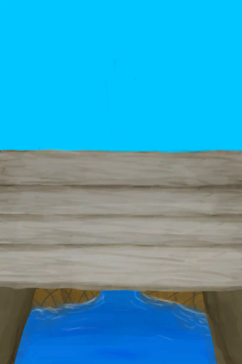

# Improvement  

[

 [Door](Imp_Door.md)](Imp_Door.md)

[

 [Home Sign](Imp_HomeSign.md)](Imp_HomeSign.md)

[

 [Irrigation System](Imp_Irrigation.md)](Imp_Irrigation.md)

[

 [Mud Hut Expansion](Imp_MudHutExpansion.md)](Imp_MudHutExpansion.md)

[

 [Path](Imp_Path.md)](Imp_Path.md)

[

 [Raft Expansion](Imp_RaftExpansion1.md)](Imp_RaftExpansion1.md)

[

 [Raft Expansion](Imp_RaftExpansion2.md)](Imp_RaftExpansion2.md)

[

 [Sea Trophy](Imp_SeaTrophy.md)](Imp_SeaTrophy.md)

[

 [Shed Expansion](Imp_ShedExpansion.md)](Imp_ShedExpansion.md)

[

 [Stitched-Hide Floor](Imp_RaftStitchedHideFloor.md)](Imp_RaftStitchedHideFloor.md)

[

 [Stitched-Hide Floor](Imp_StitchedHideFloor.md)](Imp_StitchedHideFloor.md)

[

 [Stone Hut Expansion](Imp_StoneHutExpansion.md)](Imp_StoneHutExpansion.md)

[

 [Trapping Fences](Imp_TrappingFences.md)](Imp_TrappingFences.md)

[

 [White Washed Walls](Imp_WhiteWashedWalls.md)](Imp_WhiteWashedWalls.md)

[Windcatcher](Imp_Windcatcher.md)

  
  

