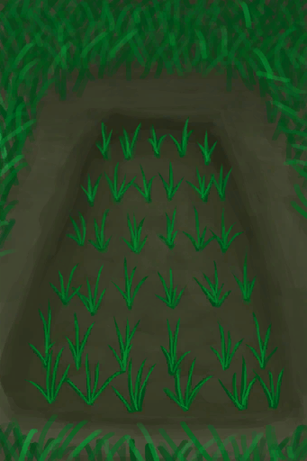

# “Container Reservoir”  
<table class="table table-bordered" data-toggle="table"  ><thead style=""><tr ><th  style="text-align:left;vertical-align:top;"  >Name</th><th  style="text-align:left;vertical-align:top;"  >LiquidCapacity</th><th  style="text-align:left;vertical-align:top;"  >Sealed</th></tr></thead><tr ><td  style="text-align:left;vertical-align:top;"  >[

[Reservoir](WaterReservoir.md)](WaterReservoir.md)</td><td  style="text-align:left;vertical-align:top;"  >12000 (40portions)</td><td  style="text-align:left;vertical-align:top;"  >❌</td></tr><tr ><td  style="text-align:left;vertical-align:top;"  >[

[Reservoir(Full)](WaterReservoirFull.md)](WaterReservoirFull.md)</td><td  style="text-align:left;vertical-align:top;"  >12000 (40portions)</td><td  style="text-align:left;vertical-align:top;"  >❌</td></tr><tr ><td  style="text-align:left;vertical-align:top;"  >[

[Reservoir (irrigating)](WaterReservoirIrrigating.md)](WaterReservoirIrrigating.md)</td><td  style="text-align:left;vertical-align:top;"  >12000 (40portions)</td><td  style="text-align:left;vertical-align:top;"  >❌</td></tr><tr ><td  style="text-align:left;vertical-align:top;"  >[

[Dry Puddle(Wetlands)](Puddle.md)](Puddle.md)</td><td  style="text-align:left;vertical-align:top;"  >6000 (20portions)</td><td  style="text-align:left;vertical-align:top;"  >❌</td></tr><tr ><td  style="text-align:left;vertical-align:top;"  >[

[Watering Trough](WateringTrough.md)](WateringTrough.md)</td><td  style="text-align:left;vertical-align:top;"  >3000 (10portions)</td><td  style="text-align:left;vertical-align:top;"  >❌</td></tr><tr ><td  style="text-align:left;vertical-align:top;"  >[

[Rain Catcher](RainCatcher.md)](RainCatcher.md)</td><td  style="text-align:left;vertical-align:top;"  >3000 (10portions)</td><td  style="text-align:left;vertical-align:top;"  >❌</td></tr><tr ><td  style="text-align:left;vertical-align:top;"  >[

[Rice Paddy](RicePaddy.md)](RicePaddy.md)</td><td  style="text-align:left;vertical-align:top;"  >2000 (6.666666666666667portions)</td><td  style="text-align:left;vertical-align:top;"  >❌</td></tr><tr ><td  style="text-align:left;vertical-align:top;"  >[

[Empty Rice Paddy(Empty)](RicePaddyEmpty.md)](RicePaddyEmpty.md)</td><td  style="text-align:left;vertical-align:top;"  >2000 (6.666666666666667portions)</td><td  style="text-align:left;vertical-align:top;"  >❌</td></tr></tbody></table>  
  

