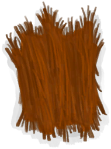
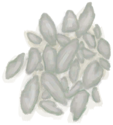

# “Cookable”  

<a href="BarkCinchona.md" style="color:black">Cinchona Bark</a>

<a href="BarkCinchonaDried.md" style="color:black">Dried Cinchona Bark</a>

<a href="ClayBowlUnfired.md" style="color:black">Unfired Clay Bowl</a>

<a href="ClayFirePitUnfired.md" style="color:black">Unfired Clay Fire Pit</a>

<a href="ClayJar.md" style="color:black">Clay Jar</a>

<a href="ClayJarJasmine.md" style="color:black">Jasmine Flowers</a>

<a href="ClayVaseUnfinished.md" style="color:black">Unfinished Clay Vase</a>

<a href="ClayVaseUnfired.md" style="color:black">Unfired Clay Vase</a>

<a href="CookingPot.md" style="color:black">Cooking Pot</a>

<a href="CopperJar.md" style="color:black">Copper Jar</a>

<a href="GlazedVaseUnfired.md" style="color:black">Unfired Glazed Vase</a>

<a href="AlienNodule.md" style="color:black">Alien Nodule</a>

<a href="Banana.md" style="color:black">Banana</a>

<a href="BananaStem.md" style="color:black">Banana Stem</a>

<a href="Bat.md" style="color:black">Dead Bat</a>

<a href="BatCooked.md" style="color:black">Roasted Bat</a>

<a href="BeeHoneycomb.md" style="color:black">Honeycomb</a>

<a href="BirdMeat.md" style="color:black">Bird Meat</a>

<a href="BirdMeatCooked.md" style="color:black">Cooked Bird Meat</a>

<a href="BirdMeatSmoked.md" style="color:black">Smoked Bird Meat</a>

<a href="BoarMeat.md" style="color:black">Boar Meat</a>

<a href="BoarMeatCooked.md" style="color:black">Cooked Boar Meat</a>

<a href="BoarMeatDried.md" style="color:black">Dried Boar Meat</a>

<a href="BoarMeatSalted.md" style="color:black">Cured Boar Meat</a>

<a href="BoarMeatSaltedDrying.md" style="color:black">Drying Boar Meat</a>

<a href="BoarMeatSmoked.md" style="color:black">Smoked Boar Meat</a>

<a href="Bonefish.md" style="color:black">Bonefish</a>

<a href="BonefishCooked.md" style="color:black">Cooked Bonefish</a>

<a href="BonefishMeat.md" style="color:black">Bonefish Meat</a>

<a href="BonefishSmoked.md" style="color:black">Smoked Bonefish</a>

<a href="CharredRemains.md" style="color:black">Charred Remains</a>

<a href="Chilies.md" style="color:black">Chillies</a>

<a href="ChiliesDried.md" style="color:black">Dried Chilies</a>

<a href="CobraDead.md" style="color:black">Dead Cobra</a>

<a href="CoconutMeat.md" style="color:black">Coconut Meat</a>

<a href="CoconutMeatCooked.md" style="color:black">Roasted Coconut Meat</a>

<a href="CoffeeBeans.md" style="color:black">Coffee Beans</a>

<a href="CoffeeBerries.md" style="color:black">Coffee Berries</a>

<a href="CoffeeBerryPulp.md" style="color:black">Coffee Berry Pulp</a>

<a href="CoffeeRoastedBeans.md" style="color:black">Roasted Coffee Beans</a>

<a href="ConchMeat.md" style="color:black">Conch Meat</a>

<a href="ConchMeatCooked.md" style="color:black">Cooked Conch Meat</a>

<a href="ConchMeatSoft.md" style="color:black">Soft Conch Meat</a>

<a href="ConchMeatSoftCooked.md" style="color:black">Cooked Soft Conch Meat</a>

<a href="Crab.md" style="color:black">Crab</a>

<a href="CrabCooked.md" style="color:black">Cooked Crab</a>

<a href="Egg.md" style="color:black">Egg</a>

<a href="EggBoiled.md" style="color:black">Boiled Egg</a>

<a href="EggCooked.md" style="color:black">Roasted Egg</a>

<a href="EggPartridgeFertilized.md" style="color:black">Fertilized Egg</a>

<a href="FeedBird.md" style="color:black">Bird Feed</a>

<a href="FeedBoar.md" style="color:black">FeedBoar_CardName</a>

<a href="FeedGoat.md" style="color:black">Goat Feed</a>

<a href="FishDried.md" style="color:black">Dried Fish</a>

<a href="FishSalted.md" style="color:black">Salted Fish</a>

<a href="FishSaltedDrying.md" style="color:black">Drying Salted Fish</a>

<a href="FishScraps.md" style="color:black">Fish Scraps</a>

<a href="FishScrapsCooked.md" style="color:black">Cooked Fish Scraps</a>

<a href="GoatMeat.md" style="color:black">Goat Meat</a>

<a href="GoatMeatCooked.md" style="color:black">Cooked Goat Meat</a>

<a href="GoatMeatDried.md" style="color:black">Dried Goat Meat</a>

<a href="GoatMeatSalted.md" style="color:black">Cured Goat Meat</a>

<a href="GoatMeatSaltedDrying.md" style="color:black">Drying Goat Meat</a>

<a href="GoatMeatSmoked.md" style="color:black">Smoked Goat Meat</a>

<a href="Goatfish.md" style="color:black">Goatfish</a>

<a href="GoatfishCooked.md" style="color:black">Cooked Goatfish</a>

<a href="GoatfishSmoked.md" style="color:black">Smoked Goatfish</a>

<a href="Grouper.md" style="color:black">Grouper</a>

<a href="GrouperMeat.md" style="color:black">Grouper Meat</a>

<a href="GrouperMeatCooked.md" style="color:black">Cooked Grouper</a>

<a href="GrouperMeatSmoked.md" style="color:black">Smoked Grouper</a>

<a href="Herring.md" style="color:black">Herring</a>

<a href="HerringCooked.md" style="color:black">Cooked Herring</a>

<a href="HerringSmoked.md" style="color:black">Smoked Herring</a>

<a href="JujubeFruits.md" style="color:black">Jujube Fruits</a>

<a href="KingThreadfin.md" style="color:black">King Threadfin</a>

<a href="Lizard.md" style="color:black">Lizard</a>

<a href="LizardCooked.md" style="color:black">Roasted Lizard</a>

<a href="MacaqueMeat.md" style="color:black">Macaque Meat</a>

<a href="MacaqueMeatCooked.md" style="color:black">Cooked Macaque Meat</a>

<a href="MacaqueMeatDried.md" style="color:black">Dried Macaque Meat</a>

<a href="MacaqueMeatSalted.md" style="color:black">Cured Macaque Meat</a>

<a href="MacaqueMeatSaltedDrying.md" style="color:black">Drying Macaque Meat</a>

<a href="MacaqueMeatSmoked.md" style="color:black">Smoked Macaque Meat</a>

<a href="Mango.md" style="color:black">Mango</a>

<a href="BoneBroth.md" style="color:black">Bone Broth</a>

<a href="BoneBrothUncooked.md" style="color:black">Uncooked Bone Broth</a>

<a href="ButterBakedOystersCooked.md" style="color:black">Butter Baked Oysters</a>

<a href="ButterBakedOystersUncooked.md" style="color:black">Uncooked Oysters</a>

<a href="CandiedGinger.md" style="color:black">Candied Ginger</a>

<a href="CandiedGingerCooked.md" style="color:black">Candied Ginger</a>

<a href="CandiedGingerUncooked.md" style="color:black">Uncooked Candied Ginger</a>

<a href="Cheese.md" style="color:black">Goat Cheese</a>

<a href="ChickenSandwich.md" style="color:black">Chicken Sandwich</a>

<a href="Chocolate.md" style="color:black">Chocolate</a>

<a href="CoconutFish.md" style="color:black">Coconut Fish</a>

<a href="CoconutFishUncooked.md" style="color:black">Uncooked Coconut Fish</a>

<a href="DrunkenCrab.md" style="color:black">Drunken Crab</a>

<a href="DrunkenCrabUncooked.md" style="color:black">Uncooked Drunken Crab</a>

<a href="EggFriedRice.md" style="color:black">Egg Fried Rice</a>

<a href="EggFriedRiceUncooked.md" style="color:black">Uncooked Egg Fried Rice</a>

<a href="FishNChips.md" style="color:black">Fish N' Chips</a>

<a href="FishNChipsUncooked.md" style="color:black">Uncooked Fish N' Chips</a>

<a href="FishOmelette.md" style="color:black">Fish Omelette</a>

<a href="FishOmeletteUncooked.md" style="color:black">Uncooked Fish Omelette</a>

<a href="FishTaco.md" style="color:black">Fish Taco</a>

<a href="FriedBanana.md" style="color:black">Fried Banana</a>

<a href="FriedBananasCooked.md" style="color:black">Cooked Fried Bananas</a>

<a href="FriedBananasUncooked.md" style="color:black">Uncooked Fried Bananas</a>

<a href="FriedPuffballs.md" style="color:black">Fried Puffballs</a>

<a href="FriedPuffballsUncooked.md" style="color:black">Uncooked Fried Puffballs</a>

<a href="GlueCooked.md" style="color:black">Cooked Glue</a>

<a href="GlueUncooked.md" style="color:black">Uncooked Glue</a>

<a href="GoatStew.md" style="color:black">Goat Stew</a>

<a href="GoatStewUncooked.md" style="color:black">Uncooked Goat Stew</a>

<a href="HeartyFeast.md" style="color:black">Hearty Feast</a>

<a href="HeartyFeastUncooked.md" style="color:black">Uncooked Hearty Feast</a>

<a href="HoneyCandy.md" style="color:black">Honey Candy</a>

<a href="HoneyCandyCooked.md" style="color:black">Honey Candy</a>

<a href="HoneyCandyUncooked.md" style="color:black">Uncooked Honey Candy</a>

<a href="HoneyGlazedPork.md" style="color:black">Honey Glazed Pork</a>

<a href="HoneyGlazedPorkUncooked.md" style="color:black">Uncooked Honey Glazed Pork</a>

<a href="IslandChicken.md" style="color:black">Island Chicken</a>

<a href="IslandChickenUncooked.md" style="color:black">Uncooked Island Chicken</a>

<a href="JungleSalad.md" style="color:black">Jungle Salad</a>

<a href="LizardFry.md" style="color:black">Lizard Fry</a>

<a href="LizardFryUncooked.md" style="color:black">Uncooked Lizard Fry</a>

<a href="MacaqueSkewers.md" style="color:black">Macaque Skewers</a>

<a href="MacaqueSkewersUncooked.md" style="color:black">Uncooked Macaque Skewers</a>

<a href="ProteinBar.md" style="color:black">Protein Bar</a>

<a href="ProteinBarUncooked.md" style="color:black">Uncooked Protein Bars</a>

<a href="ProteinBarsCooked.md" style="color:black">Cooked Protein Bars</a>

<a href="SagoCake.md" style="color:black">Sago Cake</a>

<a href="SagoCakeUncooked.md" style="color:black">Uncooked Sago Cake</a>

<a href="SagoSlime.md" style="color:black">Sago Slime</a>

<a href="SagoSlimeCooked.md" style="color:black">Cooked Sago Slime</a>

<a href="SagoSlimeUncooked.md" style="color:black">Uncooked Sago Slime</a>

<a href="SeafoodCup.md" style="color:black">Seafood Cup</a>

<a href="VitriolUncooked.md" style="color:black">Vitriol Mix</a>

<a href="YamCurry.md" style="color:black">Yam Curry</a>

<a href="YamCurryUncooked.md" style="color:black">Uncooked Yam Curry</a>

<a href="YamJamCooked.md" style="color:black">Cooked Yam Jam</a>

<a href="YamJamUncooked.md" style="color:black">Uncooked Yam Jam</a>

<a href="MonitorMeat.md" style="color:black">Lizard Meat</a>

<a href="MonitorMeatCooked.md" style="color:black">Cooked Lizard Meat</a>

<a href="MonitorMeatDried.md" style="color:black">Dried Lizard Meat</a>

<a href="MonitorMeatSalted.md" style="color:black">Cured Lizard Meat</a>

<a href="MonitorMeatSaltedDrying.md" style="color:black">Drying Lizard Meat</a>

<a href="MonitorMeatSmoked.md" style="color:black">Smoked Lizard Meat</a>

<a href="Mouse.md" style="color:black">Dead Mouse</a>

<a href="MouseCooked.md" style="color:black">Roasted Mouse</a>

<a href="MouseSkinned.md" style="color:black">Skinned Mouse</a>

<a href="Mudskipper.md" style="color:black">Mudskipper</a>

<a href="MudskipperCooked.md" style="color:black">Roasted Mudskipper</a>

<a href="NipaSeeds.md" style="color:black">Nipa Seeds</a>

<a href="OysterMeat.md" style="color:black">Oyster Meat</a>

<a href="OysterMeatBaked.md" style="color:black">Butter Baked Oyster</a>

<a href="OysterMeatCooked.md" style="color:black">Cooked Oyster</a>

<a href="ParrotFish.md" style="color:black">Parrot Fish</a>

<a href="ParrotFishCooked.md" style="color:black">Cooked Parrot Fish</a>

<a href="ParrotFishSmoked.md" style="color:black">Smoked Parrot Fish</a>

<a href="PartridgeChickDead.md" style="color:black">Dead Chick</a>

<a href="Prawns.md" style="color:black">Prawns</a>

<a href="PrawnsCooked.md" style="color:black">Roasted Prawns</a>

<a href="RiceCooked.md" style="color:black">Rice</a>

<a href="RiceGrains.md" style="color:black">Rice Grain</a>

<a href="SagoFlatbread.md" style="color:black">Sago Flatbread</a>

<a href="SagoFlatbreadHoney.md" style="color:black">Sago Flatbread with Honey</a>

<a href="SagoFlatbreadJam.md" style="color:black">Sago Flatbread with Jam</a>

<a href="SagoFlour.md" style="color:black">Sago Flour</a>

<a href="SeaKraitDead.md" style="color:black">Dead Sea Krait</a>

<a href="SeahoundCooked.md" style="color:black">Cooked Seahound</a>

<a href="Seahoundmeat.md" style="color:black">Seahound Meat</a>

<a href="Seaweed.md" style="color:black">Seaweed</a>

<a href="SharkCooked.md" style="color:black">Cooked Shark</a>

<a href="SharkMeat.md" style="color:black">Shark Meat</a>

<a href="SharkSmoked.md" style="color:black">Smoked Shark</a>

<a href="SnakeCooked.md" style="color:black">Cooked Snake Meat</a>

<a href="SnakeSkinned.md" style="color:black">Skinned Snake</a>

<a href="Sugar.md" style="color:black">Sugar</a>

<a href="Sushi.md" style="color:black">Sushi</a>

<a href="ThreadfinCooked.md" style="color:black">Cooked Threadfin</a>

<a href="ThreadfinMeat.md" style="color:black">Threadfin Meat</a>

<a href="ThreadfinSmoked.md" style="color:black">Smoked Threadfin</a>

<a href="TropicalAlmondKernels.md" style="color:black">Tropical Almond Kernels</a>

<a href="TropicalAlmondsRoasted.md" style="color:black">Roasted Tropical Almond</a>

<a href="UrchinMeat.md" style="color:black">Urchin Meat</a>

<a href="UrchinMeatCooked.md" style="color:black">Cooked Urchin</a>

<a href="Glue.md" style="color:black">Glue</a>

<a href="GlueDry.md" style="color:black">Dry Glue</a>

<a href="Stone.md" style="color:black">Stone</a>

<a href="StoneBurnt.md" style="color:black">Burnt Stone</a>

  
  

