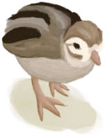
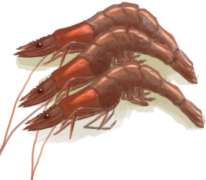

# “Feed Weak”  

<a href="BananaStem.md" style="color:black">Banana Stem</a>

<a href="ChinaRoseFlowers.md" style="color:black">China Rose</a>

<a href="JasmineFlowers.md" style="color:black">Jasmine Flowers</a>

<a href="JasmineFlowersGround.md" style="color:black">Ground Jasmine Flowers</a>

<a href="Lizard.md" style="color:black">Lizard</a>

<a href="LizardCooked.md" style="color:black">Roasted Lizard</a>

<a href="MagicMushrooms.md" style="color:black">Magic Mushrooms</a>

<a href="Mouse.md" style="color:black">Dead Mouse</a>

<a href="MouseCooked.md" style="color:black">Roasted Mouse</a>

<a href="MouseSkinned.md" style="color:black">Skinned Mouse</a>

<a href="OysterMeat.md" style="color:black">Oyster Meat</a>

<a href="OysterMeatBaked.md" style="color:black">Butter Baked Oyster</a>

<a href="OysterMeatCooked.md" style="color:black">Cooked Oyster</a>

<a href="PartridgeChick.md" style="color:black">Chick</a>

<a href="PartridgeChickDead.md" style="color:black">Dead Chick</a>

<a href="Prawns.md" style="color:black">Prawns</a>

<a href="PrawnsCooked.md" style="color:black">Roasted Prawns</a>

<a href="Rennet.md" style="color:black">Rennet</a>

<a href="SpiderLilyLeaves.md" style="color:black">Spider Lily Leaves</a>

<a href="SpiderLilyLeavesDried.md" style="color:black">Dried Spider Lily Leaves</a>

  
  

