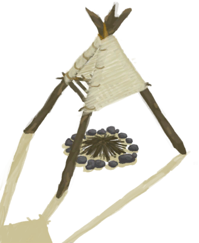

# Special  

<a href="BoarEnclosureMale.md" style="color:black">Boar</a>

<a href="PartridgeChick.md" style="color:black">Chick</a>

<a href="ClayFirePit.md" style="color:black">Clay Fire Pit</a>

<a href="GasCookerOn.md" style="color:black">Gas Cooker</a>

<a href="GoatEnclosureFemale.md" style="color:black">Goat</a>

<a href="GoatEnclosureKid.md" style="color:black">Juvenile Goat</a>

<a href="GoatEnclosureLactating.md" style="color:black">Lactating Goat</a>

<a href="GoatEnclosureMale.md" style="color:black">Male Goat</a>

<a href="PartridgeMaleEnclosure.md" style="color:black">Male Partridge</a>

<a href="PartridgeFemaleEnclosure.md" style="color:black">Partridge</a>

<a href="BoarEnclosurePiglet.md" style="color:black">Piglet</a>

<a href="SandCastle.md" style="color:black">Sand Castle</a>

<a href="Smoker.md" style="color:black">Smoker</a>

<a href="SmokerExtinguished.md" style="color:black">Smoker</a>

<a href="SmokerExtinguishedPlastic.md" style="color:black">Smoker</a>

<a href="SmokerNoFire.md" style="color:black">Smoker</a>

<a href="SmokerNoFirePlastic.md" style="color:black">Smoker</a>

<a href="SmokerPlastic.md" style="color:black">Smoker</a>

<a href="SmokerFrame.md" style="color:black">Smoker Frame</a>

<a href="BoarEnclosureFemale.md" style="color:black">Sow</a>

<a href="TV_SupplyCapsule.md" style="color:black">Supply Capsule</a>

  
  

