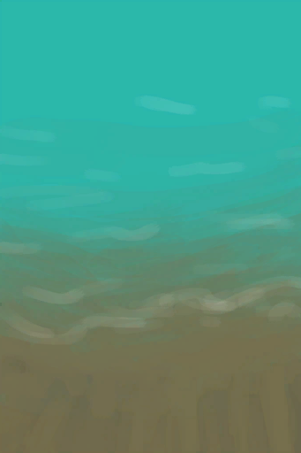
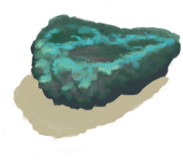
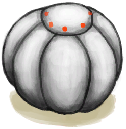
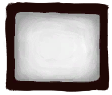
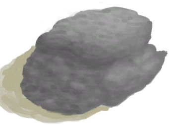
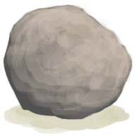

# 酸湖  
> 一池酸液，这儿的空气也有毒。  
  

<a href="AcidLake.md" style="color:black">酸湖</a>

<a href="Volcano.md" style="color:black">火山</a>

<a href="AcidLakePuddle.md" style="color:black">干涸酸湖</a>

  
  
<table class="table table-bordered" data-toggle="table"  data-show-header="false"><thead style="display:none"><tr ><th  style="width:50%;text-align:left;vertical-align:top;"  >title</th><th  style="width:50%;text-align:left;vertical-align:top;"  ></th></tr></thead><tr ><td  style="width:50%;text-align:left;vertical-align:top;"  >** 区域唯一 **  **环境：**[火山(环境)](Env_AcidLake.md)  **标签：**	[“可布置陷阱的地点”](tag_SnareCompatible.md)  ** 环境效果: ** [

[体感温度](TemperaturePerceived.md)](TemperaturePerceived.md)<b>+10</b> [

[淋雨](RainExposure.md)](RainExposure.md) [

[绝热](InsulationHeat.md)](InsulationHeat.md) [

[空气毒性](AirToxicity.md)](AirToxicity.md)<b>+6</b>  ** 可改造项目: ** [小径](Imp_Path.md)</td><td  style="width:50%;text-align:left;vertical-align:top;"  >岛上<b>火山地区</b>里的一个酸性湖泊。那里的空气毒性很高，但有多个硫磺喷口，以及大量的<b>硫酸</b>。 如果你决定访问这里，一定要带上防毒面具再来。</td></tr></tbody></table>  
  
## 探索  
<table class="table table-bordered" data-toggle="table"  ><thead style=""><tr ><th  style="text-align:left;vertical-align:top;"  >进度</th><th  style="text-align:left;vertical-align:top;"  >目的地</th></tr></thead><tr ><td  style="text-align:left;vertical-align:top;"  >33%</td><td  style="text-align:left;vertical-align:top;"  >[硫磺喷口(火山)](VentBrimstone.md)</td></tr><tr ><td  style="text-align:left;vertical-align:top;"  >66%</td><td  style="text-align:left;vertical-align:top;"  >[硫磺喷口(火山)](VentBrimstone.md)</td></tr><tr ><td  style="text-align:left;vertical-align:top;"  >100%</td><td  style="text-align:left;vertical-align:top;"  >[硫磺喷口(火山)](VentBrimstone.md)</td></tr></tbody></table>  
  
## 动作  

<table><tr><td rowspan="2" style="width:200px;text-align:center;font-size:1.3em;font-weight:bold">

探索

15分

</td><td>[“腿部动作(组)”](LegAction.md)</td></tr><tr><td></td></tr><tr><td colspan="2"><b>需求：</b>[

[光亮](Light.md)](Light.md): <b>10-100</b></td></tr><tr><td colspan="2"><b>状态变化：</b>[

[足部损伤](FootDamage.md)](FootDamage.md)<b>+20</b>, [

[耐力](Stamina.md)](Stamina.md)<b>-4</b>, [

[压力](Stress.md)](Stress.md)<b>-10</b>, [

[污垢](Filth.md)](Filth.md)<b>+1</b>, [真人秀 高地 - 探索](TV_HighlandsExplore.md)<b>+1</b></td></tr><tr><td colspan="2">

<table style="margin-bottom:3px;"><tr><td rowspan=2 style="text-align:center" width="80px">
基础权重

0
</td><td style="font-size:0.6em;line-height:0.6em;font-weight:bold">Copper❗限1次</td></tr><tr><td>[

[铜矿石](CopperOre.md)](CopperOre.md)(<b>+1</b>)</td></tr></table>

<table style="margin-bottom:3px;"><tr><td rowspan=2 style="text-align:center" width="80px">
基础权重

800
</td><td style="font-size:0.6em;line-height:0.6em;font-weight:bold">Stones</td></tr><tr><td>[

[石头](Stone.md)](Stone.md)(<b>+1</b>)</td></tr></table>

<table style="margin-bottom:3px;"><tr><td rowspan=2 style="text-align:center" width="80px">
基础权重

0
</td><td style="font-size:0.6em;line-height:0.6em;font-weight:bold">Supply Crate</td></tr><tr><td>[

[补给胶囊](TV_SupplyCapsule.md)](TV_SupplyCapsule.md)(<b>+1</b>)</td></tr><tr><td colspan=2><li>[

[真人秀 高地](TV_Highlands.md)](TV_Highlands.md)为<b>1</b>时权重<b>+100</b></li><li>[真人秀 高地 - 探索](TV_HighlandsExplore.md)为<b>0～9</b>时权重<b>-999</b></li></td></tr></table>

<table style="margin-bottom:3px;"><tr><td rowspan=2 style="text-align:center" width="80px">
基础权重

75
</td><td style="font-size:0.6em;line-height:0.6em;font-weight:bold">Heavy Stone</td></tr><tr><td>[

[大石块](StoneHeavy.md)](StoneHeavy.md)(<b>+1</b>)</td></tr></table>

<table style="margin-bottom:3px;"><tr><td rowspan=2 style="text-align:center" width="80px">
基础权重

200
</td><td style="font-size:0.6em;line-height:0.6em;font-weight:bold">Brimstone Rich Stone</td></tr><tr><td>[

[硫磺石](StoneHeavyBrimstone.md)](StoneHeavyBrimstone.md)(<b>+1</b>)</td></tr></table>

<table style="margin-bottom:3px;"><tr><td rowspan=2 style="text-align:center" width="80px">
基础权重

75
</td><td style="font-size:0.6em;line-height:0.6em;font-weight:bold">Geode❗限3次</td></tr><tr><td>[

[晶洞](Geode.md)](Geode.md)(<b>+1</b>)</td></tr></table>

<table style="margin-bottom:3px;"><tr><td rowspan=2 style="text-align:center" width="80px">
基础权重

0
</td><td style="font-size:0.6em;line-height:0.6em;font-weight:bold">Drone Encounter</td></tr><tr><td>[

[攻击无人机！(事件)](Event_DroneFight.md)](Event_DroneFight.md)(<b>+1</b>)</td></tr><tr><td colspan=2><li>[杀手无人机种群数量](Pop_Drone.md)为<b>1000～4000</b>时权重<b>+25～+100</b></li><li>[

[视力](Myopia.md)](Myopia.md)为<b>1～3</b>时权重<b>+0</b></li><li>[“战斗事件”](tag_FightEvent.md)存在于*手中/面板*，权重<b>-999999</b>(可叠加),</li></td></tr></table>
<button class="btn btn-secondary btn-sm" style="" data-toggle="modal" onclick="setCollectionDataBase64('eyJ0aXRsZSI6IuamgueOh+aooeaLnzog5o6i57SiICjphbjmuZYpIiwiY29sbGVjdGlvbnMiOlt7ImRyb3AiOiI8ZGl2IHN0eWxlPVwid2lkdGg6MjVweDtkaXNwbGF5OmlubGluZS1ibG9jazt0ZXh0LWFsaWduOmNlbnRlclwiPjxpbWcgZGVjb2Rpbmc9XCJhc3luY1wiIHNyYz1cIi4uL3dpa2kvU3ByaXRlL1N0b25lLnBuZ1wiIGhyZWY9XCJhLm1kXCIgc3R5bGU9XCJtYXgtd2lkdGg6MjVweDttYXgtaGVpZ2h0OjI1cHg7XCI+PC9kaXY+55+z5aS0IiwiYmFzZSI6ODAwLCJjb25kaXRpb24iOltdfSx7ImRyb3AiOiI8ZGl2IHN0eWxlPVwid2lkdGg6MjVweDtkaXNwbGF5OmlubGluZS1ibG9jazt0ZXh0LWFsaWduOmNlbnRlclwiPjxpbWcgZGVjb2Rpbmc9XCJhc3luY1wiIHNyYz1cIi4uL3dpa2kvU3ByaXRlL1NhbmRzdG9uZS5wbmdcIiBocmVmPVwiYS5tZFwiIHN0eWxlPVwibWF4LXdpZHRoOjI1cHg7bWF4LWhlaWdodDoyNXB4O1wiPjwvZGl2PuWkp+efs+WdlyIsImJhc2UiOjc1LCJjb25kaXRpb24iOltdfSx7ImRyb3AiOiI8ZGl2IHN0eWxlPVwid2lkdGg6MjVweDtkaXNwbGF5OmlubGluZS1ibG9jazt0ZXh0LWFsaWduOmNlbnRlclwiPjxpbWcgZGVjb2Rpbmc9XCJhc3luY1wiIHNyYz1cIi4uL3dpa2kvU3ByaXRlL0JyaW1zdG9uZUhlYXZ5U3RvbmUucG5nXCIgaHJlZj1cImEubWRcIiBzdHlsZT1cIm1heC13aWR0aDoyNXB4O21heC1oZWlnaHQ6MjVweDtcIj48L2Rpdj7noavno7rnn7MiLCJiYXNlIjoyMDAsImNvbmRpdGlvbiI6W119LHsiZHJvcCI6IjxkaXYgc3R5bGU9XCJ3aWR0aDoyNXB4O2Rpc3BsYXk6aW5saW5lLWJsb2NrO3RleHQtYWxpZ246Y2VudGVyXCI+PGltZyBkZWNvZGluZz1cImFzeW5jXCIgc3JjPVwiLi4vd2lraS9TcHJpdGUvRHJvbmUucG5nXCIgaHJlZj1cImEubWRcIiBzdHlsZT1cIm1heC13aWR0aDoyNXB4O21heC1oZWlnaHQ6MjVweDtcIj48L2Rpdj7mlLvlh7vml6DkurrmnLrvvIEo5LqL5Lu2KSIsImJhc2UiOjAsImNvbmRpdGlvbiI6W3sia2V5IjoiUG9wX0Ryb25lIiwidGl0bGUiOiLmnYDmiYvml6DkurrmnLrnp43nvqTmlbDph48iLCJ0eXBlIjoicmFuZ2UiLCJtYXgiOlswLDQwMDBdLCJyYW5nZSI6WzEwMDAsNDAwMF0sIndlaWdodCI6WzI1LDEwMF0sImRlZmF1bHRWYWx1ZSI6MTAwMCwid2hlbk91dE9mUmFuZ2UiOjB9LHsia2V5IjoiTXlvcGlhIiwidGl0bGUiOiLop4blipsiLCJ0eXBlIjoicmFuZ2UiLCJtYXgiOlswLDNdLCJyYW5nZSI6WzEsM10sIndlaWdodCI6WzAsMF0sImRlZmF1bHRWYWx1ZSI6MSwid2hlbk91dE9mUmFuZ2UiOjB9LHsia2V5IjoidGFnX0ZpZ2h0RXZlbnRfYW1vdW50IiwidGl0bGUiOiLigJzmiJjmlpfkuovku7bigJ0iLCJ0eXBlIjoicmFuZ2UiLCJyYW5nZSI6WzAsMjBdLCJtYXgiOlswLDIwXSwid2VpZ2h0IjpbMCwtMTk5OTk5ODBdLCJkZWZhdWx0VmFsdWUiOjAsIndoZW5PdXRPZlJhbmdlIjowfV19LHsiZHJvcCI6IjxkaXYgc3R5bGU9XCJ3aWR0aDoyNXB4O2Rpc3BsYXk6aW5saW5lLWJsb2NrO3RleHQtYWxpZ246Y2VudGVyXCI+PGltZyBkZWNvZGluZz1cImFzeW5jXCIgc3JjPVwiLi4vd2lraS9TcHJpdGUvQ29wcGVyT3JlLnBuZ1wiIGhyZWY9XCJhLm1kXCIgc3R5bGU9XCJtYXgtd2lkdGg6MjVweDttYXgtaGVpZ2h0OjI1cHg7XCI+PC9kaXY+6ZOc55+/55+zIiwiYmFzZSI6MCwiY29uZGl0aW9uIjpbXSwiaXNMaW1pdCI6dHJ1ZX0seyJkcm9wIjoiPGRpdiBzdHlsZT1cIndpZHRoOjI1cHg7ZGlzcGxheTppbmxpbmUtYmxvY2s7dGV4dC1hbGlnbjpjZW50ZXJcIj48aW1nIGRlY29kaW5nPVwiYXN5bmNcIiBzcmM9XCIuLi93aWtpL1Nwcml0ZS9UVkNyYXRlLnBuZ1wiIGhyZWY9XCJhLm1kXCIgc3R5bGU9XCJtYXgtd2lkdGg6MjVweDttYXgtaGVpZ2h0OjI1cHg7XCI+PC9kaXY+6KGl57uZ6IO25ZuKIiwiYmFzZSI6MCwiY29uZGl0aW9uIjpbeyJrZXkiOiJUVl9IaWdobGFuZHMiLCJ0aXRsZSI6Iuecn+S6uuengCDpq5jlnLAiLCJ0eXBlIjoicmFuZ2UiLCJtYXgiOlswLDFdLCJyYW5nZSI6WzEsMV0sIndlaWdodCI6WzEwMCwxMDBdLCJkZWZhdWx0VmFsdWUiOjEsIndoZW5PdXRPZlJhbmdlIjowfSx7ImtleSI6IlRWX0hpZ2hsYW5kc0V4cGxvcmUiLCJ0aXRsZSI6Iuecn+S6uuengCDpq5jlnLAgLSDmjqLntKIiLCJ0eXBlIjoicmFuZ2UiLCJtYXgiOlswLDIwXSwicmFuZ2UiOlswLDldLCJ3ZWlnaHQiOlstOTk5LC05OTldLCJkZWZhdWx0VmFsdWUiOjAsIndoZW5PdXRPZlJhbmdlIjowfV0sImlzTGltaXQiOnRydWV9LHsiZHJvcCI6IjxkaXYgc3R5bGU9XCJ3aWR0aDoyNXB4O2Rpc3BsYXk6aW5saW5lLWJsb2NrO3RleHQtYWxpZ246Y2VudGVyXCI+PGltZyBkZWNvZGluZz1cImFzeW5jXCIgc3JjPVwiLi4vd2lraS9TcHJpdGUvR2VvZGUucG5nXCIgaHJlZj1cImEubWRcIiBzdHlsZT1cIm1heC13aWR0aDoyNXB4O21heC1oZWlnaHQ6MjVweDtcIj48L2Rpdj7mmbbmtJ4iLCJiYXNlIjo3NSwiY29uZGl0aW9uIjpbXSwiaXNMaW1pdCI6dHJ1ZX1dfQ==')" data-target="#modelCollectionSimulator">概率模拟</button>
</td></tr></table>
  
  
  

