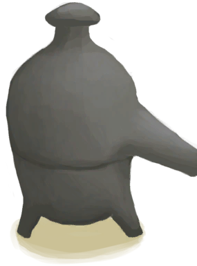

# 蒸馏器  
> 将海水蒸馏成淡水。  
   
> 一种实用的装置，通过在蒸馏过程中控制加热温度来提取不同的物质。  它可以从任何水（包括海水）中蒸馏出<b>饮用水</b>，还能制造<b>浓硝酸</b>：炸药的必备原料。 使用它的方式是先把一个空容器放在里面，然后将不适合饮用的水或<b>硝石溶液</b>倒入其中，最后再对其加热。产生的液体会随着时间逐渐滴落在空容器中。  
  
<table class="table table-bordered"><tbody><tr ><td  style="width:80%;text-align:left;vertical-align:top;" >** 不可删除 **  **标签：**	[“火”](tag_Fire.md)  **槽位：**1  **过滤器：**[“储水容器”](tag_WaterContainer.md)  **可使用次数：**0</td><td  style="width:20%;text-align:left;vertical-align:top;" >

</td></tr></tbody></tbody></table>  
  
## 获取来源  
<table class="table table-bordered"><thead><tr ><th  style="text-align:left;vertical-align:top;" >来源</th><th  style="text-align:left;vertical-align:top;" >操作</th></tr></thead><tr ><td  style="text-align:left;vertical-align:top;" >[

[蒸馏器(开)](AlembicOn.md)](AlembicOn.md)</td><td  style="text-align:left;vertical-align:top;" >熄灭火焰</td></tr><tr ><td  style="text-align:left;vertical-align:top;" >[

[蒸馏器(开)](AlembicOn.md)](AlembicOn.md)</td><td  style="text-align:left;vertical-align:top;" >转化</td></tr><tr ><td  style="text-align:left;vertical-align:top;" >[

[营火(熄灭)](CampfireExtinguished.md)](CampfireExtinguished.md)</td><td  style="text-align:left;vertical-align:top;" >放置蒸馏器 ** 拖入：**[蒸馏器](AlembicUndeployed.md)</td></tr></tbody></table>  
  
## 动作  
<table class="table table-bordered"><thead><tr ><th  style="text-align:left;vertical-align:top;" >动作</th><th  style="text-align:left;vertical-align:top;" >耗时</th><th  style="text-align:left;vertical-align:top;" >条件</th><th  style="text-align:left;vertical-align:top;" >变化</th><th  style="text-align:left;vertical-align:top;" >状态</th></tr></thead><tr ><td  style="text-align:left;vertical-align:top;" >取出木炭和灰烬 </td><td  style="text-align:left;vertical-align:top;" >15分</td><td  style="text-align:left;vertical-align:top;" ></td><td  style="text-align:left;vertical-align:top;" >** 自身：** 燃料  -16(-16.67%) 

  -16(-100%)  ** 获得： ** ** [Charcoal]  **   [

[木炭](Charcoal.md)](Charcoal.md)(+1)   [

[灰烬](Ash.md)](Ash.md)(+2) 基础权重：1</td><td  style="text-align:left;vertical-align:top;" ></td></tr><tr ><td  style="text-align:left;vertical-align:top;" >取出 </td><td  style="text-align:left;vertical-align:top;" >-</td><td  style="text-align:left;vertical-align:top;" ></td><td  style="text-align:left;vertical-align:top;" >** 自身：** → [

[营火(熄灭)](CampfireExtinguished.md)](CampfireExtinguished.md)  ** 获得： ** ** [Alembic]  **   [

[蒸馏器](AlembicUndeployed.md)](AlembicUndeployed.md)(+1) </td><td  style="text-align:left;vertical-align:top;" ></td></tr></tbody></table>  
  
## 可拖入  
<table class="table table-bordered"><thead><tr ><th  style="text-align:left;vertical-align:top;" >使用</th><th  style="text-align:left;vertical-align:top;" >动作</th><th  style="text-align:left;vertical-align:top;" >耗时</th><th  style="text-align:left;vertical-align:top;" >条件</th><th  style="text-align:left;vertical-align:top;" >变化</th><th  style="text-align:left;vertical-align:top;" >玩家状态</th></tr></thead><tr ><td  style="text-align:left;vertical-align:top;" >[

[椰子壳](CoconutShell.md)](CoconutShell.md)</td><td  style="text-align:left;vertical-align:top;" >添入椰子壳 </td><td  style="text-align:left;vertical-align:top;" >-</td><td  style="text-align:left;vertical-align:top;" ></td><td  style="text-align:left;vertical-align:top;" >** 自身: ** 燃料  +3(3.13%)  ** 使用物: ** →消失</td><td  style="text-align:left;vertical-align:top;" ></td></tr><tr ><td  style="text-align:left;vertical-align:top;" >[

[木材](Wood.md)](Wood.md)</td><td  style="text-align:left;vertical-align:top;" >添入柴火 </td><td  style="text-align:left;vertical-align:top;" >-</td><td  style="text-align:left;vertical-align:top;" ></td><td  style="text-align:left;vertical-align:top;" >** 自身: ** 燃料  +28(29.17%)  ** 使用物: ** →消失</td><td  style="text-align:left;vertical-align:top;" ></td></tr><tr ><td  style="text-align:left;vertical-align:top;" >[“燃料”](tag_Fuel.md)</td><td  style="text-align:left;vertical-align:top;" >添入燃料 </td><td  style="text-align:left;vertical-align:top;" >-</td><td  style="text-align:left;vertical-align:top;" ></td><td  style="text-align:left;vertical-align:top;" >** 自身: ** 燃料  +7(7.29%)  ** 使用物: ** →消失</td><td  style="text-align:left;vertical-align:top;" ></td></tr><tr ><td  style="text-align:left;vertical-align:top;" >[

[木炭](Charcoal.md)](Charcoal.md)</td><td  style="text-align:left;vertical-align:top;" >添入木炭 </td><td  style="text-align:left;vertical-align:top;" >-</td><td  style="text-align:left;vertical-align:top;" ></td><td  style="text-align:left;vertical-align:top;" >** 自身: ** 燃料  +7(7.29%) 

  +7(43.75%)  ** 使用物: ** →消失</td><td  style="text-align:left;vertical-align:top;" ></td></tr><tr ><td  style="text-align:left;vertical-align:top;" >[“树叶”](tag_Leaves.md)</td><td  style="text-align:left;vertical-align:top;" >添入树叶 </td><td  style="text-align:left;vertical-align:top;" >-</td><td  style="text-align:left;vertical-align:top;" ></td><td  style="text-align:left;vertical-align:top;" >** 自身: ** 燃料  +2(2.08%)  ** 使用物: ** →消失</td><td  style="text-align:left;vertical-align:top;" ></td></tr><tr ><td  style="text-align:left;vertical-align:top;" >[

[火炭](Embers.md)](Embers.md)</td><td  style="text-align:left;vertical-align:top;" >添入火炭 </td><td  style="text-align:left;vertical-align:top;" >-</td><td  style="text-align:left;vertical-align:top;" ></td><td  style="text-align:left;vertical-align:top;" >** 自身: ** 燃料  +14(14.58%) 

  +14(87.5%)  ** 使用物: ** →消失</td><td  style="text-align:left;vertical-align:top;" ></td></tr><tr ><td  style="text-align:left;vertical-align:top;" >[

[椰子皮](CoconutHusk.md)](CoconutHusk.md)</td><td  style="text-align:left;vertical-align:top;" >添入椰子皮 </td><td  style="text-align:left;vertical-align:top;" >-</td><td  style="text-align:left;vertical-align:top;" ></td><td  style="text-align:left;vertical-align:top;" >** 自身: ** 燃料  +3(3.13%)  ** 使用物: ** →消失</td><td  style="text-align:left;vertical-align:top;" ></td></tr><tr ><td  style="text-align:left;vertical-align:top;" >[

[火种](TinderLit.md)](TinderLit.md)</td><td  style="text-align:left;vertical-align:top;" >点燃 </td><td  style="text-align:left;vertical-align:top;" >-</td><td  style="text-align:left;vertical-align:top;" ></td><td  style="text-align:left;vertical-align:top;" >** 自身: ** → [

[蒸馏器(开)](AlembicOn.md)](AlembicOn.md) 燃料  +1(1.04%)  ** 使用物: ** →消失</td><td  style="text-align:left;vertical-align:top;" ></td></tr><tr ><td  style="text-align:left;vertical-align:top;" >[

[盐水](LQ_WaterSalt.md)](LQ_WaterSalt.md) [

[有毒的水](LQ_WaterToxic.md)](LQ_WaterToxic.md) [

[不安全的水](LQ_WaterUnsafe.md)](LQ_WaterUnsafe.md) [

[灰水](LQ_AshWater.md)](LQ_AshWater.md)</td><td  style="text-align:left;vertical-align:top;" >倒入 </td><td  style="text-align:left;vertical-align:top;" >-</td><td  style="text-align:left;vertical-align:top;" ></td><td  style="text-align:left;vertical-align:top;" >** 自身: ** 水量

  +1200(100%)  ** 使用物: ** 可用次数  +300 含水量  -1200</td><td  style="text-align:left;vertical-align:top;" ></td></tr><tr ><td  style="text-align:left;vertical-align:top;" >[

[硝石溶液](LQ_DissolvedNiter.md)](LQ_DissolvedNiter.md)</td><td  style="text-align:left;vertical-align:top;" >倒入 </td><td  style="text-align:left;vertical-align:top;" >-</td><td  style="text-align:left;vertical-align:top;" ></td><td  style="text-align:left;vertical-align:top;" >** 自身: ** 硝石溶液

  +300(25%)  ** 使用物: ** 可用次数  +300 含水量  -300</td><td  style="text-align:left;vertical-align:top;" ></td></tr></tbody></table>  
  
## 可拖至  

[装有燃料的油桶](JerrycanFuel.md)

  
  
## 属性   
<table class="table table-bordered"><thead><tr ><th  style="text-align:left;vertical-align:top;" >属性</th><th  style="text-align:left;vertical-align:top;" >值</th><th  style="text-align:left;vertical-align:top;" >耗时</th><th  style="text-align:left;vertical-align:top;" >变化</th></tr></thead><tr ><td  style="text-align:left;vertical-align:top;" >水量

</td><td  style="text-align:left;vertical-align:top;" >初始：0 最大：1200</td><td  style="text-align:left;vertical-align:top;" >-</td><td  style="text-align:left;vertical-align:top;" ></td></tr><tr ><td  style="text-align:left;vertical-align:top;" >燃料</td><td  style="text-align:left;vertical-align:top;" >初始：32 最大：96</td><td  style="text-align:left;vertical-align:top;" >-</td><td  style="text-align:left;vertical-align:top;" ></td></tr><tr ><td  style="text-align:left;vertical-align:top;" >

</td><td  style="text-align:left;vertical-align:top;" >初始：0 最大：16</td><td  style="text-align:left;vertical-align:top;" >-</td><td  style="text-align:left;vertical-align:top;" ></td></tr><tr ><td  style="text-align:left;vertical-align:top;" >硝石溶液

</td><td  style="text-align:left;vertical-align:top;" >初始：0 最大：1200</td><td  style="text-align:left;vertical-align:top;" >-</td><td  style="text-align:left;vertical-align:top;" ></td></tr></tbody></table>  
  

