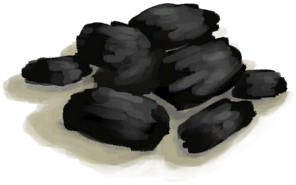

# 蒸馏器  
> 将海水蒸馏成淡水。  
   
> 一种实用的装置，通过在蒸馏过程中控制加热温度来提取不同的物质。  它可以从任何水（包括海水）中蒸馏出<b>饮用水</b>，还能制造<b>浓硝酸</b>：炸药的必备原料。 使用它的方式是先把一个空容器放在里面，然后将不适合饮用的水或<b>硝石溶液</b>倒入其中，最后再对其加热。产生的液体会随着时间逐渐滴落在空容器中。  
  
  蒸馏器  |   图片   
 ----  |  ----:   
 ** 不可删除 **  **标签：**	[“火”](tag_Fire.md)  **槽位：**1  **过滤器：**[“储水容器”](tag_WaterContainer.md)  **可使用次数：**0  ** 效果: ** [保温](InsulationCold.md)+15 [湿度](Wetness.md)加成-2 [光亮](Light.md)+25  |     
  
## 获取来源  
来源  |  操作  
----  |  ----  
[蒸馏器(关)](AlembicOff.md) , [火种](TinderLit.md)  |  点燃  
[营火](Campfire.md) , [蒸馏器](AlembicUndeployed.md)  |  放置蒸馏器  
## 动作  
动作  |  耗时  |  条件  |  变化  |  状态  
----  |  ----  |  ----  |  ----  |  ----  
取出火炭   |  15分  |    |  燃料  -16   -16  ** 获得： ** ** [Embers] **   [火炭](Embers.md)(+1) 基础权重：1   |    
熄灭火焰   |  -  |    |  → [蒸馏器(关)](AlembicOff.md)  |    
取出   |  -  |    |  → [营火](Campfire.md)  ** 获得： ** ** [Alembic] **   [蒸馏器](AlembicUndeployed.md)(+1)   |    
## 可拖入  
使用  |  动作  |  耗时  |  条件  |  变化  |  玩家状态  
----  |  ----  |  ----  |  ----  |  ----  |  ----  
[椰子壳](CoconutShell.md)  |  添入椰子壳   |  -  |    |  ** 自身: ** 燃料 + 3  ** 使用物: ** 消失  |    
[木材](Wood.md)  |  添入柴火   |  -  |    |  ** 自身: ** 燃料 + 28  ** 使用物: ** 消失  |    
[“燃料”](tag_Fuel.md)  |  添入燃料   |  -  |    |  ** 自身: ** 燃料 + 7  ** 使用物: ** 消失  |    
[木炭](Charcoal.md)  |  添入木炭   |  -  |    |  ** 自身: ** 燃料 + 7  + 7  ** 使用物: ** 消失  |    
[枯叶](LeavesDry.md)  |  点燃火绒   |  -  |    |   ** 使用物: ** → [火种](TinderLit.md)  |    
[“树叶”](tag_Leaves.md)  |  添入树叶   |  -  |    |  ** 自身: ** 燃料 + 2  ** 使用物: ** 消失  |    
[盐水](LQ_WaterSalt.md)  |  倒入   |  -  |    |  ** 自身: ** 水量 + 1200  ** 使用物: ** 可用次数 + 300 含水量  -1200  |    
[硝石溶液](LQ_DissolvedNiter.md)  |  倒入   |  -  |    |   ** 使用物: ** 可用次数 + 300 含水量  -300  |    
## 可拖至  
[装有燃料的油桶](JerrycanFuel.md), [熏蜂器(关)](BeeSmokerOff.md)  
## 转化  
放入  |  动作  |  耗时  |  条件  |  变化  |  状态  
----  |  ----  |  ----  |  ----  |  ----  |  ----  
[“灌溉用水”](tag_WaterFresh.md)  |  补充液体  |  15分  |  ** 需要属性：** 水量: 1～1200  |  含水量 + 19  |    
[“储水容器”](tag_WaterContainer.md)  |  加入用于蒸馏水的液体  |  15分  |  ** 需要属性：** 水量: 1～1200  |  ** [water] ** [水](LQ_Water.md)(+1)   |    
[“储水容器”](tag_WaterContainer.md)  |  加入用于蒸馏硝酸的液体  |  15分  |  ** 需要属性：** 硝石溶液: 1～1200  |  ** [Aqua Fortis] ** [浓硝酸](LQ_AquaFortis.md)(+1)   |    
[浓硝酸](LQ_AquaFortis.md)  |  补充液体  |  15分  |  ** 需要属性：** 硝石溶液: 1～1200  |  含水量 + 19  |    
## 属性   
属性  |  值  |  耗时  |  变化  
----  |  ----  |  ----  |  ----  
水量  |  初始：0 最大：1200  |  每15分钟-38 最多需要：7小时54分  |    
燃料  |  初始：32 最大：96  |  每15分钟-1 最多需要：1天  |  ** 到达0时： **  → [蒸馏器(关)](AlembicOff.md)  
  |  初始：0 最大：16  |  每15分钟+1 最多需要：4小时  |    
硝石溶液  |  初始：0 最大：1200  |  每15分钟-38 最多需要：7小时54分  |    
## 被动效果  
名称  |  条件  |  变化(每15分钟)  |  玩家状态  
----  |  ----  |  ----  |  ----  
Hot  |  ** 需要状态：** [遮蔽](Sheltered.md): 1-1  |    |  [体感温度](TemperaturePerceived.md)+10  
