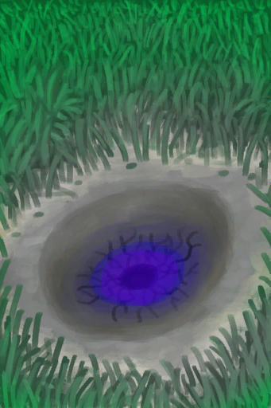

# 陨石坑  
> 从天而降的陨石，有什么从里面长出来了。  
  
<table class="table table-bordered"><tbody><tr ><td  style="width:80%;text-align:left;vertical-align:top;" ></td><td  style="width:20%;text-align:left;vertical-align:top;" >

</td></tr></tbody></tbody></table>  
  
## 获取来源  
<table class="table table-bordered"><thead><tr ><th  style="text-align:left;vertical-align:top;" >来源</th><th  style="text-align:left;vertical-align:top;" >操作</th></tr></thead><tr ><td  style="text-align:left;vertical-align:top;" >[

[小行星撞击！(事件)](Event_AlienCrater.md)](Event_AlienCrater.md)</td><td  style="text-align:left;vertical-align:top;" >继续</td></tr></tbody></table>  
  
## 属性   
<table class="table table-bordered"><thead><tr ><th  style="text-align:left;vertical-align:top;" >属性</th><th  style="text-align:left;vertical-align:top;" >值</th><th  style="text-align:left;vertical-align:top;" >耗时</th><th  style="text-align:left;vertical-align:top;" >变化</th></tr></thead><tr ><td  style="text-align:left;vertical-align:top;" >成熟度

</td><td  style="text-align:left;vertical-align:top;" >初始：288 最大：576</td><td  style="text-align:left;vertical-align:top;" >每15分钟+1 最多需要：6天</td><td  style="text-align:left;vertical-align:top;" >** 到达上限时： ** ** [Alien Growth]  **   [

[外星植物](AlienGrowthCleared.md)](AlienGrowthCleared.md)(+1)  ** 自身 ** 成熟度

  -576(-100%)</td></tr></tbody></table>  
  

