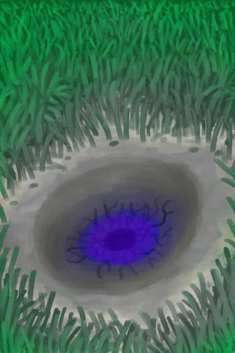

# 陨石坑  
> 从天而降的陨石，有什么从里面长出来了。  
  
<table class="table table-bordered table1204" data-toggle="table"  data-show-header="false"><thead style="display:none"><tr ><th  style="width:50%;"  data-sortable="true"  >title</th><th  style="width:50%;"  ></th></tr></thead><tr ><td  style="width:50%;"  ></td><td  style="width:50%;"  >

<a href="AlienCrater.md" style="color:black">陨石坑</a>

</td></tr></tbody></table>  
  
## 获取来源  

继续

[小行星撞击！(事件)](Event_AlienCrater.md)

  
  
## 属性   

<table style="margin-bottom:0px;"><tr><td style="width:30%;text-align:left; background-color:#FEFEFE;font-size:1.3em;font-weight:bold;">

成熟度</td><td style="font-size:1em;background-color:#FEFEFE">初始：288 , 最大：576 每15分钟+1 , 最多需要：6天</td></tr><tr style="background-color:#FFFFFF"><td colspan=2>** 到达上限时： ** 自身: 成熟度

  <b>-576(-100%)</b> [

[外星植物](AlienGrowthCleared.md)](AlienGrowthCleared.md)(<b>+1</b>)</td></tr></table>
  

