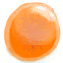

# 外星结节  
> 一种奇怪的外星植物。闻起来很香，不知为何看起来很好吃。  
  
<table class="table table-bordered"><tbody><tr ><td  style="width:80%;text-align:left;vertical-align:top;" >** 不可删除 **  **重量：**25  **标签：**	[“强效食料”](tag_FeedRich.md), [“杂食饲料”](tag_FeedOmnivorous.md), [“可烹饪的”](tag_Cookable.md), [“人类食物”](tag_HumanFood.md)</td><td  style="width:20%;text-align:left;vertical-align:top;" >

</td></tr></tbody></tbody></table>  
  
## 获取来源  
<table class="table table-bordered"><thead><tr ><th  style="text-align:left;vertical-align:top;" >来源</th><th  style="text-align:left;vertical-align:top;" >操作</th></tr></thead><tr ><td  style="text-align:left;vertical-align:top;" >[

[盛开的外星植物](AlienGrowth.md)](AlienGrowth.md)</td><td  style="text-align:left;vertical-align:top;" >采集</td></tr><tr ><td  style="text-align:left;vertical-align:top;" >[

[盛开的外星植物](AlienGrowth.md)](AlienGrowth.md)</td><td  style="text-align:left;vertical-align:top;" >砍倒 ** 拖入：**[“斧”](tag_Axe.md)</td></tr><tr ><td  style="text-align:left;vertical-align:top;" >[

[外星植物](AlienGrowthCleared.md)](AlienGrowthCleared.md)</td><td  style="text-align:left;vertical-align:top;" >砍倒 ** 拖入：**[“斧”](tag_Axe.md)</td></tr></tbody></table>  
  
## 动作  
<table class="table table-bordered"><thead><tr ><th  style="text-align:left;vertical-align:top;" >动作</th><th  style="text-align:left;vertical-align:top;" >耗时</th><th  style="text-align:left;vertical-align:top;" >条件</th><th  style="text-align:left;vertical-align:top;" >变化</th><th  style="text-align:left;vertical-align:top;" >状态</th></tr></thead><tr ><td  style="text-align:left;vertical-align:top;" >食用 [进食动作(组)](EatingAction.md)</td><td  style="text-align:left;vertical-align:top;" >-</td><td  style="text-align:left;vertical-align:top;" ></td><td  style="text-align:left;vertical-align:top;" >** 自身：** →消失</td><td  style="text-align:left;vertical-align:top;" >[

[饱食](Satiation.md)](Satiation.md)+20 [

[胃](Stomach.md)](Stomach.md)+20 [

[水分](Hydration.md)](Hydration.md)+8 [

[压力](Stress.md)](Stress.md)-10 [

[情绪](Morale.md)](Morale.md)+5 [

[污垢](Filth.md)](Filth.md)+5 [

[外星斑点](AlienSpots.md)](AlienSpots.md)+50 [

[外星植物渴求](AlienCravings.md)](AlienCravings.md)-48</td></tr></tbody></table>  
  
## 可拖至  

[猪食槽](BoarFeeder.md)

[猪食槽(空)](BoarFeederEmpty.md)

[母猪](BoarEnclosureFemale.md)

[公猪](BoarEnclosureMale.md)

[小猪](BoarEnclosurePiglet.md)

[母猪](BoarTiedFemale.md)

[公猪](BoarTiedMale.md)

[小猪](BoarTiedPiglet.md)

[祖父](Grandfather.md)

[祖父(健康)](GrandfatherHealthy.md)

  
  
## 属性   
<table class="table table-bordered"><thead><tr ><th  style="text-align:left;vertical-align:top;" >属性</th><th  style="text-align:left;vertical-align:top;" >值</th><th  style="text-align:left;vertical-align:top;" >耗时</th><th  style="text-align:left;vertical-align:top;" >变化</th></tr></thead><tr ><td  style="text-align:left;vertical-align:top;" >耐久</td><td  style="text-align:left;vertical-align:top;" >初始：288 最大：288</td><td  style="text-align:left;vertical-align:top;" >每15分钟-1 最多需要：3天</td><td  style="text-align:left;vertical-align:top;" >** 到达0时： **  ** 自身 ** → [

[外星植物](AlienGrowthCleared.md)](AlienGrowthCleared.md)</td></tr></tbody></table>  
  

