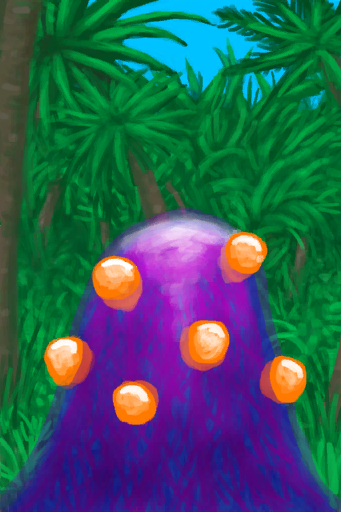

# 外星孢子  
  

<b>基础值: </b> 0 
  

<b>变化范围: </b> 0 ~ 288 
  

<b>基础变化率: </b> 无 
  
  
## 加成值影响因素  
<table class="table table-bordered" data-toggle="table"  ><thead style=""><tr ><th  style="text-align:left;vertical-align:top;"  >来源</th><th  style="text-align:left;vertical-align:top;"  >操作</th><th  style="text-align:left;vertical-align:top;"  >值</th></tr></thead><tr ><td  style="text-align:left;vertical-align:top;"  >

[外星生物](Pk_1_AlienLifeform.md)</td><td  style="text-align:left;vertical-align:top;"  >特质影响</td><td  style="text-align:left;vertical-align:top;"  >加成+1</td></tr></tbody></table>  
  
  
## 可被以下操作改变  
<table class="table table-bordered" data-toggle="table"  ><thead style=""><tr ><th  style="text-align:left;vertical-align:top;"  >来源</th><th  style="text-align:left;vertical-align:top;"  >操作</th><th  style="text-align:left;vertical-align:top;"  data-sortable="true"  >值</th></tr></thead><tr ><td  style="text-align:left;vertical-align:top;"  >[

[外星植物](AlienGrowthCleared.md)](AlienGrowthCleared.md)</td><td  style="text-align:left;vertical-align:top;"  >触发事件</td><td  style="text-align:left;vertical-align:top;"  >-288</td></tr></tbody></table>  
  
  
## 被以下操作需求  
<table class="table table-bordered" data-toggle="table"  ><thead style=""><tr ><th  style="text-align:left;vertical-align:top;"  >来源</th><th  style="text-align:left;vertical-align:top;"  >操作</th><th  style="text-align:left;vertical-align:top;"  data-sortable="true"  >值</th></tr></thead><tr ><td  style="text-align:left;vertical-align:top;"  >[外星植物](AlienGrowthCleared.md)</td><td  style="text-align:left;vertical-align:top;"  >触发事件</td><td  style="text-align:left;vertical-align:top;"  >288</td></tr></tbody></table>  
  
  
## 相关触发器  

<table><tr style="background-color:#F8F8F8"><td><b>一株外星植物！</b></td></tr><tr><td><b>触发条件：</b>[外星孢子](AlienSpores.md): <b>288-288</b></td></tr><tr><td><b>触发后：</b>[外星孢子](AlienSpores.md)<b>-288</b></td></tr><tr><td>[

[外星植物](AlienGrowthCleared.md)](AlienGrowthCleared.md)(<b>+1</b>)</td></tr></table>
  

