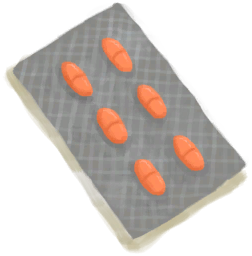

[返回首页](index.md)   |  [查看所有物品](object.md)
# 抗生素  
> 应该能应对感染。  
  
  属性  |   图片   
 ----  |  ----:   
 **重量：**10  **标签：**	[“小的”](tag_Tiny.md)  **可使用次数：**6  |     
  
## 获取来源  
来源  |  操作  
----  |  ----  
[TestDropModifiers_CardName](TestDropModifiers.md)  |  TestDropModifiers_DismantleActions[0].ActionName  
[补给胶囊](TV_SupplyCapsule.md)  |  打开  
## 动作  
动作  |  时间  |  条件  |  变化  |  状态  
----  |  ----  |  ----  |  ----  |  ----  
吃药  |  -  |    |  可用次数  -1   |  [抗生素](AntibioticsEffect.md)+96  
## 变化  
操作  |  值  |  时间  |  变化  
----  |  ----  |  ----  |  ----  
使用次数  |  初始：6  |  -  |    
