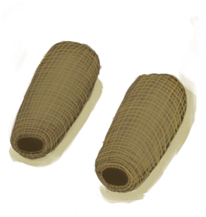

# 护甲  
> 身上衣服的数量和厚度可以帮助你在一定程度上抵御<b>动物和环境</b>的伤害。  如果你要做一些可能会受伤的事情，请考虑先穿上更多更厚的衣服。  
  

<b>基础值: </b> 0 
  

<b>变化范围: </b> 0 ~ 245 
  

<b>基础变化率: </b> 无 
  
  
## 可被以下操作改变  
<table class="table table-bordered" data-toggle="table"  ><thead style=""><tr ><th  style="text-align:left;vertical-align:top;"  >来源</th><th  style="text-align:left;vertical-align:top;"  >操作</th><th  style="text-align:left;vertical-align:top;"  data-sortable="true"  >值</th></tr></thead><tr ><td  style="text-align:left;vertical-align:top;"  >[

[盾牌](Shield.md)](Shield.md)</td><td  style="text-align:left;vertical-align:top;"  >被动效果</td><td  style="text-align:left;vertical-align:top;"  >75</td></tr><tr ><td  style="text-align:left;vertical-align:top;"  >[

[纤维胸甲](FiberCuirass.md)](FiberCuirass.md)</td><td  style="text-align:left;vertical-align:top;"  >被动效果</td><td  style="text-align:left;vertical-align:top;"  >50</td></tr><tr ><td  style="text-align:left;vertical-align:top;"  >[

[纤维甲](FiberArmor.md)](FiberArmor.md)</td><td  style="text-align:left;vertical-align:top;"  >被动效果</td><td  style="text-align:left;vertical-align:top;"  >25</td></tr><tr ><td  style="text-align:left;vertical-align:top;"  >[

[纤维护腕](FiberBracers.md)](FiberBracers.md)</td><td  style="text-align:left;vertical-align:top;"  >被动效果</td><td  style="text-align:left;vertical-align:top;"  >25</td></tr><tr ><td  style="text-align:left;vertical-align:top;"  >[

[纤维头盔](FiberHelmet.md)](FiberHelmet.md)</td><td  style="text-align:left;vertical-align:top;"  >被动效果</td><td  style="text-align:left;vertical-align:top;"  >25</td></tr><tr ><td  style="text-align:left;vertical-align:top;"  >[

[防毒面具](GasMaskRustic.md)](GasMaskRustic.md)</td><td  style="text-align:left;vertical-align:top;"  >被动效果</td><td  style="text-align:left;vertical-align:top;"  >25</td></tr><tr ><td  style="text-align:left;vertical-align:top;"  >[

[皮护腕](LeatherBracers.md)](LeatherBracers.md)</td><td  style="text-align:left;vertical-align:top;"  >被动效果</td><td  style="text-align:left;vertical-align:top;"  >25</td></tr><tr ><td  style="text-align:left;vertical-align:top;"  >[

[皮头盔](LeatherHelmet.md)](LeatherHelmet.md)</td><td  style="text-align:left;vertical-align:top;"  >被动效果</td><td  style="text-align:left;vertical-align:top;"  >25</td></tr><tr ><td  style="text-align:left;vertical-align:top;"  >[

[皮裤](LeatherPants.md)](LeatherPants.md)</td><td  style="text-align:left;vertical-align:top;"  >被动效果</td><td  style="text-align:left;vertical-align:top;"  >25</td></tr><tr ><td  style="text-align:left;vertical-align:top;"  >[

[皮背心](LeatherVest.md)](LeatherVest.md)</td><td  style="text-align:left;vertical-align:top;"  >被动效果</td><td  style="text-align:left;vertical-align:top;"  >25</td></tr><tr ><td  style="text-align:left;vertical-align:top;"  >[

[防蜂服](BeeSuit.md)](BeeSuit.md)</td><td  style="text-align:left;vertical-align:top;"  >被动效果</td><td  style="text-align:left;vertical-align:top;"  >10</td></tr><tr ><td  style="text-align:left;vertical-align:top;"  >[

[夏威夷衬衫](HawaiianShirt.md)](HawaiianShirt.md)</td><td  style="text-align:left;vertical-align:top;"  >被动效果</td><td  style="text-align:left;vertical-align:top;"  >10</td></tr><tr ><td  style="text-align:left;vertical-align:top;"  >[

[卫衣](HoodieRetromation.md)](HoodieRetromation.md)</td><td  style="text-align:left;vertical-align:top;"  >被动效果</td><td  style="text-align:left;vertical-align:top;"  >10</td></tr><tr ><td  style="text-align:left;vertical-align:top;"  >[

[皮夹克](LeatherJacketDisabled.md)](LeatherJacketDisabled.md)</td><td  style="text-align:left;vertical-align:top;"  >被动效果</td><td  style="text-align:left;vertical-align:top;"  >10</td></tr><tr ><td  style="text-align:left;vertical-align:top;"  >[

[Leather Pants Stealth 1000](LeatherStealthyPants.md)](LeatherStealthyPants.md)(未实装)</td><td  style="text-align:left;vertical-align:top;"  >被动效果</td><td  style="text-align:left;vertical-align:top;"  >10</td></tr><tr ><td  style="text-align:left;vertical-align:top;"  >[

[军裤](MilitaryPants.md)](MilitaryPants.md)</td><td  style="text-align:left;vertical-align:top;"  >被动效果</td><td  style="text-align:left;vertical-align:top;"  >10</td></tr><tr ><td  style="text-align:left;vertical-align:top;"  >[

[雨衣](Raincoat.md)](Raincoat.md)</td><td  style="text-align:left;vertical-align:top;"  >被动效果</td><td  style="text-align:left;vertical-align:top;"  >10</td></tr><tr ><td  style="text-align:left;vertical-align:top;"  >[

[衬衫](ShirtCloth.md)](ShirtCloth.md)</td><td  style="text-align:left;vertical-align:top;"  >被动效果</td><td  style="text-align:left;vertical-align:top;"  >10</td></tr><tr ><td  style="text-align:left;vertical-align:top;"  >[

[蓑衣](StrawCape.md)](StrawCape.md)</td><td  style="text-align:left;vertical-align:top;"  >被动效果</td><td  style="text-align:left;vertical-align:top;"  >10</td></tr><tr ><td  style="text-align:left;vertical-align:top;"  >[

[T恤](T-Shirt.md)](T-Shirt.md)</td><td  style="text-align:left;vertical-align:top;"  >被动效果</td><td  style="text-align:left;vertical-align:top;"  >10</td></tr><tr ><td  style="text-align:left;vertical-align:top;"  >[

[军裤](MilitaryPants.md)](MilitaryPants.md)</td><td  style="text-align:left;vertical-align:top;"  >被动效果</td><td  style="text-align:left;vertical-align:top;"  >5</td></tr></tbody></table>  
  
  
## 被以下操作需求  
<table class="table table-bordered" data-toggle="table"  ><thead style=""><tr ><th  style="text-align:left;vertical-align:top;"  >来源</th><th  style="text-align:left;vertical-align:top;"  >操作</th><th  style="text-align:left;vertical-align:top;"  data-sortable="true"  >值</th></tr></thead><tr ><td  style="text-align:left;vertical-align:top;"  >[一头野猪！(事件)](Event_BoarFight.md)</td><td  style="text-align:left;vertical-align:top;"  >影响</td><td  style="text-align:left;vertical-align:top;"  >1 ~ 100</td></tr><tr ><td  style="text-align:left;vertical-align:top;"  >[一头野猪！(事件)](Event_BoarFightRaidOld.md)</td><td  style="text-align:left;vertical-align:top;"  >影响</td><td  style="text-align:left;vertical-align:top;"  >1 ~ 100</td></tr></tbody></table>  
  

