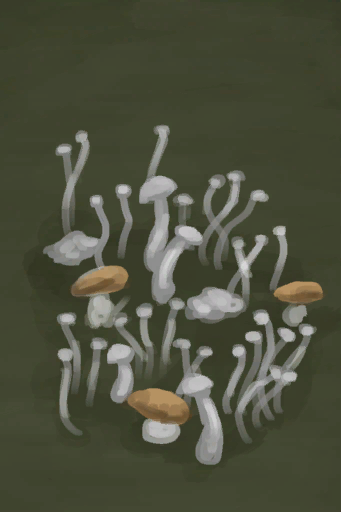

# 杂菌  
> 不是不能吃，前提是我能把没毒的挑出来。  
  
  属性  |   图片   
 ----  |  ----:   
   |     
  
## 获取来源  
来源  |  操作  
----  |  ----  
[湿地丛林](Wetlands.md)  |  探索  
## 动作  
动作  |  时间  |  条件  |  变化  |  状态  
----  |  ----  |  ----  |  ----  |  ----  
采集   |  15分  |  [光亮](Light.md):5-100  |  → [柠檬草](LemongrassStalks.md)  [杂菌](AssortedMushrooms.md)(+1～+2)   |  [药草学(技能)](Skill_Herbology.md)+1  
