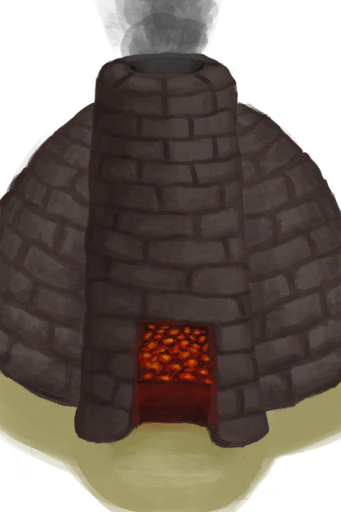

# 斧子头  
> 可被用来制作斧子。  
   
> 一种耐用而锋利的铜斧。在损坏后只要把金属部分<b>重新打磨</b>就可以重新做成斧子。 你能用它更快地砍伐<b>树木</b>，并制作更复杂的<b>木制品</b>。  
  
<table class="table table-bordered"><tbody><tr ><td  style="width:80%;text-align:left;vertical-align:top;" >**重量：**100  **标签：**	[“刮具”](tag_Scraper.md), [“切割工具”](tag_Cutter.md), [“锤”](tag_Hammer.md), [“沉重的”](tag_Heavy.md), [“铜制大物件”](tag_CopperBig.md)  **可使用次数：**150</td><td  style="width:20%;text-align:left;vertical-align:top;" >

</td></tr></tbody></tbody></table>  
  
## 获取来源  
<table class="table table-bordered"><thead><tr ><th  style="text-align:left;vertical-align:top;" >来源</th><th  style="text-align:left;vertical-align:top;" >操作</th></tr></thead><tr ><td  style="text-align:left;vertical-align:top;" >[

[斧头模具](MoldAxe.md)](MoldAxe.md) , [

[熔炉](Forge.md)](Forge.md)</td><td  style="text-align:left;vertical-align:top;" >斧子头</td></tr><tr ><td  style="text-align:left;vertical-align:top;" >[

[斧头模具](MoldAxe.md)](MoldAxe.md) , [

[高级窑炉](KilnAdvanced.md)](KilnAdvanced.md)</td><td  style="text-align:left;vertical-align:top;" >熔炼斧子头</td></tr><tr ><td  style="text-align:left;vertical-align:top;" >[

[钝斧子头](AxeHeadBlunt.md)](AxeHeadBlunt.md)</td><td  style="text-align:left;vertical-align:top;" >磨利 ** 拖入：**[石头](Stone.md) , [大石块](StoneHeavy.md)</td></tr></tbody></table>  
  
## 可拖至  

[帐篷](TentDeployed.md)

[收起的帐篷](TentPacked.md)

[铜矿脉(洞穴上层)](CopperVein.md)

[干土堆](DirtPile.md)

[火炉(熄灭)](StoveExtinguished.md)

[没气的救生筏](LifeRaftDeflated.md)

[泥堆](MudPile.md)

[打开的降落伞](ParachuteDeployed.md)

[水槽](WateringTrough.md)

[骨头碎片](BoneSplinters.md)

[骨头](Bones.md)

[木炭](Charcoal.md)

[椰子](Coconut.md)

[椰子](Coconut.md)

[青椰子](CoconutHusked.md)

[青椰子](CoconutHusked.md)

[带孔椰子](CoconutPerforated.md)

[腐烂的椰子](CoconutRotten.md)

[海螺](Conch.md)

[铜制装饰品](CopperDecoration_Mold.md)

[北梭鱼](Bonefish.md)

[烤北梭鱼](BonefishCooked.md)

[北梭鱼肉](BonefishMeat.md)

[烟熏北梭鱼](BonefishSmoked.md)

[中陷阱的猕猴](CageTrapMacaque.md)

[干辣椒](ChiliesDried.md)

[眼镜蛇尸体](CobraDead.md)

[海螺肉](ConchMeat.md)

[鱼干](FishDried.md)

[咸鱼](FishSalted.md)

[腌制中的咸鱼肉](FishSaltedDrying.md)

[姜](Ginger.md)

[干姜](GingerDried.md)

[绯鲤](Goatfish.md)

[烤绯鲤](GoatfishCooked.md)

[烟熏绯鲤](GoatfishSmoked.md)

[石斑鱼](Grouper.md)

[石斑鱼肉](GrouperMeat.md)

[烤石斑鱼](GrouperMeatCooked.md)

[烟熏石斑鱼](GrouperMeatSmoked.md)

[鲱鱼](Herring.md)

[烤鲱鱼](HerringCooked.md)

[烟熏鲱鱼](HerringSmoked.md)

[茉莉花](JasmineFlowers.md)

[卡瓦根](KavaRoot.md)

[干燥的卡瓦根](KavaRootDried.md)

[大马鲅鱼](KingThreadfin.md)

[野猪尸体](BoarCarcass.md)

[小猪尸体](BoarCarcassPiglet.md)

[母猪](BoarEnclosureFemale.md)

[公猪](BoarEnclosureMale.md)

[小猪](BoarEnclosurePiglet.md)

[剥皮的野猪](BoarSkinned.md)

[剥皮的猪](BoarSkinnedPiglet.md)

[母猪](BoarTiedFemale.md)

[公猪](BoarTiedMale.md)

[小猪](BoarTiedPiglet.md)

[忠犬朋友](DogFriend.md)

[山羊尸体(母)](GoatCarcassFemale.md)

[小羊尸体](GoatCarcassKid.md)

[山羊尸体(公)](GoatCarcassMale.md)

[母山羊](GoatEnclosureFemale.md)

[小羊](GoatEnclosureKid.md)

[哺乳期山羊](GoatEnclosureLactating.md)

[公山羊](GoatEnclosureMale.md)

[剥皮的山羊](GoatSkinned.md)

[剥皮的小羊](GoatSkinnedKid.md)

[母山羊](GoatTiedFemale.md)

[哺乳期山羊](GoatTiedFemaleLactating.md)

[小羊](GoatTiedKid.md)

[公山羊](GoatTiedMale.md)

[猕猴朋友](MacaqueFriend.md)

[柠檬草](LemongrassStalks.md)

[猕猴尸体](MacaqueCarcass.md)

[受伤的猕猴](MacaqueWounded.md)

[鹦哥鱼](ParrotFish.md)

[烤鹦哥鱼](ParrotFishCooked.md)

[烟熏鹦哥鱼](ParrotFishSmoked.md)

[灰山鹑尸体](PartridgeDead.md)

[雌灰山鹑](PartridgeFemaleEnclosure.md)

[雌灰山鹑](PartridgeFemaleLive.md)

[雄灰山鹑](PartridgeMaleEnclosure.md)

[雄灰山鹑](PartridgeMaleLive.md)

[海蛇尸体](SeaKraitDead.md)

[海鸥尸体](SeagullDead.md)

[海怪尸体](SeahoundCarcass.md)

[鲨鱼尸体](SharkCarcass.md)

[烤鲨鱼肉](SharkCooked.md)

[鲨鱼肉](SharkMeat.md)

[烟熏鲨鱼肉](SharkSmoked.md)

[蜘蛛兰叶](SpiderLilyLeaves.md)

[干燥的蜘蛛兰叶](SpiderLilyLeavesDried.md)

[烤马鲅鱼](ThreadfinCooked.md)

[马鲅鱼肉](ThreadfinMeat.md)

[烟熏马鲅鱼](ThreadfinSmoked.md)

[参薯](Yam.md)

[晶洞](Geode.md)

[大海螺](GiantConch.md)

[巨蜥尸体](MonitorCarcass.md)

[剥皮的巨蜥](MonitorSkinned.md)

[煅烧后的砂浆](MortarBurnt.md)

[泥砖](MudBrick.md)

[水椰子](NipaFruit.md)

[硝石晶体](NiterCrystals.md)

[牡蛎](Oyster.md)

[牡蛎](Oyster.md)

[新鲜兽皮](SkinFresh.md)

[蜥蜴生皮](SkinFreshReptile.md)

[蛇草](SnakeGrass.md)

[长木棍](StickLong.md)

[小树枝](Sticks.md)

[煅烧后的石头](StoneBurnt.md)

[煅烧后的大石块](StoneHeavyBurnt.md)

[热带杏仁](TropicalAlmonds.md)

[海胆](Urchin.md)

[硫磺喷口(火山)](VentBrimstone.md)

[韦斯顿](Weston.md)

[金鸡纳树](CinchonaTree.md)

[狭窄通道(洞穴底层)](CrystalChamberEntranceClosed.md)

[狭窄通道(潮湿洞穴)](DarkCaveCaveEntranceClosed.md)

[狭窄通道(洞穴中层)](DarkChamberCaveEntranceClosed.md)

[狭窄通道(洞穴上层)](FloodedChamberEntranceClosed.md)

[狭窄通道(隧道)](HighChamberEntranceClosed.md)

[水椰](NipaPalm.md)

[水稻](RicePlant.md)

[劈开的西米树干](SagoSplitLog.md)

[滤水器](WaterFilter.md)

  
  
## 可用于蓝图  

[

[铜斧(蓝图)](Bp_CopperAxe.md)](Bp_CopperAxe.md)

  
  
  
## 可用于转化  
<table class="table table-bordered"><thead><tr ><th  style="text-align:left;vertical-align:top;" >转化为</th><th  style="text-align:left;vertical-align:top;" >容器</th></tr></thead><tr ><td  style="text-align:left;vertical-align:top;" >[铜](Copper.md)</td><td  style="text-align:left;vertical-align:top;" >[熔炉](Forge.md)</td></tr><tr ><td  style="text-align:left;vertical-align:top;" >[铜](Copper.md)</td><td  style="text-align:left;vertical-align:top;" >[高级窑炉](KilnAdvanced.md)</td></tr></tbody></table>  
  
## 属性   
<table class="table table-bordered"><thead><tr ><th  style="text-align:left;vertical-align:top;" >属性</th><th  style="text-align:left;vertical-align:top;" >值</th><th  style="text-align:left;vertical-align:top;" >耗时</th><th  style="text-align:left;vertical-align:top;" >变化</th></tr></thead><tr ><td  style="text-align:left;vertical-align:top;" >使用次数</td><td  style="text-align:left;vertical-align:top;" >初始：150 最大：150</td><td  style="text-align:left;vertical-align:top;" >-</td><td  style="text-align:left;vertical-align:top;" >** 到达0时： **  ** 自身 ** → [

[钝斧子头](AxeHeadBlunt.md)](AxeHeadBlunt.md)</td></tr></tbody></table>  
  

