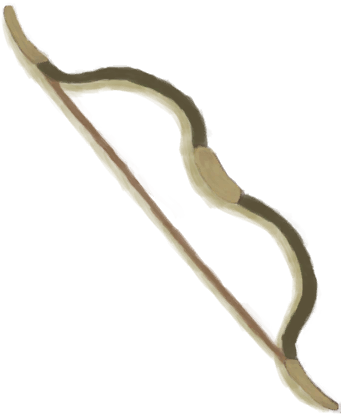
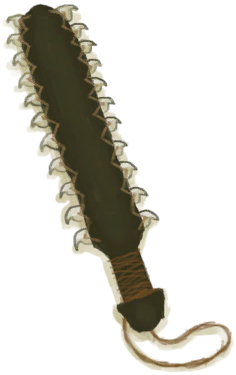

# 求生斧  
> 可以用来砍树，斧刃钝了的话就得再打磨一下。  
  
<table class="table table-bordered" data-toggle="table"  data-show-header="false"><thead style="display:none"><tr ><th  style="width:50%;text-align:left;vertical-align:top;"  >title</th><th  style="width:50%;text-align:left;vertical-align:top;"  ></th></tr></thead><tr ><td  style="width:50%;text-align:left;vertical-align:top;"  >**重量：**250  **标签：**	[“锤”](tag_Hammer.md), [“斧”](tag_Axe.md), [“高级斧”](tag_AxeAdv.md), [“沉重的”](tag_Heavy.md)  **可用次数：**50</td><td  style="width:50%;text-align:left;vertical-align:top;"  >

<a href="AxeSurvival.md" style="color:black">求生斧</a>

</td></tr></tbody></table>  
  
## 获取来源  

** 使用**[石头](Stone.md)磨利

[求生斧](AxeSurvival.md)

** 使用**[石头](Stone.md) , [大石块](StoneHeavy.md)磨利

[钝的求生斧](AxeSurvivalBlunt.md)

特质影响

[生存专家](Pk_2_Survivalist.md)

  
  
## 可拖入  

<table style="margin-bottom:0px;"><tr><td style="width:40%;text-align:left; background-color:#FEFEFE"><b>拖入：</b>[

[石头](Stone.md)](Stone.md)</td><td style="width:40%;font-size:1em;font-weight:bold;background-color:#FEFEFE">磨利 (30分) </td></tr><tr style="background-color:#FFFFFF"><td style=""><b>使用物：</b></td><td style=""><b>自身：</b>→ [

[求生斧](AxeSurvival.md)](AxeSurvival.md)</td></tr></table>
  
  
## 可拖至  

[铜矿脉(洞穴上层)](CopperVein.md)

[干土堆](DirtPile.md)

[火炉(熄灭)](StoveExtinguished.md)

[半根原木](HalfLog.md)

[原木](Log.md)

[泥堆](MudPile.md)

[座椅](Seat.md)

[座椅](SeatPlaced.md)

[水槽](WateringTrough.md)

[骨头碎片](BoneSplinters.md)

[骨头](Bones.md)

[木炭](Charcoal.md)

[椰子](Coconut.md)

[青椰子](CoconutHusked.md)

[带孔椰子](CoconutPerforated.md)

[腐烂的椰子](CoconutRotten.md)

[海螺](Conch.md)

[铜制装饰品](CopperDecoration_Mold.md)

[羽毛](Feathers.md)

[干辣椒](ChiliesDried.md)

[海螺肉](ConchMeat.md)

[姜](Ginger.md)

[干姜](GingerDried.md)

[茉莉花](JasmineFlowers.md)

[卡瓦根](KavaRoot.md)

[干燥的卡瓦根](KavaRootDried.md)

[母猪](BoarEnclosureFemale.md)

[公猪](BoarEnclosureMale.md)

[小猪](BoarEnclosurePiglet.md)

[母猪](BoarTiedFemale.md)

[公猪](BoarTiedMale.md)

[小猪](BoarTiedPiglet.md)

[母山羊](GoatEnclosureFemale.md)

[小羊](GoatEnclosureKid.md)

[泌乳期山羊](GoatEnclosureLactating.md)

[公山羊](GoatEnclosureMale.md)

[母山羊](GoatTiedFemale.md)

[泌乳期山羊](GoatTiedFemaleLactating.md)

[小羊](GoatTiedKid.md)

[公山羊](GoatTiedMale.md)

[柠檬草](LemongrassStalks.md)

[蛇草](SnakeGrass.md)

[蜘蛛兰叶](SpiderLilyLeaves.md)

[干燥的蜘蛛兰叶](SpiderLilyLeavesDried.md)

[晶洞](Geode.md)

[大海螺](GiantConch.md)

[煅烧后的砂浆](MortarBurnt.md)

[泥砖](MudBrick.md)

[水椰子](NipaFruit.md)

[硝石晶体](NiterCrystals.md)

[牡蛎](Oyster.md)

[煅烧后的石头](StoneBurnt.md)

[煅烧后的大石块](StoneHeavyBurnt.md)

[热带杏仁](TropicalAlmonds.md)

[海胆](Urchin.md)

[硫磺喷口(火山)](VentBrimstone.md)

[韦斯顿](Weston.md)

[盛开的外星植物](AlienGrowth.md)

[外星植物](AlienGrowthCleared.md)

[金鸡纳树](CinchonaTree.md)

[剥净的金鸡纳树](CinchonaTreeCleared.md)

[狭窄通道(洞穴底层)](CrystalChamberEntranceClosed.md)

[狭窄通道(潮湿洞穴)](DarkCaveCaveEntranceClosed.md)

[狭窄通道(洞穴中层)](DarkChamberCaveEntranceClosed.md)

[狭窄通道(洞穴上层)](FloodedChamberEntranceClosed.md)

[狭窄通道(隧道)](HighChamberEntranceClosed.md)

[小芒果树](MangoTreeYoung.md)

[丛林深处](DeepJungle.md)

[东部高地](HighlandsEastern.md)

[西部高地](HighlandsWestern.md)

[丛林](Jungle.md)

[丛林高地](JungleHighlands.md)

[红树林](Mangroves.md)

[丛林边缘](Outskirts.md)

[湿地丛林(湿地)](Wetlands.md)

[幼年椰子树](PalmTreeYoung.md)

[摘光的香蕉树](BananaTreeCleared.md)

[大树](LargeTree.md)

[Large Tree Cover 10000](LargeTreeCover10000.md)

[倒下的大树](LargeTreeFelled.md)

[摘光的芒果树](MangoTreeCleared.md)

[水椰](NipaPalm.md)

[摘完的椰子树](PalmTreeCleared.md)

[倒下的棕榈树](PalmTreeFelled.md)

[椰子树](PalmTreeNew.md)

[椰子树(多事件旧)](PalmTreeNewMultiEventOld.md)

[椰子树(旧)](PalmTreeOld.md)

[树液收集处](PalmTreeSapStation.md)

[树液补给点(空)](PalmTreeSapStationEmpty.md)

[西米树](SagoPalm.md)

[倒下的西米树](SagoPalmFelled.md)

[劈开的西米树干](SagoSplitLog.md)

[摘光的热带杏仁树](TropicalAlmondTreeCleared.md)

[倒下的热带杏仁树](TropicalAlmondTreeFelled.md)

[小棕榈树](SmallPalm.md)

[小树](SmallTree.md)

[小杏仁树](TropicalAlmondTreeYoung.md)

[滤水器](WaterFilter.md)

[野枣丛](WildJujube.md)

[摘光的野枣从](WildJujubeCleared.md)

  
  
## 可用于蓝图  

<a href="Bp_BedRustic.md" style="color:black">简易床</a>

<a href="Bp_BedWooden.md" style="color:black">木床</a>

<a href="Bp_BoarFeeder.md" style="color:black">猪食槽</a>

<a href="Bp_Bookshelf.md" style="color:black">书架</a>

<a href="Bp_BowComposite.md" style="color:black">复合弓</a>

<a href="Bp_BrimstoneGel.md" style="color:black">硫磺膏</a>

<a href="Bp_BugRepellent.md" style="color:black">驱虫膏</a>

<a href="Bp_CeremonialDagger.md" style="color:black">仪式匕首</a>

<a href="Bp_Chair.md" style="color:black">椅子</a>

<a href="Bp_Chest.md" style="color:black">储物箱</a>

<a href="Bp_ClubSerrated.md" style="color:black">鲨齿棒</a>

<a href="Bp_CompostBin.md" style="color:black">堆肥箱</a>

<a href="Bp_CopperSheet.md" style="color:black">铜板</a>

<a href="Bp_Drum.md" style="color:black">鼓</a>

<a href="Bp_EatingUtensilsWooden.md" style="color:black">木质餐具</a>

<a href="Bp_Enclosure.md" style="color:black">畜栏</a>

<a href="Bp_GoatFeeder.md" style="color:black">羊食槽</a>

<a href="Bp_Honey.md" style="color:black">蜂蜜</a>

<a href="Bp_LizardDrum.md" style="color:black">蜥蜴皮手鼓</a>

<a href="Bp_Mortar.md" style="color:black">砂浆</a>

<a href="Bp_PesticideBrimstone.md" style="color:black">硫磺农药</a>

<a href="Bp_Planks.md" style="color:black">木板</a>

<a href="Bp_PotteryWheel.md" style="color:black">陶轮</a>

<a href="Bp_Quinine.md" style="color:black">金鸡纳树皮粉</a>

<a href="Bp_Raft.md" style="color:black">木筏</a>

<a href="Bp_ScrapAxe.md" style="color:black">废金属斧</a>

<a href="Bp_ScrapKnife.md" style="color:black">废金属刀</a>

<a href="Bp_ScrapShovel.md" style="color:black">废金属铲</a>

<a href="Bp_Shelf.md" style="color:black">架子</a>

<a href="Bp_Shield.md" style="color:black">盾牌</a>

<a href="Bp_SupplyChest.md" style="color:black">补给箱</a>

<a href="Bp_Table.md" style="color:black">木桌</a>

<a href="Bp_Vitriol.md" style="color:black">硫酸</a>

<a href="Bp_WoodenShovel.md" style="color:black">木铲</a>

<a href="Bp_CoconutMilk.md" style="color:black">椰奶</a>

<a href="Bp_CopperBottle.md" style="color:black">铜瓶</a>

<a href="Bp_CopperJar.md" style="color:black">铜罐</a>

  
  
  
## 属性   

<table style="margin-bottom:0px;"><tr><td style="width:30%;text-align:left; background-color:#FEFEFE;font-size:1.3em;font-weight:bold;">使用次数</td><td style="font-size:1em;background-color:#FEFEFE">初始：50 , 最大：50 -</td></tr><tr style="background-color:#FFFFFF"><td colspan=2>** 到达0时： ** 自身: → [

[钝的求生斧](AxeSurvivalBlunt.md)](AxeSurvivalBlunt.md)</td></tr></table>
  

