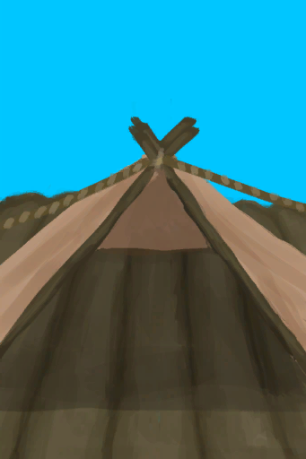

# 背痛  
> 睡在地上或不好的床上引起的疼痛。  
> 睡在<b>劣质床或地板</b>上而引起的疼痛症状。 可以通过建造更好的<b>床</b>来防止。  涂抹<b>芦荟膏</b>可以减轻疼痛，帮助你的背部快速恢复。  
  

<b>基础值: </b> 0 
  

<b>变化范围: </b> 0 ~ 225 
  

<b>基础变化率: </b> -1 / 每15分钟 
  
## 阶段  

<table><tr style="height:2em;"><td style="background-color:#F0F0F0;text-align:center;width:180px;font-size:1.4em;font-weight:bold;vertical-align:middle;">
75 ～ 150

33% ～ 66%
</td><td colspan=2 style="font-size:1.1em;vertical-align:middle;background-color:#F9F9F9;">
<b>

背痛</b>

</td></tr><tr><td colspan=2><b>影响：</b>[

[疼痛](Pain.md)](Pain.md)+50</td></tr><tr><td colspan=2></td></tr><tr style="height:2em;"><td style="background-color:#F0F0F0;text-align:center;width:180px;font-size:1.4em;font-weight:bold;vertical-align:middle;">
151 ～ 225

67% ～ 100%
</td><td colspan=2 style="font-size:1.1em;vertical-align:middle;background-color:#F9F9F9;">
<b>

严重的背痛</b>

&nbsp;&nbsp;痛……
</td></tr><tr><td colspan=2><b>影响：</b>[

[疼痛](Pain.md)](Pain.md)+100</td></tr><tr><td colspan=2></td></tr></table>
  
## 相关卡牌  
[芦荟膏防护](AloeVeraGelProtection.md)  |  [硫磺膏保护](BrimstoneGelProtection.md)  
## 加成值影响因素  
<table class="table table-bordered" data-toggle="table"  ><thead style=""><tr ><th  style="text-align:left;vertical-align:top;"  >来源</th><th  style="text-align:left;vertical-align:top;"  >操作</th><th  style="text-align:left;vertical-align:top;"  >值</th></tr></thead><tr ><td  style="text-align:left;vertical-align:top;"  >

[席地而睡](Pk_4_RoughSleeper.md)</td><td  style="text-align:left;vertical-align:top;"  >特质影响</td><td  style="text-align:left;vertical-align:top;"  >加成-50</td></tr></tbody></table>  
  
## 可被以下操作改变  
<table class="table table-bordered" data-toggle="table"  ><thead style=""><tr ><th  style="text-align:left;vertical-align:top;"  >来源</th><th  style="text-align:left;vertical-align:top;"  >操作</th><th  style="text-align:left;vertical-align:top;"  >值</th></tr></thead><tr ><td  style="text-align:left;vertical-align:top;"  >[

[韦斯顿(Special2e)(事件)](Event_WestonSpecial2e.md)](Event_WestonSpecial2e.md)</td><td  style="text-align:left;vertical-align:top;"  >Thanks Wes.</td><td  style="text-align:left;vertical-align:top;"  >56 ~ 90</td></tr><tr ><td  style="text-align:left;vertical-align:top;"  >[

[你昏过去了(事件)](Event_FaintDizzy.md)](Event_FaintDizzy.md)</td><td  style="text-align:left;vertical-align:top;"  >继续</td><td  style="text-align:left;vertical-align:top;"  >50</td></tr><tr ><td  style="text-align:left;vertical-align:top;"  >[

[你昏过去了(事件)](Event_FaintExhaustion.md)](Event_FaintExhaustion.md)</td><td  style="text-align:left;vertical-align:top;"  >继续</td><td  style="text-align:left;vertical-align:top;"  >25</td></tr><tr ><td  style="text-align:left;vertical-align:top;"  >[

[你睡着了！(事件)](Event_FallingAsleep.md)](Event_FallingAsleep.md)</td><td  style="text-align:left;vertical-align:top;"  >Zzz……</td><td  style="text-align:left;vertical-align:top;"  >6 / 每15分钟</td></tr><tr ><td  style="text-align:left;vertical-align:top;"  >[

[窝棚](Shelter.md)](Shelter.md)</td><td  style="text-align:left;vertical-align:top;"  >小憩</td><td  style="text-align:left;vertical-align:top;"  >5 / 每15分钟</td></tr><tr ><td  style="text-align:left;vertical-align:top;"  >[

[窝棚](Shelter.md)](Shelter.md)</td><td  style="text-align:left;vertical-align:top;"  >睡觉</td><td  style="text-align:left;vertical-align:top;"  >5 / 每15分钟</td></tr><tr ><td  style="text-align:left;vertical-align:top;"  >[

[木筏庇护所](RaftShelter.md)](RaftShelter.md)</td><td  style="text-align:left;vertical-align:top;"  >小憩</td><td  style="text-align:left;vertical-align:top;"  >5 / 每15分钟</td></tr><tr ><td  style="text-align:left;vertical-align:top;"  >[

[木筏庇护所](RaftShelter.md)](RaftShelter.md)</td><td  style="text-align:left;vertical-align:top;"  >睡觉</td><td  style="text-align:left;vertical-align:top;"  >5 / 每15分钟</td></tr><tr ><td  style="text-align:left;vertical-align:top;"  >[

[叶床](LeafBed.md)](LeafBed.md)</td><td  style="text-align:left;vertical-align:top;"  >小憩</td><td  style="text-align:left;vertical-align:top;"  >4.5 / 每15分钟</td></tr><tr ><td  style="text-align:left;vertical-align:top;"  >[

[叶床](LeafBed.md)](LeafBed.md)</td><td  style="text-align:left;vertical-align:top;"  >睡觉</td><td  style="text-align:left;vertical-align:top;"  >4.5 / 每15分钟</td></tr><tr ><td  style="text-align:left;vertical-align:top;"  >[

[人鱼巢](MermaidNest.md)](MermaidNest.md)</td><td  style="text-align:left;vertical-align:top;"  >小憩</td><td  style="text-align:left;vertical-align:top;"  >4.5 / 每15分钟</td></tr><tr ><td  style="text-align:left;vertical-align:top;"  >[

[人鱼巢](MermaidNest.md)](MermaidNest.md)</td><td  style="text-align:left;vertical-align:top;"  >睡觉</td><td  style="text-align:left;vertical-align:top;"  >4.5 / 每15分钟</td></tr><tr ><td  style="text-align:left;vertical-align:top;"  >[

[有遮蔽的叶床](ShelteredLeafBed.md)](ShelteredLeafBed.md)</td><td  style="text-align:left;vertical-align:top;"  >小憩</td><td  style="text-align:left;vertical-align:top;"  >4.5</td></tr><tr ><td  style="text-align:left;vertical-align:top;"  >[

[有遮蔽的叶床](ShelteredLeafBed.md)](ShelteredLeafBed.md)</td><td  style="text-align:left;vertical-align:top;"  >睡觉</td><td  style="text-align:left;vertical-align:top;"  >4.5 / 每15分钟</td></tr><tr ><td  style="text-align:left;vertical-align:top;"  >[

[睡袋](BedRoll.md)](BedRoll.md)</td><td  style="text-align:left;vertical-align:top;"  >小憩</td><td  style="text-align:left;vertical-align:top;"  >4 / 每15分钟</td></tr><tr ><td  style="text-align:left;vertical-align:top;"  >[

[睡袋](BedRoll.md)](BedRoll.md)</td><td  style="text-align:left;vertical-align:top;"  >睡觉</td><td  style="text-align:left;vertical-align:top;"  >4 / 每15分钟</td></tr><tr ><td  style="text-align:left;vertical-align:top;"  >[

[帐篷](TentDeployed.md)](TentDeployed.md)</td><td  style="text-align:left;vertical-align:top;"  >小憩</td><td  style="text-align:left;vertical-align:top;"  >4 / 每15分钟</td></tr><tr ><td  style="text-align:left;vertical-align:top;"  >[

[帐篷](TentDeployed.md)](TentDeployed.md)</td><td  style="text-align:left;vertical-align:top;"  >睡觉</td><td  style="text-align:left;vertical-align:top;"  >4 / 每15分钟</td></tr><tr ><td  style="text-align:left;vertical-align:top;"  >[

[简易床](BedRustic.md)](BedRustic.md)</td><td  style="text-align:left;vertical-align:top;"  >小憩</td><td  style="text-align:left;vertical-align:top;"  >3 / 每15分钟</td></tr><tr ><td  style="text-align:left;vertical-align:top;"  >[

[简易床](BedRustic.md)](BedRustic.md)</td><td  style="text-align:left;vertical-align:top;"  >睡觉</td><td  style="text-align:left;vertical-align:top;"  >3 / 每15分钟</td></tr><tr ><td  style="text-align:left;vertical-align:top;"  >[

[吊床](Hammock.md)](Hammock.md)</td><td  style="text-align:left;vertical-align:top;"  >小憩</td><td  style="text-align:left;vertical-align:top;"  >3 / 每15分钟</td></tr><tr ><td  style="text-align:left;vertical-align:top;"  >[

[吊床](Hammock.md)](Hammock.md)</td><td  style="text-align:left;vertical-align:top;"  >睡觉</td><td  style="text-align:left;vertical-align:top;"  >3 / 每15分钟</td></tr><tr ><td  style="text-align:left;vertical-align:top;"  >[

[木床](BedWooden.md)](BedWooden.md)</td><td  style="text-align:left;vertical-align:top;"  >小憩</td><td  style="text-align:left;vertical-align:top;"  >2.5 / 每15分钟</td></tr><tr ><td  style="text-align:left;vertical-align:top;"  >[

[木床](BedWooden.md)](BedWooden.md)</td><td  style="text-align:left;vertical-align:top;"  >睡觉</td><td  style="text-align:left;vertical-align:top;"  >2.5 / 每15分钟</td></tr></tbody></table>  
  

