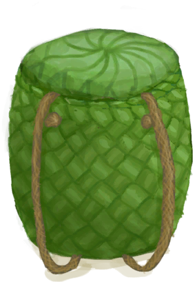

# 背篓  
> 我可以把物品储存在里面。<b>可在装备栏装备</b>    
  
<table class="table table-bordered table4121" data-toggle="table"  data-show-header="false"><thead style="display:none"><tr ><th  style="width:50%;"  >title</th><th  style="width:50%;"  ></th></tr></thead><tr ><td  style="width:50%;"  >** 不可删除 **  ** 不可堆叠 **  **重量：**500  **装备时减重：**-250  **标签：**	[“袋子”](tag_Bag.md), [“背包”](tag_Backpack.md)  **装备：**[“后背装备”](eTag_Backpack.md)  **槽位：**4  **过滤器：**~~[“袋子”](tag_Bag.md)~~ , ~~[“大的”](tag_Large.md)~~ , ~~[“火源”](tag_FireSource.md)~~ , ~~[“火”](tag_Fire.md)~~ , ~~[“可泼溅的”](tag_Spillable.md)~~  **容量：**1000  **减重：**-1000</td><td  style="width:50%;"  >

<a href="BackpackBasket.md" style="color:black">背篓</a>

一个由绳子和<b>棕榈编织片</b>制而成的简易背篓。  可以用来携带额外的物品而不增加负重，能够装备在后背装备栏上。</td></tr></tbody></table>  
  
## 获取来源  

蓝图制造

[背篓(蓝图)](Bp_WovenBackpack.md)

** 使用**[绳子](Rope.md)绑上绳子

[编织篓](Basket.md)

  
  
## 动作  

<table><tr><td rowspan="2" style="width:200px;text-align:center;font-size:1.3em;font-weight:bold">

解开绳子

15分

</td><td></td></tr><tr><td><b>自身：</b>→ [

[编织篓](Basket.md)](Basket.md)</td></tr><tr><td colspan="2">[

[绳子](Rope.md)](Rope.md)(<b>+1</b>)</td></tr></table>
  
  
  

