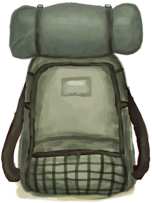

# 生存者背包  
> 我可以把物品储存在里面。<b>可在装备栏装备</b>    
  
  生存者背包  |   图片   
 ----  |  ----:   
 ** 不可删除 **  ** 不可堆叠 **  **重量：**500  **装备时减重：**-475  **标签：**	[“袋子”](tag_Bag.md), [“背包”](tag_Backpack.md)  **装备：**[“后背装备”](eTag_Backpack.md)  **槽位：**5  **过滤器：**~~[“袋子”](tag_Bag.md)~~ , ~~[“大的”](tag_Large.md)~~ , ~~[“火源”](tag_FireSource.md)~~ , ~~[“火”](tag_Fire.md)~~ , ~~[“可泼溅的”](tag_Spillable.md)~~  **容量：**1500  **减重量：**-750  |     
  
