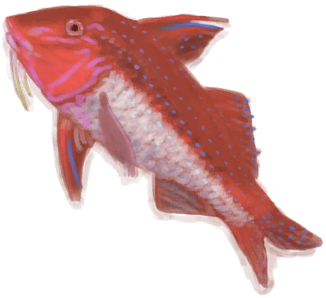
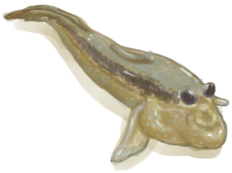
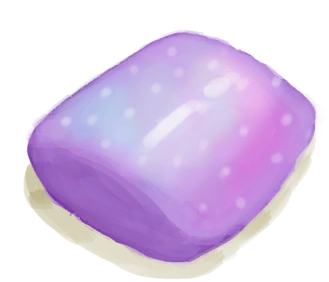

# 细菌性发烧  
> 一旦你体内的细菌水平过高，这种状态就会出现。  虽然发烧有助于杀死细菌，但其代价是<b>脱水</b>速度大大增加，<b>情绪、耐力和世界观</b>也会下降，特别是当发烧太重时。  止痛药品如<b>卡瓦或止痛药</b>可以帮助退烧。将自己浸入<b>水中</b>也会暂时有所帮助。  
  
#### ** 基础值: ** 0   
#### ** 变化范围: ** 0 ~ 1500  
#### ** 基础变化率: ** 无   
## 阶段  
<table class="table table-bordered" data-toggle="table"  ><thead style=""><tr ><th  style="text-align:left;vertical-align:top;"  >范围</th><th  style="text-align:left;vertical-align:top;"  >名称</th><th  style="text-align:left;vertical-align:top;"  data-sortable="true"  >描述</th><th  style="text-align:left;vertical-align:top;"  >影响状态</th><th  style="text-align:left;vertical-align:top;"  data-sortable="true"  >影响动作</th></tr></thead><tr ><td  style="text-align:left;vertical-align:top;"  >201 ～ 300</td><td  style="text-align:left;vertical-align:top;"  >

低</td><td  style="text-align:left;vertical-align:top;"  ></td><td  style="text-align:left;vertical-align:top;"  >[

[发烧](Fever.md)](Fever.md)加成+12</td><td  style="text-align:left;vertical-align:top;"  ></td></tr><tr ><td  style="text-align:left;vertical-align:top;"  >301 ～ 600</td><td  style="text-align:left;vertical-align:top;"  >

中低</td><td  style="text-align:left;vertical-align:top;"  ></td><td  style="text-align:left;vertical-align:top;"  >[

[发烧](Fever.md)](Fever.md)加成+16</td><td  style="text-align:left;vertical-align:top;"  ></td></tr><tr ><td  style="text-align:left;vertical-align:top;"  >601 ～ 900</td><td  style="text-align:left;vertical-align:top;"  >

中高</td><td  style="text-align:left;vertical-align:top;"  ></td><td  style="text-align:left;vertical-align:top;"  >[

[发烧](Fever.md)](Fever.md)加成+24</td><td  style="text-align:left;vertical-align:top;"  ></td></tr><tr ><td  style="text-align:left;vertical-align:top;"  >901 ～ 1500</td><td  style="text-align:left;vertical-align:top;"  >

高</td><td  style="text-align:left;vertical-align:top;"  ></td><td  style="text-align:left;vertical-align:top;"  >[

[发烧](Fever.md)](Fever.md)加成+40</td><td  style="text-align:left;vertical-align:top;"  ></td></tr></tbody></table>  
  
## 相关卡牌  
[免疫系统](ImmuneSystem.md)  |  [体重](Weight.md)  |  [湿度](Wetness.md)  |  [表面细菌](BacteriaSurface.md)  |  [失温](Hypothermia.md)  |  [污垢](Filth.md)  |  [奎宁](Quinine.md)  
## 加成值影响因素  
<table class="table table-bordered" data-toggle="table"  ><thead style=""><tr ><th  style="text-align:left;vertical-align:top;"  >来源</th><th  style="text-align:left;vertical-align:top;"  >操作</th><th  style="text-align:left;vertical-align:top;"  >值</th></tr></thead><tr ><td  style="text-align:left;vertical-align:top;"  >[擦伤](W_Abrasion.md)</td><td  style="text-align:left;vertical-align:top;"  >条件被动</td><td  style="text-align:left;vertical-align:top;"  >加成+10</td></tr><tr ><td  style="text-align:left;vertical-align:top;"  >[左臂撕裂伤](W_ArmLacerationL.md)</td><td  style="text-align:left;vertical-align:top;"  >条件被动</td><td  style="text-align:left;vertical-align:top;"  >加成+10</td></tr><tr ><td  style="text-align:left;vertical-align:top;"  >[已缝合的左臂撕裂伤](W_ArmLacerationLStitched.md)</td><td  style="text-align:left;vertical-align:top;"  >条件被动</td><td  style="text-align:left;vertical-align:top;"  >加成+10</td></tr><tr ><td  style="text-align:left;vertical-align:top;"  >[右臂撕裂伤](W_ArmLacerationR.md)</td><td  style="text-align:left;vertical-align:top;"  >条件被动</td><td  style="text-align:left;vertical-align:top;"  >加成+10</td></tr><tr ><td  style="text-align:left;vertical-align:top;"  >[已缝合的右臂撕裂伤](W_ArmLacerationRStitched.md)</td><td  style="text-align:left;vertical-align:top;"  >条件被动</td><td  style="text-align:left;vertical-align:top;"  >加成+10</td></tr><tr ><td  style="text-align:left;vertical-align:top;"  >[狗咬伤](W_DogBite.md)</td><td  style="text-align:left;vertical-align:top;"  >条件被动</td><td  style="text-align:left;vertical-align:top;"  >加成+10</td></tr><tr ><td  style="text-align:left;vertical-align:top;"  >[左腿撕裂伤](W_LegLacerationL.md)</td><td  style="text-align:left;vertical-align:top;"  >条件被动</td><td  style="text-align:left;vertical-align:top;"  >加成+10</td></tr><tr ><td  style="text-align:left;vertical-align:top;"  >[已缝合的左腿撕裂伤](W_LegLacerationLStitched.md)</td><td  style="text-align:left;vertical-align:top;"  >条件被动</td><td  style="text-align:left;vertical-align:top;"  >加成+10</td></tr><tr ><td  style="text-align:left;vertical-align:top;"  >[右腿撕裂伤](W_LegLacerationR.md)</td><td  style="text-align:left;vertical-align:top;"  >条件被动</td><td  style="text-align:left;vertical-align:top;"  >加成+10</td></tr><tr ><td  style="text-align:left;vertical-align:top;"  >[已缝合的右腿撕裂伤](W_LegLacerationRStitched.md)</td><td  style="text-align:left;vertical-align:top;"  >条件被动</td><td  style="text-align:left;vertical-align:top;"  >加成+10</td></tr><tr ><td  style="text-align:left;vertical-align:top;"  >[猕猴咬伤](W_MacaqueBite.md)</td><td  style="text-align:left;vertical-align:top;"  >条件被动</td><td  style="text-align:left;vertical-align:top;"  >加成+10</td></tr><tr ><td  style="text-align:left;vertical-align:top;"  >[轻微撕裂伤](W_MinorLaceration.md)</td><td  style="text-align:left;vertical-align:top;"  >条件被动</td><td  style="text-align:left;vertical-align:top;"  >加成+10</td></tr><tr ><td  style="text-align:left;vertical-align:top;"  >[已缝合的轻微撕裂伤](W_MinorLacerationStitched.md)</td><td  style="text-align:left;vertical-align:top;"  >条件被动</td><td  style="text-align:left;vertical-align:top;"  >加成+10</td></tr><tr ><td  style="text-align:left;vertical-align:top;"  >[巨蜥咬伤](W_MonitorBite.md)</td><td  style="text-align:left;vertical-align:top;"  >条件被动</td><td  style="text-align:left;vertical-align:top;"  >加成+10</td></tr><tr ><td  style="text-align:left;vertical-align:top;"  >[海怪刺伤](W_SeahoundSting.md)</td><td  style="text-align:left;vertical-align:top;"  >条件被动</td><td  style="text-align:left;vertical-align:top;"  >加成+10</td></tr><tr ><td  style="text-align:left;vertical-align:top;"  >[鲨鱼咬伤](W_SharkBite.md)</td><td  style="text-align:left;vertical-align:top;"  >条件被动</td><td  style="text-align:left;vertical-align:top;"  >加成+10</td></tr><tr ><td  style="text-align:left;vertical-align:top;"  >[蜘蛛咬伤](W_SpiderBite.md)</td><td  style="text-align:left;vertical-align:top;"  >条件被动</td><td  style="text-align:left;vertical-align:top;"  >加成+10</td></tr><tr ><td  style="text-align:left;vertical-align:top;"  >[海胆刺伤](W_UrchinWound.md)</td><td  style="text-align:left;vertical-align:top;"  >条件被动</td><td  style="text-align:left;vertical-align:top;"  >加成+10</td></tr><tr ><td  style="text-align:left;vertical-align:top;"  >[海胆刺伤](W_UrchinWoundSpines.md)</td><td  style="text-align:left;vertical-align:top;"  >条件被动</td><td  style="text-align:left;vertical-align:top;"  >加成+10</td></tr><tr ><td  style="text-align:left;vertical-align:top;"  >[巨蜥咬伤](W_MonitorBite.md)</td><td  style="text-align:left;vertical-align:top;"  >条件被动</td><td  style="text-align:left;vertical-align:top;"  >加成+5</td></tr><tr ><td  style="text-align:left;vertical-align:top;"  >[海怪刺伤](W_SeahoundSting.md)</td><td  style="text-align:left;vertical-align:top;"  >条件被动</td><td  style="text-align:left;vertical-align:top;"  >加成+2</td></tr><tr ><td  style="text-align:left;vertical-align:top;"  >[蜘蛛咬伤](W_SpiderBite.md)</td><td  style="text-align:left;vertical-align:top;"  >条件被动</td><td  style="text-align:left;vertical-align:top;"  >加成+2</td></tr><tr ><td  style="text-align:left;vertical-align:top;"  >

[鱼人皮肤](Pk_3_PermeableSkin.md)</td><td  style="text-align:left;vertical-align:top;"  >特质影响</td><td  style="text-align:left;vertical-align:top;"  >加成-4</td></tr></tbody></table>  
  
## 可被以下操作改变  
<table class="table table-bordered" data-toggle="table"  ><thead style=""><tr ><th  style="text-align:left;vertical-align:top;"  >来源</th><th  style="text-align:left;vertical-align:top;"  >操作</th><th  style="text-align:left;vertical-align:top;"  >值</th></tr></thead><tr ><td  style="text-align:left;vertical-align:top;"  >[

[腐烂物](RottenRemains.md)](RottenRemains.md)</td><td  style="text-align:left;vertical-align:top;"  >食用</td><td  style="text-align:left;vertical-align:top;"  >300 ~ 600</td></tr><tr ><td  style="text-align:left;vertical-align:top;"  >[

[猕猴肉](MacaqueMeat.md)](MacaqueMeat.md)</td><td  style="text-align:left;vertical-align:top;"  >食用</td><td  style="text-align:left;vertical-align:top;"  >50 ~ 100</td></tr><tr ><td  style="text-align:left;vertical-align:top;"  >[

[虾](Prawns.md)](Prawns.md)</td><td  style="text-align:left;vertical-align:top;"  >食用</td><td  style="text-align:left;vertical-align:top;"  >15</td></tr><tr ><td  style="text-align:left;vertical-align:top;"  >[

[食丸](GastricPellet.md)](GastricPellet.md)</td><td  style="text-align:left;vertical-align:top;"  >采集</td><td  style="text-align:left;vertical-align:top;"  >10 ~ 50</td></tr><tr ><td  style="text-align:left;vertical-align:top;"  >[

[蝙蝠尸体](Bat.md)](Bat.md)</td><td  style="text-align:left;vertical-align:top;"  >食用</td><td  style="text-align:left;vertical-align:top;"  >0 ~ 50</td></tr><tr ><td  style="text-align:left;vertical-align:top;"  >[

[鸟肉](BirdMeat.md)](BirdMeat.md)</td><td  style="text-align:left;vertical-align:top;"  >食用</td><td  style="text-align:left;vertical-align:top;"  >0 ~ 200</td></tr><tr ><td  style="text-align:left;vertical-align:top;"  >[

[野猪肉](BoarMeat.md)](BoarMeat.md)</td><td  style="text-align:left;vertical-align:top;"  >食用</td><td  style="text-align:left;vertical-align:top;"  >0 ~ 50</td></tr><tr ><td  style="text-align:left;vertical-align:top;"  >[

[腌制中的野猪肉](BoarMeatSaltedDrying.md)](BoarMeatSaltedDrying.md)</td><td  style="text-align:left;vertical-align:top;"  >食用</td><td  style="text-align:left;vertical-align:top;"  >0 ~ 10</td></tr><tr ><td  style="text-align:left;vertical-align:top;"  >[

[北梭鱼肉](BonefishMeat.md)](BonefishMeat.md)</td><td  style="text-align:left;vertical-align:top;"  >食用</td><td  style="text-align:left;vertical-align:top;"  >0 ~ 50</td></tr><tr ><td  style="text-align:left;vertical-align:top;"  >[

[黄油](Butter.md)](Butter.md)</td><td  style="text-align:left;vertical-align:top;"  >食用</td><td  style="text-align:left;vertical-align:top;"  >0 ~ 10</td></tr><tr ><td  style="text-align:left;vertical-align:top;"  >[

[海螺肉](ConchMeat.md)](ConchMeat.md)</td><td  style="text-align:left;vertical-align:top;"  >食用</td><td  style="text-align:left;vertical-align:top;"  >0 ~ 25</td></tr><tr ><td  style="text-align:left;vertical-align:top;"  >[

[松软的海螺肉](ConchMeatSoft.md)](ConchMeatSoft.md)</td><td  style="text-align:left;vertical-align:top;"  >食用</td><td  style="text-align:left;vertical-align:top;"  >0 ~ 25</td></tr><tr ><td  style="text-align:left;vertical-align:top;"  >[

[螃蟹](Crab.md)](Crab.md)</td><td  style="text-align:left;vertical-align:top;"  >食用</td><td  style="text-align:left;vertical-align:top;"  >0 ~ 50</td></tr><tr ><td  style="text-align:left;vertical-align:top;"  >[

[蛋](Egg.md)](Egg.md)</td><td  style="text-align:left;vertical-align:top;"  >食用</td><td  style="text-align:left;vertical-align:top;"  >0 ~ 100</td></tr><tr ><td  style="text-align:left;vertical-align:top;"  >[

[受精蛋](EggPartridgeFertilized.md)](EggPartridgeFertilized.md)</td><td  style="text-align:left;vertical-align:top;"  >食用</td><td  style="text-align:left;vertical-align:top;"  >0 ~ 100</td></tr><tr ><td  style="text-align:left;vertical-align:top;"  >[

[脂肪](Fat.md)](Fat.md)</td><td  style="text-align:left;vertical-align:top;"  >食用</td><td  style="text-align:left;vertical-align:top;"  >0 ~ 10</td></tr><tr ><td  style="text-align:left;vertical-align:top;"  >[

[腌制中的咸鱼肉](FishSaltedDrying.md)](FishSaltedDrying.md)</td><td  style="text-align:left;vertical-align:top;"  >食用</td><td  style="text-align:left;vertical-align:top;"  >0 ~ 10</td></tr><tr ><td  style="text-align:left;vertical-align:top;"  >[

[鱼杂](FishScraps.md)](FishScraps.md)</td><td  style="text-align:left;vertical-align:top;"  >食用</td><td  style="text-align:left;vertical-align:top;"  >0 ~ 25</td></tr><tr ><td  style="text-align:left;vertical-align:top;"  >[

[鱼片](FishSlices.md)](FishSlices.md)</td><td  style="text-align:left;vertical-align:top;"  >食用</td><td  style="text-align:left;vertical-align:top;"  >0 ~ 50</td></tr><tr ><td  style="text-align:left;vertical-align:top;"  >[

[羊肉](GoatMeat.md)](GoatMeat.md)</td><td  style="text-align:left;vertical-align:top;"  >食用</td><td  style="text-align:left;vertical-align:top;"  >0 ~ 50</td></tr><tr ><td  style="text-align:left;vertical-align:top;"  >[

[腌制中的羊肉](GoatMeatSaltedDrying.md)](GoatMeatSaltedDrying.md)</td><td  style="text-align:left;vertical-align:top;"  >食用</td><td  style="text-align:left;vertical-align:top;"  >0 ~ 10</td></tr><tr ><td  style="text-align:left;vertical-align:top;"  >[

[绯鲤](Goatfish.md)](Goatfish.md)</td><td  style="text-align:left;vertical-align:top;"  >食用</td><td  style="text-align:left;vertical-align:top;"  >0 ~ 100</td></tr><tr ><td  style="text-align:left;vertical-align:top;"  >[

[石斑鱼肉](GrouperMeat.md)](GrouperMeat.md)</td><td  style="text-align:left;vertical-align:top;"  >食用</td><td  style="text-align:left;vertical-align:top;"  >0 ~ 25</td></tr><tr ><td  style="text-align:left;vertical-align:top;"  >[

[鲱鱼](Herring.md)](Herring.md)</td><td  style="text-align:left;vertical-align:top;"  >食用</td><td  style="text-align:left;vertical-align:top;"  >0 ~ 100</td></tr><tr ><td  style="text-align:left;vertical-align:top;"  >[

[蜥蜴](Lizard.md)](Lizard.md)</td><td  style="text-align:left;vertical-align:top;"  >食用</td><td  style="text-align:left;vertical-align:top;"  >0 ~ 50</td></tr><tr ><td  style="text-align:left;vertical-align:top;"  >[

[烤猕猴肉](MacaqueMeatCooked.md)](MacaqueMeatCooked.md)</td><td  style="text-align:left;vertical-align:top;"  >食用</td><td  style="text-align:left;vertical-align:top;"  >0 ~ 25</td></tr><tr ><td  style="text-align:left;vertical-align:top;"  >[

[猕猴肉干](MacaqueMeatDried.md)](MacaqueMeatDried.md)</td><td  style="text-align:left;vertical-align:top;"  >食用</td><td  style="text-align:left;vertical-align:top;"  >0 ~ 10</td></tr><tr ><td  style="text-align:left;vertical-align:top;"  >[

[腌猕猴肉](MacaqueMeatSalted.md)](MacaqueMeatSalted.md)</td><td  style="text-align:left;vertical-align:top;"  >食用</td><td  style="text-align:left;vertical-align:top;"  >0 ~ 10</td></tr><tr ><td  style="text-align:left;vertical-align:top;"  >[

[腌制中的猕猴肉](MacaqueMeatSaltedDrying.md)](MacaqueMeatSaltedDrying.md)</td><td  style="text-align:left;vertical-align:top;"  >食用</td><td  style="text-align:left;vertical-align:top;"  >0 ~ 10</td></tr><tr ><td  style="text-align:left;vertical-align:top;"  >[

[腌制中的猕猴肉](MacaqueMeatSaltedDrying.md)](MacaqueMeatSaltedDrying.md)</td><td  style="text-align:left;vertical-align:top;"  >食用</td><td  style="text-align:left;vertical-align:top;"  >0 ~ 25</td></tr><tr ><td  style="text-align:left;vertical-align:top;"  >[

[烟熏猕猴肉](MacaqueMeatSmoked.md)](MacaqueMeatSmoked.md)</td><td  style="text-align:left;vertical-align:top;"  >食用</td><td  style="text-align:left;vertical-align:top;"  >0 ~ 25</td></tr><tr ><td  style="text-align:left;vertical-align:top;"  >[

[巨蜥肉](MonitorMeat.md)](MonitorMeat.md)</td><td  style="text-align:left;vertical-align:top;"  >食用</td><td  style="text-align:left;vertical-align:top;"  >0 ~ 50</td></tr><tr ><td  style="text-align:left;vertical-align:top;"  >[

[腌制中的巨蜥肉](MonitorMeatSaltedDrying.md)](MonitorMeatSaltedDrying.md)</td><td  style="text-align:left;vertical-align:top;"  >食用</td><td  style="text-align:left;vertical-align:top;"  >0 ~ 10</td></tr><tr ><td  style="text-align:left;vertical-align:top;"  >[

[老鼠尸体](Mouse.md)](Mouse.md)</td><td  style="text-align:left;vertical-align:top;"  >食用</td><td  style="text-align:left;vertical-align:top;"  >0 ~ 50</td></tr><tr ><td  style="text-align:left;vertical-align:top;"  >[

[剥皮的老鼠](MouseSkinned.md)](MouseSkinned.md)</td><td  style="text-align:left;vertical-align:top;"  >食用</td><td  style="text-align:left;vertical-align:top;"  >0 ~ 50</td></tr><tr ><td  style="text-align:left;vertical-align:top;"  >[

[弹涂鱼](Mudskipper.md)](Mudskipper.md)</td><td  style="text-align:left;vertical-align:top;"  >食用</td><td  style="text-align:left;vertical-align:top;"  >0 ~ 50</td></tr><tr ><td  style="text-align:left;vertical-align:top;"  >[

[牡蛎肉](OysterMeat.md)](OysterMeat.md)</td><td  style="text-align:left;vertical-align:top;"  >食用</td><td  style="text-align:left;vertical-align:top;"  >0 ~ 25</td></tr><tr ><td  style="text-align:left;vertical-align:top;"  >[

[鹦哥鱼](ParrotFish.md)](ParrotFish.md)</td><td  style="text-align:left;vertical-align:top;"  >食用</td><td  style="text-align:left;vertical-align:top;"  >0 ~ 100</td></tr><tr ><td  style="text-align:left;vertical-align:top;"  >[

[小灰山鹑尸体](PartridgeChickDead.md)](PartridgeChickDead.md)</td><td  style="text-align:left;vertical-align:top;"  >食用</td><td  style="text-align:left;vertical-align:top;"  >0 ~ 50</td></tr><tr ><td  style="text-align:left;vertical-align:top;"  >[

[海怪肉](Seahoundmeat.md)](Seahoundmeat.md)</td><td  style="text-align:left;vertical-align:top;"  >食用</td><td  style="text-align:left;vertical-align:top;"  >0 ~ 50</td></tr><tr ><td  style="text-align:left;vertical-align:top;"  >[

[鲨鱼肉](SharkMeat.md)](SharkMeat.md)</td><td  style="text-align:left;vertical-align:top;"  >食用</td><td  style="text-align:left;vertical-align:top;"  >0 ~ 50</td></tr><tr ><td  style="text-align:left;vertical-align:top;"  >[

[剥皮的蛇](SnakeSkinned.md)](SnakeSkinned.md)</td><td  style="text-align:left;vertical-align:top;"  >食用</td><td  style="text-align:left;vertical-align:top;"  >0 ~ 200</td></tr><tr ><td  style="text-align:left;vertical-align:top;"  >[

[马鲅鱼肉](ThreadfinMeat.md)](ThreadfinMeat.md)</td><td  style="text-align:left;vertical-align:top;"  >食用</td><td  style="text-align:left;vertical-align:top;"  >0 ~ 50</td></tr><tr ><td  style="text-align:left;vertical-align:top;"  >[

[海胆肉](UrchinMeat.md)](UrchinMeat.md)</td><td  style="text-align:left;vertical-align:top;"  >食用</td><td  style="text-align:left;vertical-align:top;"  >0 ~ 25</td></tr><tr ><td  style="text-align:left;vertical-align:top;"  >[

[不安全的水](LQ_WaterUnsafe.md)](LQ_WaterUnsafe.md)</td><td  style="text-align:left;vertical-align:top;"  >饮用</td><td  style="text-align:left;vertical-align:top;"  >0 ~ 350</td></tr><tr ><td  style="text-align:left;vertical-align:top;"  >[

[捣碎的柠檬草](LemonGrassGround.md)](LemonGrassGround.md)</td><td  style="text-align:left;vertical-align:top;"  >食用</td><td  style="text-align:left;vertical-align:top;"  >-10</td></tr><tr ><td  style="text-align:left;vertical-align:top;"  >[

[捣碎的蛇草](SnakeGrassGround.md)](SnakeGrassGround.md)</td><td  style="text-align:left;vertical-align:top;"  >食用</td><td  style="text-align:left;vertical-align:top;"  >-10</td></tr><tr ><td  style="text-align:left;vertical-align:top;"  >[

[捣碎的蜘蛛兰](SpiderLilyGround.md)](SpiderLilyGround.md)</td><td  style="text-align:left;vertical-align:top;"  >食用</td><td  style="text-align:left;vertical-align:top;"  >-50</td></tr><tr ><td  style="text-align:left;vertical-align:top;"  >[

[蜘蛛兰叶](SpiderLilyLeaves.md)](SpiderLilyLeaves.md)</td><td  style="text-align:left;vertical-align:top;"  >食用</td><td  style="text-align:left;vertical-align:top;"  >-50</td></tr><tr ><td  style="text-align:left;vertical-align:top;"  >[

[干燥的蜘蛛兰叶](SpiderLilyLeavesDried.md)](SpiderLilyLeavesDried.md)</td><td  style="text-align:left;vertical-align:top;"  >食用</td><td  style="text-align:left;vertical-align:top;"  >-50</td></tr></tbody></table>  
  

