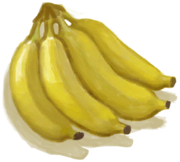

# 香蕉  
> 是香蕉！  
  
<table class="table table-bordered" data-toggle="table"  data-show-header="false"><thead style="display:none"><tr ><th  style="width:50%;text-align:left;vertical-align:top;"  >title</th><th  style="width:50%;text-align:left;vertical-align:top;"  ></th></tr></thead><tr ><td  style="width:50%;text-align:left;vertical-align:top;"  >**重量：**25  **标签：**	[“可烹饪的”](tag_Cookable.md), [“杂食饲料”](tag_FeedOmnivorous.md), [“喂食（草食动物）”](tag_FeedHerb.md), [“饲料”](tag_Feed.md), [“人类食物”](tag_HumanFood.md)</td><td  style="width:50%;text-align:left;vertical-align:top;"  >

<a href="Banana.md" style="color:black">香蕉</a>

这种水果，准确讲是浆果，生长在<b>丛林</b>的香蕉树上。  它营养丰富、味道甜美，也可以用在一些烹饪食谱中。</td></tr></tbody></table>  
  
## 获取来源  
<table class="table table-bordered" data-toggle="table"  ><thead style=""><tr ><th  style="text-align:left;vertical-align:top;"  >来源</th><th  style="text-align:left;vertical-align:top;"  >操作</th></tr></thead><tr ><td  style="text-align:left;vertical-align:top;"  >[

[礼物！(事件)](Event_MacaqueFriendGift.md)](Event_MacaqueFriendGift.md)</td><td  style="text-align:left;vertical-align:top;"  >看看礼物</td></tr><tr ><td  style="text-align:left;vertical-align:top;"  >[

[一串香蕉](BananaHand.md)](BananaHand.md)</td><td  style="text-align:left;vertical-align:top;"  >分开</td></tr><tr ><td  style="text-align:left;vertical-align:top;"  >[

[香蕉树](BananaTree.md)](BananaTree.md)</td><td  style="text-align:left;vertical-align:top;"  >采摘香蕉</td></tr></tbody></table>  
  
## 动作  
<table class="table table-bordered" data-toggle="table"  ><thead style=""><tr ><th  style="text-align:left;vertical-align:top;"  >动作</th><th  style="text-align:left;vertical-align:top;"  data-sortable="true"  >耗时</th><th  style="text-align:left;vertical-align:top;"  data-sortable="true"  >条件</th><th  style="text-align:left;vertical-align:top;"  >变化</th><th  style="text-align:left;vertical-align:top;"  >状态</th></tr></thead><tr ><td  style="text-align:left;vertical-align:top;"  >食用 [“食用蔬菜类动作(组)”](VegetarianAction.md) [“进食动作(组)”](EatingAction.md)</td><td  style="text-align:left;vertical-align:top;"  >-</td><td  style="text-align:left;vertical-align:top;"  ></td><td  style="text-align:left;vertical-align:top;"  >** 自身：** →消失</td><td  style="text-align:left;vertical-align:top;"  >[

[饱食](Satiation.md)](Satiation.md)+20 [

[胃](Stomach.md)](Stomach.md)+10 [

[水分](Hydration.md)](Hydration.md)+1 [

[压力](Stress.md)](Stress.md)-10 [

[情绪](Morale.md)](Morale.md)+2 [

[腹泻](Diarrhoea.md)](Diarrhoea.md)-5 [

[香蕉<nobr>厌倦度</nobr>](SaturationBananas.md)](SaturationBananas.md)+45 [

[污垢](Filth.md)](Filth.md)+1</td></tr></tbody></table>  
  
## 可拖至  

[猪食槽](BoarFeeder.md)

[猪食槽(空)](BoarFeederEmpty.md)

[堆肥箱](CompostBin.md)

[未栽种的农田(空)](CropPlotEmpty.md)

[羊食槽](GoatFeeder.md)

[羊食槽(空)](GoatFeederEmpty.md)

[灰山鹑喂食器](PartridgeFeeder.md)

[灰山鹑喂食器(空)](PartridgeFeederEmpty.md)

[中陷阱的猕猴](CageTrapMacaque.md)

[母猪](BoarEnclosureFemale.md)

[公猪](BoarEnclosureMale.md)

[小猪](BoarEnclosurePiglet.md)

[母猪](BoarTiedFemale.md)

[公猪](BoarTiedMale.md)

[小猪](BoarTiedPiglet.md)

[母山羊](GoatEnclosureFemale.md)

[小羊](GoatEnclosureKid.md)

[哺乳期山羊](GoatEnclosureLactating.md)

[公山羊](GoatEnclosureMale.md)

[母山羊](GoatTiedFemale.md)

[哺乳期山羊](GoatTiedFemaleLactating.md)

[小羊](GoatTiedKid.md)

[公山羊](GoatTiedMale.md)

[祖父](Grandfather.md)

[祖父(健康)](GrandfatherHealthy.md)

[猕猴朋友](MacaqueFriend.md)

[受伤的猕猴](MacaqueWounded.md)

[小灰山鹑](PartridgeChick.md)

[雌灰山鹑](PartridgeFemaleEnclosure.md)

[雌灰山鹑](PartridgeFemaleLive.md)

[雄灰山鹑](PartridgeMaleEnclosure.md)

[雄灰山鹑](PartridgeMaleLive.md)

  
  
## 可用于蓝图  

[

[炸香蕉(蓝图)](Bp_FriedBananas.md)](Bp_FriedBananas.md)

[

[丛林沙拉(蓝图)](Bp_JungleSalad.md)](Bp_JungleSalad.md)

  
  
  
## 属性   
<table class="table table-bordered" data-toggle="table"  ><thead style=""><tr ><th  style="text-align:left;vertical-align:top;"  >属性</th><th  style="text-align:left;vertical-align:top;"  >值</th><th  style="text-align:left;vertical-align:top;"  >耗时</th><th  style="text-align:left;vertical-align:top;"  >变化</th></tr></thead><tr ><td  style="text-align:left;vertical-align:top;"  >耐久</td><td  style="text-align:left;vertical-align:top;"  >初始：192</td><td  style="text-align:left;vertical-align:top;"  >每15分钟-1 最多需要：2天</td><td  style="text-align:left;vertical-align:top;"  >** 到达0时： **  ** 自身 ** → [

[腐烂物](RottenRemains.md)](RottenRemains.md)</td></tr></tbody></table>  
  

