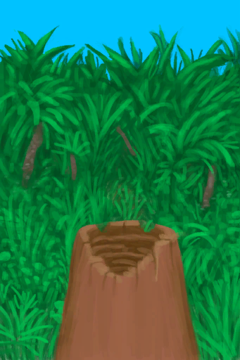

# 香蕉树桩  
> 我可以在这里放一个储水容器来收集水。  
   
> 香蕉树可以在岛上的<b>丛林</b>地区找到，它们结满了营养丰富的香蕉。  当香蕉摘完后还可以把树砍掉，以获得可食用的<b>香蕉树芯</b>，还能够在它们的树桩腐烂之前利用容器从树桩中获取<b>水</b>。  
  
  香蕉树桩  |   图片   
 ----  |  ----:   
 **槽位：**1  **过滤器：**[“碗（容器）”](tag_ContainerBowl.md)  |     
  
## 获取来源  
来源  |  操作  
----  |  ----  
[摘光的香蕉树](BananaTreeCleared.md)  |  砍树 ** 拖入：**[石斧](StoneAxe.md)  
[摘光的香蕉树](BananaTreeCleared.md)  |  砍树 ** 拖入：**[“斧”](tag_Axe.md)  
## 转化  
放入  |  动作  |  耗时  |  条件  |  变化  |  状态  
----  |  ----  |  ----  |  ----  |  ----  |  ----  
[“灌溉用水”](tag_WaterFresh.md)  |  继续填充  |  15分  |    |  含水量 + 12  |    
[“储水容器”](tag_WaterContainer.md)  |  开始填充  |  15分  |    |  ** [water] ** [水](LQ_Water.md)(+0.5)   |    
[刮净的皮](SkinFleshed.md)  |  鞣制皮革  |  15分  |    |  耐久  -1  |    
## 属性   
属性  |  值  |  耗时  |  变化  
----  |  ----  |  ----  |  ----  
耐久  |  初始：188 最大：188  |  每15分钟-1 最多需要：1天23小时  |  ** 到达0时： **  自身→消失  

