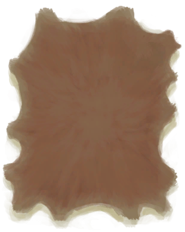

# 香蕉树桩  
> 我可以在这里放一个储水容器来收集水。  
  
<table class="table table-bordered" data-toggle="table"  data-show-header="false"><thead style="display:none"><tr ><th  style="width:50%;text-align:left;vertical-align:top;"  >title</th><th  style="width:50%;text-align:left;vertical-align:top;"  ></th></tr></thead><tr ><td  style="width:50%;text-align:left;vertical-align:top;"  >**槽位：**1  **过滤器：**[“碗（容器）”](tag_ContainerBowl.md)</td><td  style="width:50%;text-align:left;vertical-align:top;"  >

<a href="BananaStump.md" style="color:black">香蕉树桩</a>

香蕉树可以在岛上的<b>丛林</b>地区找到，它们结满了营养丰富的香蕉。  当香蕉摘完后还可以把树砍掉，以获得可食用的<b>香蕉树芯</b>，还能够在它们的树桩腐烂之前利用容器从树桩中获取<b>水</b>。</td></tr></tbody></table>  
  
## 获取来源  

** 使用**[石斧](StoneAxe.md)砍树

[摘光的香蕉树](BananaTreeCleared.md)

** 使用**[“斧”](tag_Axe.md)砍树

[摘光的香蕉树](BananaTreeCleared.md)

  
  
## 转化  

<table style="margin-bottom:0px;"><tr><td  colspan=2 style="font-size:1em;font-weight:bold;background-color:#FEFEFE">继续填充</td><td style="text-align:right; background-color:#FEFEFE"></td></tr><tr style="background-color:#FFFFFF"><td style="width:30%;font-size:1em;text-align:right;vertical-align:middle;">[“灌溉用水”](tag_WaterFresh.md)</td><td style="text-align:center;width:20%;vertical-align:middle;">
15分

继续填充
</td><td style="text-align:left;vertical-align:middle;">含水量  <b>+12</b></td></tr></table>
  

<table style="margin-bottom:0px;"><tr><td  colspan=2 style="font-size:1em;font-weight:bold;background-color:#FEFEFE">开始填充</td><td style="text-align:right; background-color:#FEFEFE"></td></tr><tr style="background-color:#FFFFFF"><td style="width:30%;font-size:1em;text-align:right;vertical-align:middle;">[“储水容器”](tag_WaterContainer.md)</td><td style="text-align:center;width:20%;vertical-align:middle;">
15分

开始填充
</td><td style="text-align:left;vertical-align:middle;"></td></tr><tr><td colspan="3">[水](LQ_Water.md)(<b>+0.5</b>)</td></tr></table>
  

<table style="margin-bottom:0px;"><tr><td  colspan=2 style="font-size:1em;font-weight:bold;background-color:#FEFEFE">鞣制皮革</td><td style="text-align:right; background-color:#FEFEFE"></td></tr><tr style="background-color:#FFFFFF"><td style="width:30%;font-size:1em;text-align:right;vertical-align:middle;">[

[刮净的皮](SkinFleshed.md)](SkinFleshed.md)</td><td style="text-align:center;width:20%;vertical-align:middle;">
15分

鞣制皮革
</td><td style="text-align:left;vertical-align:middle;">耐久  <b>-1</b></td></tr></table>
  
## 属性   

<table style="margin-bottom:0px;"><tr><td style="width:30%;text-align:left; background-color:#FEFEFE;font-size:1.3em;font-weight:bold;">耐久</td><td style="font-size:1em;background-color:#FEFEFE">初始：188 , 最大：188 每15分钟-1 , 最多需要：1天23小时</td></tr><tr style="background-color:#FFFFFF"><td colspan=2>** 到达0时： ** 自身: →消失</td></tr></table>
  

