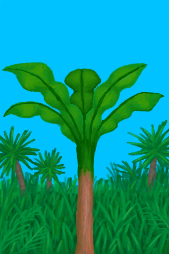

# 香蕉树  
> 我能在上面摘点香蕉。  
   
> 香蕉树可以在岛上的<b>丛林</b>地区找到，它们结满了营养丰富的香蕉。  当香蕉摘完后还可以把树砍掉，以获得可食用的<b>香蕉树芯</b>，还能够在它们的树桩腐烂之前利用容器从树桩中获取<b>水</b>。  
  
<table class="table table-bordered"><tbody><tr ><td  style="width:80%;text-align:left;vertical-align:top;" >**可使用次数：**3</td><td  style="width:20%;text-align:left;vertical-align:top;" >

</td></tr></tbody></tbody></table>  
  
## 获取来源  
<table class="table table-bordered"><thead><tr ><th  style="text-align:left;vertical-align:top;" >来源</th><th  style="text-align:left;vertical-align:top;" >操作</th></tr></thead><tr ><td  style="text-align:left;vertical-align:top;" >[

[香蕉树田](CropPlotBananaTree.md)](CropPlotBananaTree.md)</td><td  style="text-align:left;vertical-align:top;" >转化</td></tr><tr ><td  style="text-align:left;vertical-align:top;" >[

[丛林深处](DeepJungle.md)](DeepJungle.md)</td><td  style="text-align:left;vertical-align:top;" >探索</td></tr><tr ><td  style="text-align:left;vertical-align:top;" >[

[丛林](Jungle.md)](Jungle.md)</td><td  style="text-align:left;vertical-align:top;" >探索</td></tr><tr ><td  style="text-align:left;vertical-align:top;" >[

[湿地丛林(湿地)](Wetlands.md)](Wetlands.md)</td><td  style="text-align:left;vertical-align:top;" >探索</td></tr></tbody></table>  
  
## 动作  
<table class="table table-bordered"><thead><tr ><th  style="text-align:left;vertical-align:top;" >动作</th><th  style="text-align:left;vertical-align:top;" >耗时</th><th  style="text-align:left;vertical-align:top;" >条件</th><th  style="text-align:left;vertical-align:top;" >变化</th><th  style="text-align:left;vertical-align:top;" >状态</th></tr></thead><tr ><td  style="text-align:left;vertical-align:top;" >采摘香蕉 </td><td  style="text-align:left;vertical-align:top;" >15分</td><td  style="text-align:left;vertical-align:top;" >[

[光亮](Light.md)](Light.md): 10-100</td><td  style="text-align:left;vertical-align:top;" >** 自身：** 使用次数  -1  ** 获得： ** ** [Bananas]  **   [

[香蕉](Banana.md)](Banana.md)(+5) 基础权重：1</td><td  style="text-align:left;vertical-align:top;" ></td></tr></tbody></table>  
  
## 属性   
<table class="table table-bordered"><thead><tr ><th  style="text-align:left;vertical-align:top;" >属性</th><th  style="text-align:left;vertical-align:top;" >值</th><th  style="text-align:left;vertical-align:top;" >耗时</th><th  style="text-align:left;vertical-align:top;" >变化</th></tr></thead><tr ><td  style="text-align:left;vertical-align:top;" >使用次数</td><td  style="text-align:left;vertical-align:top;" >初始：3</td><td  style="text-align:left;vertical-align:top;" >-</td><td  style="text-align:left;vertical-align:top;" >** 到达0时： **  ** 自身 ** → [

[摘光的香蕉树](BananaTreeCleared.md)](BananaTreeCleared.md)</td></tr></tbody></table>  
  

