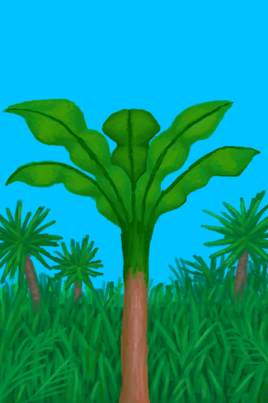
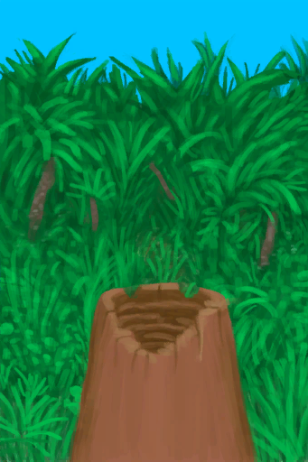
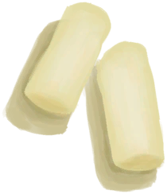

# 摘光的香蕉树  
> 香蕉摘光了，但它的树芯也可以食用。  
  
<table class="table table-bordered" data-toggle="table"  data-show-header="false"><thead style="display:none"><tr ><th  style="width:50%;text-align:left;vertical-align:top;"  data-sortable="true"  >title</th><th  style="width:50%;text-align:left;vertical-align:top;"  ></th></tr></thead><tr ><td  style="width:50%;text-align:left;vertical-align:top;"  ></td><td  style="width:50%;text-align:left;vertical-align:top;"  >

<a href="BananaTreeCleared.md" style="color:black">摘光的香蕉树</a>

香蕉树可以在岛上的<b>丛林</b>地区找到，它们结满了营养丰富的香蕉。  当香蕉摘完后还可以把树砍掉，以获得可食用的<b>香蕉树芯</b>，还能够在它们的树桩腐烂之前利用容器从树桩中获取<b>水</b>。</td></tr></tbody></table>  
  
## 获取来源  

转化

[香蕉树](BananaTree.md)

  
  
## 可拖入  

<table style="margin-bottom:0px;"><tr><td style="width:40%;text-align:left; background-color:#FEFEFE"><b>拖入：</b>[

[石斧](StoneAxe.md)](StoneAxe.md)</td><td style="width:40%;font-size:1em;font-weight:bold;background-color:#FEFEFE">砍树 (30分) [“手部动作(组)”](HandAction.md)</td></tr><tr><td colspan="2"><b>需求：</b>[

[光亮](Light.md)](Light.md): <b>10-100</b></td></tr><tr style="background-color:#FFFFFF"><td style=""><b>使用物：</b>使用次数  <b>-1(-5%)</b></td><td style=""><b>自身：</b>→ [

[香蕉树桩](BananaStump.md)](BananaStump.md)</td></tr><tr><td colspan="2"><b>状态变化：</b>[

[体重](Weight.md)](Weight.md)<b>-2</b>, [

[手掌损伤](HandDamage.md)](HandDamage.md)<b>+20</b></td></tr><tr><td colspan="2">[

[香蕉树芯](BananaStem.md)](BananaStem.md)(<b>+2</b>)</td></tr></table>
  

<table style="margin-bottom:0px;"><tr><td style="width:40%;text-align:left; background-color:#FEFEFE"><b>拖入：</b>[“斧”](tag_Axe.md)</td><td style="width:40%;font-size:1em;font-weight:bold;background-color:#FEFEFE">砍树 (15分) [“手部动作(组)”](HandAction.md)</td></tr><tr><td colspan="2"><b>需求：</b>[

[光亮](Light.md)](Light.md): <b>10-100</b></td></tr><tr style="background-color:#FFFFFF"><td style=""><b>使用物：</b>使用次数  <b>-1(-2%)</b></td><td style=""><b>自身：</b>→ [

[香蕉树桩](BananaStump.md)](BananaStump.md)</td></tr><tr><td colspan="2"><b>状态变化：</b>[

[体重](Weight.md)](Weight.md)<b>-1</b>, [

[手掌损伤](HandDamage.md)](HandDamage.md)<b>+10</b></td></tr><tr><td colspan="2">[

[香蕉树芯](BananaStem.md)](BananaStem.md)(<b>+2</b>)</td></tr></table>
  
  

