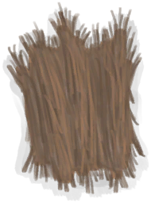
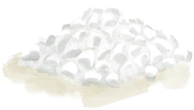

# 干燥的金鸡纳树皮  
> 我可以从中提取奎宁，这对疟疾很有效。  
  
<table class="table table-bordered" data-toggle="table"  data-show-header="false"><thead style="display:none"><tr ><th  style="width:50%;text-align:left;vertical-align:top;"  >title</th><th  style="width:50%;text-align:left;vertical-align:top;"  ></th></tr></thead><tr ><td  style="width:50%;text-align:left;vertical-align:top;"  >**重量：**25  **标签：**	[“可烹饪的”](tag_Cookable.md)</td><td  style="width:50%;text-align:left;vertical-align:top;"  >

<a href="BarkCinchonaDried.md" style="color:black">干燥的金鸡纳树皮</a>

金鸡纳树生长在岛上的<b>丛林</b>和<b>丛林高地</b>。  它们的树皮经过干燥处理后可以用来制造<b>奎宁</b>，一种治疗和预防<b>疟疾</b>的基本薬物。奎宁可以被进一步提炼成一种更有效的薬物，称为<b>硫酸奎宁</b>，或用于制作<b>汤力水</b>。</td></tr></tbody></table>  
  
## 获取来源  

金鸡纳树皮

[金鸡纳树皮](BarkCinchona.md)

转化

[金鸡纳树皮](BarkCinchona.md)

  
  
## 可用于蓝图  

<a href="Bp_Quinine.md" style="color:black">金鸡纳树皮粉</a>

  
  
  

