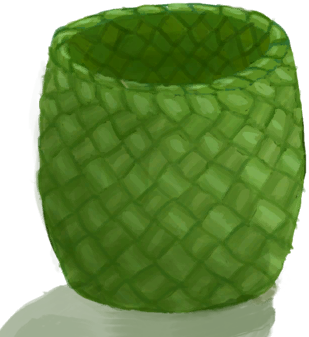

# 编织篓  
> 我可以把物品储存在里面。  
   
> 由棕榈编织片制成的篓子。它可用于<b>存储和保护</b>物品不受动物伤害，或者在不同地点间方便地搬运物品。  它也可以被放在最上方建筑栏，以保持物品栏整洁。  
  
  编织篓  |   图片   
 ----  |  ----:   
 ** 不可堆叠 **  **重量：**500  **标签：**	[“袋子”](tag_Bag.md)  **槽位：**4  **过滤器：**~~[“袋子”](tag_Bag.md)~~ , ~~[“大的”](tag_Large.md)~~ , ~~[“火源”](tag_FireSource.md)~~ , ~~[“火”](tag_Fire.md)~~ , ~~[“可泼溅的”](tag_Spillable.md)~~  **容量：**1000  **减重量：**-1000  |     
  
## 获取来源  
来源  |  操作  
----  |  ----  
[编织篓(蓝图)](Bp_WovenBasket.md)  |  蓝图制造  
[背篓](BackpackBasket.md)  |  解开绳子  
[编织篓(已放置)](BasketPlaced.md)  |  拿起  
[编织篓](LuggagePlacedReference.md)  |  拿起  
## 动作  
动作  |  耗时  |  条件  |  变化  |  状态  
----  |  ----  |  ----  |  ----  |  ----  
放置   |  -  |    |  ** 自身：** → [编织篓(已放置)](BasketPlaced.md)  |    
## 可拖入  
使用  |  动作  |  耗时  |  条件  |  变化  |  玩家状态  
----  |  ----  |  ----  |  ----  |  ----  |  ----  
[绳子](Rope.md)  |  绑上绳子   |  30分  |    |  ** 自身: ** → [背篓](BackpackBasket.md)  ** 使用物: ** →消失  |    

