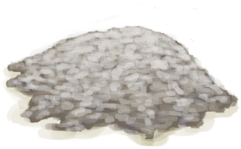

# 蝙蝠群  
> 好多蝙蝠。  
   
> 蝙蝠聚居在<b>洞穴</b>内。  它们生产的<b>海鸟粪</b>可以用作肥料或制作硝床。当然，蝙蝠也是可食用的。  
  
<table class="table table-bordered" data-toggle="table" ><tbody><tr ><td  style="width:80%;text-align:left;vertical-align:top;"  >**环境：**[蝙蝠洞(环境)](Env_CaveBats.md)  **可用次数：**30  ** 效果: ** [

[不适](Discomfort.md)](Discomfort.md)+2000</td><td  style="width:20%;text-align:left;vertical-align:top;"  >

</td></tr></tbody></tbody></table>  
  
## 动作  
<table class="table table-bordered" data-toggle="table" ><thead><tr ><th  style="text-align:left;vertical-align:top;"  >动作</th><th  style="text-align:left;vertical-align:top;"  >耗时</th><th  style="text-align:left;vertical-align:top;"  >条件</th><th  style="text-align:left;vertical-align:top;"  >变化</th><th  style="text-align:left;vertical-align:top;"  >状态</th></tr></thead><tr ><td  style="text-align:left;vertical-align:top;"  >用弓箭攻击！ </td><td  style="text-align:left;vertical-align:top;"  >2TP</td><td  style="text-align:left;vertical-align:top;"  >[

[简易的弓](BowRustic.md)](BowRustic.md)存在于手中/身上 [

[简易箭矢](ArrowSimple.md)](ArrowSimple.md)存在于手中</td><td  style="text-align:left;vertical-align:top;"  >** 自身：** 蝙蝠数量  -1  ** 获得： ** ** [Success] 搞到一只！ **   [

[蝙蝠尸体](Bat.md)](Bat.md)(+1) 基础权重：0<li>[

[箭术(技能)](Skill_Archery.md)](Skill_Archery.md)为0～150时权重限定为+1～+150</li><li>[

[视力](Myopia.md)](Myopia.md)为0～3时权重限定为+0～-100</li><li>[手部动作受限](ModifierHand.md)为0～3时权重限定为+0～-125</li><li>蝙蝠数量为1～30时权重-100～+0，否则取消掉落</li> ** [Failure] 没打中！ ** 基础权重：30  ** 相关卡牌 ** [简易的弓](BowRustic.md)可用次数  -1 ** 相关卡牌 ** [简易箭矢](ArrowSimple.md)可用次数  -3～-1</td><td  style="text-align:left;vertical-align:top;"  >[

[箭术(技能)](Skill_Archery.md)](Skill_Archery.md)+1</td></tr><tr ><td  style="text-align:left;vertical-align:top;"  >使用投索 </td><td  style="text-align:left;vertical-align:top;"  >1TP</td><td  style="text-align:left;vertical-align:top;"  >[

[投石索](Sling.md)](Sling.md)存在于手中</td><td  style="text-align:left;vertical-align:top;"  >** 自身：** 蝙蝠数量  -1  ** 获得： ** ** [Success] 搞到一只！ **   [

[蝙蝠尸体](Bat.md)](Bat.md)(+1) 基础权重：0<li>[

[投石索(技能)](Skill_Sling.md)](Skill_Sling.md)为1～150时权重限定为+0～+150</li><li>[

[视力](Myopia.md)](Myopia.md)为0～3时权重限定为+0～-100</li><li>[手部动作受限](ModifierHand.md)为0～3时权重限定为+0～-125</li><li>蝙蝠数量为1～30时权重-100～+0，否则取消掉落</li> ** [Failure] 没打中！ ** 基础权重：30  ** 相关卡牌 ** [投石索](Sling.md)可用次数  -1</td><td  style="text-align:left;vertical-align:top;"  >[

[投石索(技能)](Skill_Sling.md)](Skill_Sling.md)+1</td></tr><tr ><td  style="text-align:left;vertical-align:top;"  >用枪攻击！ </td><td  style="text-align:left;vertical-align:top;"  >2TP</td><td  style="text-align:left;vertical-align:top;"  >[

[枪](Gun.md)](Gun.md)存在于手中</td><td  style="text-align:left;vertical-align:top;"  >** 自身：** 蝙蝠数量  -1  ** 获得： ** ** [Success] 搞到一只！ **   [

[蝙蝠尸体](Bat.md)](Bat.md)(+1) 基础权重：50<li>[

[手枪(技能)](Skill_Handguns.md)](Skill_Handguns.md)为0～150时权重限定为+1～+150</li><li>[

[视力](Myopia.md)](Myopia.md)为0～3时权重限定为+0～-100</li><li>[手部动作受限](ModifierHand.md)为0～3时权重限定为+0～-125</li><li>蝙蝠数量为1～30时权重-100～+0，否则取消掉落</li> ** [Failure] 没打中！ ** 基础权重：25  ** 相关卡牌 ** [枪](Gun.md)可用次数  -1</td><td  style="text-align:left;vertical-align:top;"  >[

[手枪(技能)](Skill_Handguns.md)](Skill_Handguns.md)+1</td></tr><tr ><td  style="text-align:left;vertical-align:top;"  >朝它砸石头 </td><td  style="text-align:left;vertical-align:top;"  >1TP</td><td  style="text-align:left;vertical-align:top;"  ></td><td  style="text-align:left;vertical-align:top;"  >** 自身：** 蝙蝠数量  -1  ** 获得： ** ** [Success] 搞到一只！ **   [

[蝙蝠尸体](Bat.md)](Bat.md)(+1) 基础权重：0<li>[

[投石(技能)](Skill_RockThrowing.md)](Skill_RockThrowing.md)为1～150时权重限定为+0～+50</li><li>[

[视力](Myopia.md)](Myopia.md)为0～3时权重限定为+0～-100</li><li>[手部动作受限](ModifierHand.md)为0～3时权重限定为+0～-125</li><li>蝙蝠数量为1～30时权重-100～+0，否则取消掉落</li> ** [Failure] 没打中！ ** 基础权重：50</td><td  style="text-align:left;vertical-align:top;"  >[

[投石(技能)](Skill_RockThrowing.md)](Skill_RockThrowing.md)+0.5</td></tr></tbody></table>  
  
## 属性   
<table class="table table-bordered" data-toggle="table" ><thead><tr ><th  style="text-align:left;vertical-align:top;"  >属性</th><th  style="text-align:left;vertical-align:top;"  >值</th><th  style="text-align:left;vertical-align:top;"  >耗时</th><th  style="text-align:left;vertical-align:top;"  >变化</th></tr></thead><tr ><td  style="text-align:left;vertical-align:top;"  >蝙蝠数量</td><td  style="text-align:left;vertical-align:top;"  >初始：30</td><td  style="text-align:left;vertical-align:top;"  >-</td><td  style="text-align:left;vertical-align:top;"  >** 到达0时： **  ** 自身 ** →消失</td></tr><tr ><td  style="text-align:left;vertical-align:top;"  >繁殖中</td><td  style="text-align:left;vertical-align:top;"  >初始：0 最大：96</td><td  style="text-align:left;vertical-align:top;"  >每15分钟+1 最多需要：96TP</td><td  style="text-align:left;vertical-align:top;"  >** 到达上限时： **  ** 自身 ** 蝙蝠数量  +1 繁殖中  -672(-700%)</td></tr><tr ><td  style="text-align:left;vertical-align:top;"  >（排便）</td><td  style="text-align:left;vertical-align:top;"  >初始：0 最大：480</td><td  style="text-align:left;vertical-align:top;"  >每15分钟+1 最多需要：480TP</td><td  style="text-align:left;vertical-align:top;"  >** 到达上限时： ** ** [Guano]  **   [

[海鸟粪](Guano.md)](Guano.md)(+1)  ** 自身 ** （排便）  -480(-100%)</td></tr><tr ><td  style="text-align:left;vertical-align:top;"  >蘑菇</td><td  style="text-align:left;vertical-align:top;"  >初始：0 最大：672</td><td  style="text-align:left;vertical-align:top;"  >每15分钟+1 最多需要：672TP</td><td  style="text-align:left;vertical-align:top;"  >** 到达上限时： ** ** [Mushrooms]  **   [

[杂菌](AssortedMushroomsPlant.md)](AssortedMushroomsPlant.md)(+1～+2)  ** 自身 ** 蘑菇  -672(-100%)</td></tr></tbody></table>  
  

