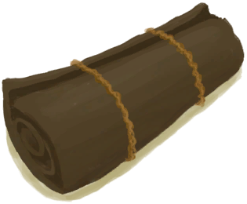

# 睡袋  
> 一个便携式睡袋。  
   
> 由鞣皮制成的便携床铺，是探索旅行的理想选择，而且与其他床相比相对舒适。  
  
  睡袋  |   图片   
 ----  |  ----:   
 **重量：**500  ** 区域唯一 **  |     
  
## 获取来源  
来源  |  操作  
----  |  ----  
[睡袋(蓝图)](Bp_Bedroll.md)  |  蓝图制造  
## 动作  
动作  |  耗时  |  条件  |  变化  |  状态  
----  |  ----  |  ----  |  ----  |  ----  
小憩 [休息动作](SleepAction.md)  |  4小时  |  [波次](WaveCounter.md): 0-0  **不能处于以下状态**： [睡眠中断](SleepInterrupt.md): 1-1 [水分](Hydration.md): 0-30 [过热](Hyperthermia.md): 51-200 [失温](Hypothermia.md): 26-100 [血压](Blood.md): 0-30 [恶心](Nausea.md): 20-24 [体重](Weight.md): 0-74 [波次](WaveCounter.md): 12-24  |    |  [睡眠中断](SleepInterrupt.md)-1 [睡眠钟](SleepClock.md)+15 [睡眠风险](SleepRisk.md)+15 [压力](Stress.md)-1.5 [世界观](Structure.md)+1 [情绪](Morale.md)+1.25 [恶心](Nausea.md)-1.5 [清醒度](Wakefulness.md)+6 [背痛](BackPain.md)+4 [蚊虫叮咬](BugBites.md)-1  
睡觉 [休息动作](SleepAction.md)  |  8小时  |  [波次](WaveCounter.md): 0-0  **不能处于以下状态**： [睡眠中断](SleepInterrupt.md): 1-1 [水分](Hydration.md): 0-30 [过热](Hyperthermia.md): 51-200 [失温](Hypothermia.md): 26-100 [血压](Blood.md): 0-30 [恶心](Nausea.md): 20-24 [体重](Weight.md): 0-74 [波次](WaveCounter.md): 12-24  |    |  [睡眠中断](SleepInterrupt.md)-1 [睡眠风险](SleepRisk.md)+31 [睡眠钟](SleepClock.md)+31 [压力](Stress.md)-2 [世界观](Structure.md)+2 [情绪](Morale.md)+1.25 [恶心](Nausea.md)-1.5 [清醒度](Wakefulness.md)+6 [背痛](BackPain.md)+4 [蚊虫叮咬](BugBites.md)-1  
拆解   |  2小时  |    |  消失 **  **   [绳子](Rope.md)(+2)   [细线](CordFiber.md)(+4)   [鞣制兽皮](CuredSkin.md)(+7)   |    
## 属性   
属性  |  值  |  耗时  |  变化  
----  |  ----  |  ----  |  ----  
耐久  |  初始：2880 最大：2880  |  -  |  ** 到达0时： ** [鞣制兽皮](CuredSkin.md)+7  [细线](CordFiber.md)+5  [绳子](Rope.md)+2   
