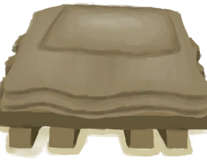

# 木床  
> 一张结实又舒服的木床。我的背会好受些。  
  
<table class="table table-bordered" data-toggle="table"  data-show-header="false"><thead style="display:none"><tr ><th  style="width:50%;text-align:left;vertical-align:top;"  >title</th><th  style="width:50%;text-align:left;vertical-align:top;"  ></th></tr></thead><tr ><td  style="width:50%;text-align:left;vertical-align:top;"  >** 不可删除 **  **重量：**1500  ** 效果: ** [

[舒适度](Comfort.md)](Comfort.md)<b>+250</b>  ** 解锁需求: ** [泥屋(环境)](Env_MudHut.md)</td><td  style="width:50%;text-align:left;vertical-align:top;"  >

<a href="BedWooden.md" style="color:black">木床</a>

一张非常舒适的床，由木板和大布毯制成，甚至附带一个羽毛枕头！！对你的背和睡眠质量都非常有好处。</td></tr></tbody></table>  
  
## 获取来源  

放置

[木床（未放置）](BedWoodenDismantled.md)

蓝图制造

[木床(蓝图)](Bp_BedWooden.md)

悲报！

[祖父](Grandfather.md)

  
  
## 动作  

<table><tr><td rowspan="2" style="width:200px;text-align:center;font-size:1.3em;font-weight:bold">

小憩

4小时

</td><td>[“休息动作(组)”](SleepAction.md)</td></tr><tr><td></td></tr><tr><td colspan="2"><b>需求：</b>**不能处于以下状态**：, [睡眠中断](SleepInterrupt.md): <b>1-1</b>, [

[水分](Hydration.md)](Hydration.md): <b>0-30</b>, [

[过热](Hyperthermia.md)](Hyperthermia.md): <b>51-200</b>, [

[失温](Hypothermia.md)](Hypothermia.md): <b>26-100</b>, [

[血压](Blood.md)](Blood.md): <b>0-30</b>, [

[恶心](Nausea.md)](Nausea.md): <b>20-24</b>, [

[体重](Weight.md)](Weight.md): <b>0-74</b></td></tr><tr><td colspan="2"><b>状态变化：</b>[睡眠中断](SleepInterrupt.md)<b>-1</b>, [睡眠钟](SleepClock.md)<b>+15</b>, [

[压力](Stress.md)](Stress.md)<b>-2.5</b> (每15分钟), [

[世界观](Structure.md)](Structure.md)<b>+3</b> (每15分钟), [

[情绪](Morale.md)](Morale.md)<b>+2</b> (每15分钟), [

[恶心](Nausea.md)](Nausea.md)<b>-2</b> (每15分钟), [

[清醒度](Wakefulness.md)](Wakefulness.md)<b>+6</b> (每15分钟), [

[背痛](BackPain.md)](BackPain.md)<b>+2.5</b> (每15分钟)</td></tr></table>
  

<table><tr><td rowspan="2" style="width:200px;text-align:center;font-size:1.3em;font-weight:bold">

睡觉

8小时

</td><td>[“休息动作(组)”](SleepAction.md)</td></tr><tr><td></td></tr><tr><td colspan="2"><b>需求：</b>**不能处于以下状态**：, [睡眠中断](SleepInterrupt.md): <b>1-1</b>, [

[水分](Hydration.md)](Hydration.md): <b>0-30</b>, [

[过热](Hyperthermia.md)](Hyperthermia.md): <b>51-200</b>, [

[失温](Hypothermia.md)](Hypothermia.md): <b>26-100</b>, [

[血压](Blood.md)](Blood.md): <b>0-30</b>, [

[恶心](Nausea.md)](Nausea.md): <b>20-24</b>, [

[体重](Weight.md)](Weight.md): <b>0-74</b></td></tr><tr><td colspan="2"><b>状态变化：</b>[睡眠中断](SleepInterrupt.md)<b>-1</b>, [睡眠钟](SleepClock.md)<b>+31</b>, [

[耐力](Stamina.md)](Stamina.md)<b>+30</b>, [

[压力](Stress.md)](Stress.md)<b>-3</b> (每15分钟), [

[世界观](Structure.md)](Structure.md)<b>+6</b> (每15分钟), [

[情绪](Morale.md)](Morale.md)<b>+2</b> (每15分钟), [

[恶心](Nausea.md)](Nausea.md)<b>-2</b> (每15分钟), [

[清醒度](Wakefulness.md)](Wakefulness.md)<b>+6</b> (每15分钟), [

[背痛](BackPain.md)](BackPain.md)<b>+2.5</b> (每15分钟)</td></tr></table>
  

<table><tr><td rowspan="2" style="width:200px;text-align:center;font-size:1.3em;font-weight:bold">

拆卸并搬起

45分

</td><td>[“手部动作(组)”](HandAction.md)</td></tr><tr><td><b>自身：</b>→ [

[木床（未放置）](BedWoodenDismantled.md)](BedWoodenDismantled.md)</td></tr><tr><td colspan="2"><b>需求：</b>[

[光亮](Light.md)](Light.md): <b>10-100</b></td></tr></table>
  
  
  

