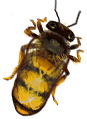

# 蜂箱  
> 一个人造蜂巢。喂糖水给蜜蜂们可以帮助它们繁衍生存。  
   
> <b>蜂箱</b>是一种人工蜂巢，需要由<b>棕榈编织片、泥土和粪便</b>制成，然后需要放入<b>巢脾</b>、蜂王和一些蜜蜂。 一旦你有了一个蜂巢，你就要确保该地区长了足够的花，让蜜蜂可以生产足够的蜂蜜来养活自己。你也可以给蜜蜂喂混合了<b>糖或蜂蜜</b>的<b>水</b>，这样它们的蜂蜜储备增长得更快。  一旦蜜蜂达到最大数量，它们就会<b>繁殖</b>。这时可以用一个袋子捕捉多余的蜜蜂和它们的蜂后，并用它们来制作一个新的蜂箱。 处理蜜蜂时，考虑使用<b>熏蜂器和防蜂服</b>，否则你会被蜇得很惨。  
  
  蜂箱  |   图片   
 ----  |  ----:   
 ** 不可堆叠 **  **可使用次数：**336  |     
  
## 获取来源  
来源  |  操作  
----  |  ----  
[繁殖中的蜂群](BeeSkepSwarming.md) , [布袋](Sack.md)  |  捕捉蜜蜂  
[繁殖中的蜂群](BeeSkepSwarming.md)  |  转化  
[蜂箱(蓝图)](Bp_BeeSkep.md)  |  蓝图制造  
## 动作  
动作  |  耗时  |  条件  |  变化  |  状态  
----  |  ----  |  ----  |  ----  |  ----  
采集   |  45分  |  [光亮](Light.md): 10-100  |  蜂蜜  -500  ** 获得： ** ** [Beehive] **   [巢脾](BeeHoneycomb.md)(+2)   [一群蜜蜂！(事件)](Event_BeesSwarming.md)(+1)   |  [污垢](Filth.md)+20 [蜜蜂蛰刺](BeeStings.md)+4～+16  
采集   |  45分  |  [光亮](Light.md): 10-100  |  蜂蜜  -500  ** 获得： ** ** [Beehive] **   [巢脾](BeeHoneycomb.md)(+2)   |  [污垢](Filth.md)+20 [蜜蜂蛰刺](BeeStings.md)+2～+8  
## 可拖入  
使用  |  动作  |  耗时  |  条件  |  变化  |  玩家状态  
----  |  ----  |  ----  |  ----  |  ----  |  ----  
[火把(开)](TorchOn.md)  |  烟熏   |  -  |    |  ** 自身: ** 休眠 + 6  |    
[“储水容器”](tag_WaterContainer.md)  |  添入   |  -  |    |  ** 自身: ** 食物储备 + 500  ** 使用物: ** 含水量  -300  |    
## 属性   
属性  |  值  |  耗时  |  变化  
----  |  ----  |  ----  |  ----  
休眠  |  初始：0 最大：6  |  每15分钟-1 最多需要：1小时30分  |    
种群数量  |  初始：336 最大：1344  |  每15分钟+1 最多需要：14天  |  ** 到达0时：蜂群死光了！ **  → [空蜂箱(空)](BeeSkepEmpty.md)  
食物储备  |  初始：0 最大：288  |  每15分钟-1 最多需要：3天  |    
蜂蜜  |  初始：0 最大：1000  |  每15分钟+0.1 最多需要：104天4小时  |    
## 被动效果  
名称  |  条件  |  变化(每15分钟)  |  玩家状态  
----  |  ----  |  ----  |  ----  
Make Honey  |  ** 需要存在卡牌：** [“花”](tag_Flower.md)  |  蜂蜜+0.1  |    
Honey Enviromental Boost  |  ** 需要存在卡牌：** [“肥沃环境”](tag_EnvFertile.md)  |  蜂蜜+0.5  |    
Eat Honey  |  ** 需要属性：** 食物储备: 0～0.1  |  蜂蜜-1  |    
Starve  |  ** 需要属性：** 食物储备: 0～0.1 蜂蜜: 0～0.1  |  种群数量-2  |    
Hive Competition  |  ** 需要存在卡牌：** [蜂箱](BeeSkep.md)  |  蜂蜜-0.5  |    
Breed More  |  ** 需要属性：** 食物储备: 0.5～1 蜂蜜: 0.5～1  |  种群数量+1  |    
