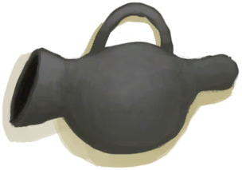

# 熏蜂器  
> 一个使蜜蜂镇定的工具。  
  
<table class="table table-bordered" data-toggle="table"  data-show-header="false"><thead style="display:none"><tr ><th  style="width:50%;text-align:left;vertical-align:top;"  >title</th><th  style="width:50%;text-align:left;vertical-align:top;"  ></th></tr></thead><tr ><td  style="width:50%;text-align:left;vertical-align:top;"  >**重量：**150  **标签：**	[“火源”](tag_FireSource.md)  ** 效果: ** [

[光亮](Light.md)](Light.md)<b>+20</b></td><td  style="width:50%;text-align:left;vertical-align:top;"  >

<a href="BeeSmokerOn.md" style="color:black">熏蜂器</a>

这个实用的的工具提供了一个比火把更有效的方法来熏蜜蜂，以免它们在你采集蜂蜜时攻击你。 它是由粘土制成，因此需要先在窑里烧制才能工作，燃料耗尽后需要填充火绒。</td></tr></tbody></table>  
  
## 获取来源  

** 使用**[火种](TinderLit.md)点燃

[熏蜂器(关)](BeeSmokerOff.md)

** 使用**[蒸馏器(开)](AlembicOn.md) , [火堆](Fire.md) , [营火](Campfire.md) , [火炉](Stove.md) , [香茅蜡烛(开)](CandleCitronellaOn.md) , [茉莉蜡烛(开)](CandleJasmineOn.md) , [蜡烛(开)](CandleOn.md) , [瓦斯炉(开)](GasCookerOn.md) , [燃烧的信号弹(开)](FlareHandOn.md)点燃

[熏蜂器(关)](BeeSmokerOff.md)

  
  
## 动作  

<table><tr><td rowspan="2" style="width:200px;text-align:center;font-size:1.3em;font-weight:bold">

熄灭

</td><td></td></tr><tr><td><b>自身：</b>→ [

[熏蜂器(关)](BeeSmokerOff.md)](BeeSmokerOff.md), 燃料  <b>-1(-6.25%)</b></td></tr></table>
  
  
  
## 可拖至  

[蜂箱](BeeSkep.md)

[繁殖中的蜂群](BeeSkepSwarming.md)

[蜂巢](Beehive.md)

[蜜蜂](Bees.md)

  
  
## 属性   

<table style="margin-bottom:0px;"><tr><td style="width:30%;text-align:left; background-color:#FEFEFE;font-size:1.3em;font-weight:bold;">燃料</td><td style="font-size:1em;background-color:#FEFEFE">初始：16 , 最大：16 每15分钟-1 , 最多需要：4小时</td></tr><tr style="background-color:#FFFFFF"><td colspan=2>** 到达0时： ** 自身: → [

[熏蜂器(关)](BeeSmokerOff.md)](BeeSmokerOff.md)</td></tr></table>
  

