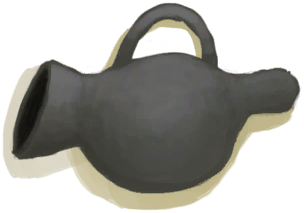

# 未烧制的熏蜂器  
> 需要在窑炉中烧制。  
  
<table class="table table-bordered" data-toggle="table"  data-show-header="false"><thead style="display:none"><tr ><th  style="width:50%;text-align:left;vertical-align:top;"  >title</th><th  style="width:50%;text-align:left;vertical-align:top;"  ></th></tr></thead><tr ><td  style="width:50%;text-align:left;vertical-align:top;"  >**重量：**150  **标签：**	[“粘土”](tag_Clay.md)</td><td  style="width:50%;text-align:left;vertical-align:top;"  >

<a href="BeeSmokerUnfired.md" style="color:black">未烧制的熏蜂器</a>

这个实用的的工具提供了一个比火把更有效的方法来熏蜜蜂，以免它们在你采集蜂蜜时攻击你。 它是由粘土制成，因此需要先在窑里烧制才能工作，燃料耗尽后需要填充火绒。</td></tr></tbody></table>  
  
## 获取来源  

蓝图制造

[熏蜂器(蓝图)](Bp_BeeSmoker.md)

  
  
## 可用于转化  
<table class="table table-bordered" data-toggle="table"  ><thead style=""><tr ><th  style="text-align:left;vertical-align:top;"  >转化为</th><th  style="text-align:left;vertical-align:top;"  >容器</th></tr></thead><tr ><td  style="text-align:left;vertical-align:top;"  >[

[熏蜂器(关)](BeeSmokerOff.md)](BeeSmokerOff.md)</td><td  style="text-align:left;vertical-align:top;"  >[

[窑炉](Kiln.md)](Kiln.md)</td></tr><tr ><td  style="text-align:left;vertical-align:top;"  >[

[熏蜂器(关)](BeeSmokerOff.md)](BeeSmokerOff.md)</td><td  style="text-align:left;vertical-align:top;"  >[

[高级窑炉](KilnAdvanced.md)](KilnAdvanced.md)</td></tr></tbody></table>  
  

