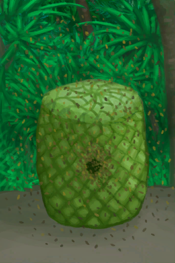

# 蜜蜂蛰刺  
> 蜜蜂蛰刺引起的，当数值过高时会导致恶心和头痛。  
> 与蜜蜂交互时引起，当数值过高时会导致恶心和头痛。 在与蜜蜂交互前，请考虑使用熏蜂器熏倒它们，或者穿好防蜂服。  
  

<b>基础值: </b> 0 
  

<b>变化范围: </b> 0 ~ 192 
  

<b>基础变化率: </b> -1 / 每15分钟 
  
## 阶段  

<table><tr style="height:2em;"><td style="background-color:#F0F0F0;text-align:center;width:180px;font-size:1.4em;font-weight:bold;vertical-align:middle;">
1 ～ 48

0% ～ 25%
</td><td colspan=2 style="font-size:1.1em;vertical-align:middle;background-color:#F9F9F9;">
<b>

蜜蜂蛰刺</b>

&nbsp;&nbsp;我被蜜蜂蛰了。
</td></tr><tr><td colspan=2><b>影响：</b>[

[疼痛](Pain.md)](Pain.md)<b>+50</b></td></tr><tr><td colspan=2></td></tr><tr style="height:2em;"><td style="background-color:#F0F0F0;text-align:center;width:180px;font-size:1.4em;font-weight:bold;vertical-align:middle;">
49 ～ 96

25% ～ 50%
</td><td colspan=2 style="font-size:1.1em;vertical-align:middle;background-color:#F9F9F9;">
<b>

蜜蜂蛰刺</b>

&nbsp;&nbsp;我被许多蜜蜂蛰了。
</td></tr><tr><td colspan=2><b>影响：</b>[

[疼痛](Pain.md)](Pain.md)<b>+75</b></td></tr><tr><td colspan=2></td></tr><tr style="height:2em;"><td style="background-color:#F0F0F0;text-align:center;width:180px;font-size:1.4em;font-weight:bold;vertical-align:middle;">
97 ～ 144

50% ～ 75%
</td><td colspan=2 style="font-size:1.1em;vertical-align:middle;background-color:#F9F9F9;">
<b>

蜜蜂蛰刺</b>

&nbsp;&nbsp;我被大量蜜蜂蛰了。
</td></tr><tr><td colspan=2><b>影响：</b>[

[疼痛](Pain.md)](Pain.md)<b>+100</b>, [

[皮肤完整度](SkinIntegrity.md)](SkinIntegrity.md)<b>-1</b>, [

[恶心](Nausea.md)](Nausea.md)加成<b>+2</b>, [

[头疼](Headache.md)](Headache.md)加成<b>+1.5</b></td></tr><tr><td colspan=2></td></tr><tr style="height:2em;"><td style="background-color:#F0F0F0;text-align:center;width:180px;font-size:1.4em;font-weight:bold;vertical-align:middle;">
145 ～ 196

75% ～ 102%
</td><td colspan=2 style="font-size:1.1em;vertical-align:middle;background-color:#F9F9F9;">
<b>

蜜蜂蛰刺</b>

&nbsp;&nbsp;我被成百上千的蜜蜂蛰了！
</td></tr><tr><td colspan=2><b>影响：</b>[

[疼痛](Pain.md)](Pain.md)<b>+100</b>, [

[皮肤完整度](SkinIntegrity.md)](SkinIntegrity.md)<b>-2</b>, [

[恶心](Nausea.md)](Nausea.md)加成<b>+3</b>, [

[头疼](Headache.md)](Headache.md)加成<b>+2</b></td></tr><tr><td colspan=2></td></tr></table>
  
## 相关卡牌  
[芦荟膏防护](AloeVeraGelProtection.md)  
## 可被以下操作改变  
<table class="table table-bordered table9326" data-toggle="table"  ><thead style=""><tr ><th  style=""  >来源</th><th  style=""  >操作</th><th  style=""  >值</th></tr></thead><tr ><td  style=""  >[

[一群蜜蜂！(事件)](Event_BeesSwarming.md)](Event_BeesSwarming.md)</td><td  style=""  >啊——！</td><td  style=""  >96 ~ 192</td></tr><tr ><td  style=""  >[

[一群蜜蜂！(事件)](Event_BeesSwarming.md)](Event_BeesSwarming.md)</td><td  style=""  >我的衣服一定程度上保护了我！</td><td  style=""  >48 ~ 96</td></tr><tr ><td  style=""  >[

[蜂箱](BeeSkep.md)](BeeSkep.md)</td><td  style=""  >采集</td><td  style=""  >4 ~ 16</td></tr><tr ><td  style=""  >[

[繁殖中的蜂群](BeeSkepSwarming.md)](BeeSkepSwarming.md)</td><td  style=""  >采集</td><td  style=""  >4 ~ 16</td></tr><tr ><td  style=""  >[

[蜂巢](Beehive.md)](Beehive.md)</td><td  style=""  >采集</td><td  style=""  >4 ~ 16</td></tr><tr ><td  style=""  >[

[蜂箱](BeeSkep.md)](BeeSkep.md)</td><td  style=""  >采集</td><td  style=""  >2 ~ 8</td></tr><tr ><td  style=""  >[

[繁殖中的蜂群](BeeSkepSwarming.md)](BeeSkepSwarming.md)</td><td  style=""  >采集</td><td  style=""  >2 ~ 8</td></tr><tr ><td  style=""  >[

[蜂巢](Beehive.md)](Beehive.md)</td><td  style=""  >采集</td><td  style=""  >2 ~ 8</td></tr><tr ><td  style=""  >[

[一群蜜蜂！(事件)](Event_BeesSwarming.md)](Event_BeesSwarming.md)</td><td  style=""  >我的衣服保护了我！</td><td  style=""  >0 ~ 16</td></tr></tbody></table>  
  

