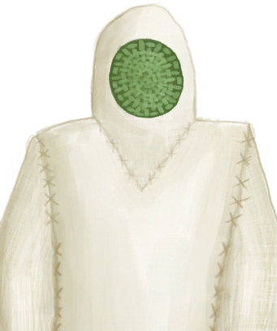

# 防蜂服  
> 进行养蜂工作的最佳防护服。<b>可在装备栏装备</b>  
  
<table class="table table-bordered" data-toggle="table"  data-show-header="false"><thead style="display:none"><tr ><th  style="width:50%;text-align:left;vertical-align:top;"  >title</th><th  style="width:50%;text-align:left;vertical-align:top;"  ></th></tr></thead><tr ><td  style="width:50%;text-align:left;vertical-align:top;"  >**重量：**350  **装备时减重：**-300  **标签：**	[“躯干（外层）”](tag_OuterTorso.md), [“腿部（内层）”](tag_Clothing.md)  **装备：**[“大衣”](eTag_Coat.md)  **可用次数：**2400  ** 效果: ** [

[体感温度](TemperaturePerceived.md)](TemperaturePerceived.md)+8 [

[阳光防护](SunProtection.md)](SunProtection.md)+5 [

[蚊虫防护](BugProtection.md)](BugProtection.md)+5 [

[蜂蛰防护](BeeProtection.md)](BeeProtection.md)+10</td><td  style="width:50%;text-align:left;vertical-align:top;"  >

<a href="BeeSuit.md" style="color:black">防蜂服</a>

一件厚布衣服，用来保护你不被蜜蜂蛰伤。对于养蜂人来说，这是必不可少的装备。</td></tr></tbody></table>  
  
## 获取来源  

蓝图制造

[防蜂服(蓝图)](Bp_BeeSuit.md)

  
  
## 动作  

<table><tr><td rowspan="2" style="width:200px;text-align:center;font-size:1.5em;font-weight:bold">

拆解

-

</td><td>[“手部动作(组)”](HandAction.md)</td></tr><tr><td><b>自身：</b>→消失</td></tr><tr><td colspan="2">[

[超大块布](ClothVeryLarge.md)](ClothVeryLarge.md)(+1), [

[细线](CordFiber.md)](CordFiber.md)(+4～+8)</td></tr></table>
  
  
  
## 可拖入  

<table style="margin-bottom:0px;"><tr><td style="width:40%;text-align:left; background-color:#FEFEFE"><b>拖入：</b>[“针线”](tag_ThreadedNeedle.md)</td><td style="width:40%;font-size:1em;font-weight:bold;background-color:#FEFEFE">修复 (30分) [“手部动作(组)”](HandAction.md), [“制造动作(组)”](CraftAction.md)</td></tr><tr style="background-color:#FFFFFF"><td style=""><b>使用物：</b>可用次数  -1,   -1</td><td style=""><b>自身：</b>使用次数  +800(33.33%)</td></tr></table>
  
  
## 属性   

<table style="margin-bottom:0px;"><tr><td style="width:30%;text-align:left; background-color:#FEFEFE;font-size:1.3em;font-weight:bold;">使用次数</td><td style="font-size:1em;background-color:#FEFEFE">初始：2400 , 最大：2400 -</td></tr><tr style="background-color:#FFFFFF"><td colspan=2>** 到达0时： ** 自身: →消失 [

[超大块布](ClothVeryLarge.md)](ClothVeryLarge.md)(+1), [

[细线](CordFiber.md)](CordFiber.md)(+4～+8)</td></tr></table>
  

<table style="margin-bottom:0px;"><tr><td style="width:30%;text-align:left; background-color:#FEFEFE;font-size:1.3em;font-weight:bold;">

</td><td style="font-size:1em;background-color:#FEFEFE">初始：0 , 最大：12 每15分钟-1 , 最多需要：3小时</td></tr><tr style="background-color:#FFFFFF"><td colspan=2></td></tr></table>
  
## 被动效果  
<table class="table table-bordered" data-toggle="table"  ><thead style=""><tr ><th  style="text-align:left;vertical-align:top;"  >名称</th><th  style="text-align:left;vertical-align:top;"  >条件</th><th  style="text-align:left;vertical-align:top;"  >变化(每15分钟)</th><th  style="text-align:left;vertical-align:top;"  >玩家状态</th></tr></thead><tr ><td  style="text-align:left;vertical-align:top;"  >Wet</td><td  style="text-align:left;vertical-align:top;"  >** 需要属性：** 

: 1～12(8.33%～100%)</td><td  style="text-align:left;vertical-align:top;"  ></td><td  style="text-align:left;vertical-align:top;"  >[

[湿度](Wetness.md)](Wetness.md)+20</td></tr><tr ><td  style="text-align:left;vertical-align:top;"  >FillUnderRain</td><td  style="text-align:left;vertical-align:top;"  >** 需要状态：** [

[遮蔽](Sheltered.md)](Sheltered.md): 0-0 [

[淋雨](RainExposure.md)](RainExposure.md): 1-5</td><td  style="text-align:left;vertical-align:top;"  >

 +2(16.66%)</td><td  style="text-align:left;vertical-align:top;"  ></td></tr></tbody></table>  
  

