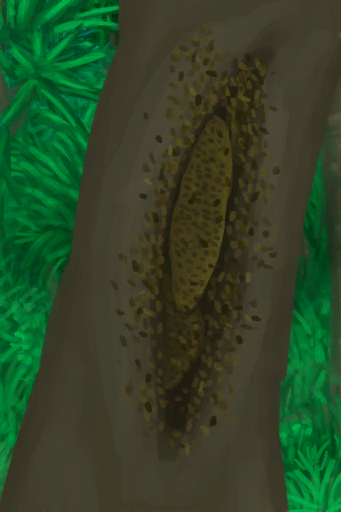
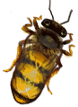
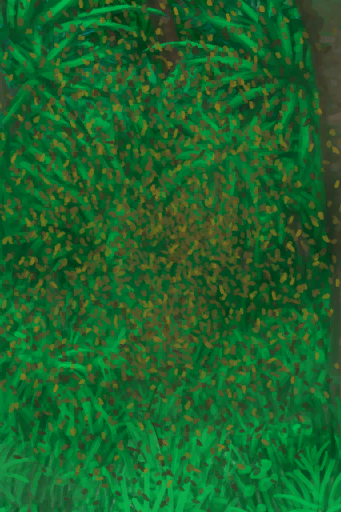
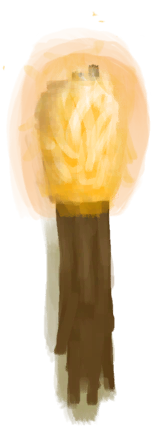

# 蜂巢  
> 最好先用烟熏它再动手。  
  
<table class="table table-bordered" data-toggle="table"  data-show-header="false"><thead style="display:none"><tr ><th  style="width:50%;text-align:left;vertical-align:top;"  >title</th><th  style="width:50%;text-align:left;vertical-align:top;"  ></th></tr></thead><tr ><td  style="width:50%;text-align:left;vertical-align:top;"  >** 区域唯一 **  ** 不可堆叠 **</td><td  style="width:50%;text-align:left;vertical-align:top;"  >

<a href="Beehive.md" style="color:black">蜂巢</a>

蜂巢可以在岛上的<b>丛林深处</b>找到。巢脾里可以提取蜂蜜和蜡，蜜蜂可以捕来建造你自己的人工蜂箱。  在与蜂巢交互之前，请确保先用火把或熏蜂器熏倒蜜蜂，否则它们会攻击你。</td></tr></tbody></table>  
  
## 获取来源  

探索

[丛林深处](DeepJungle.md)

  
  
## 动作  

<table><tr><td rowspan="2" style="width:200px;text-align:center;font-size:1.3em;font-weight:bold">

采集

45分

</td><td></td></tr><tr><td><b>自身：</b>→消失</td></tr><tr><td colspan="2"><b>需求：</b>休眠

: <b>0(0%)</b>, [

[光亮](Light.md)](Light.md): <b>10-100</b></td></tr><tr><td colspan="2"><b>状态变化：</b>[

[污垢](Filth.md)](Filth.md)<b>+20</b>, [

[蜜蜂蛰刺](BeeStings.md)](BeeStings.md)<b>+4～+16</b></td></tr><tr><td colspan="2">[

[巢脾](BeeHoneycomb.md)](BeeHoneycomb.md)(<b>+2～+5</b>), [

[一群蜜蜂！(事件)](Event_BeesSwarming.md)](Event_BeesSwarming.md)(<b>+1</b>)</td></tr></table>
  

<table><tr><td rowspan="2" style="width:200px;text-align:center;font-size:1.3em;font-weight:bold">

采集

45分

</td><td></td></tr><tr><td><b>自身：</b>→消失</td></tr><tr><td colspan="2"><b>需求：</b>休眠

: <b>1～6(16.67%～100%)</b>, [

[光亮](Light.md)](Light.md): <b>10-100</b></td></tr><tr><td colspan="2"><b>状态变化：</b>[

[污垢](Filth.md)](Filth.md)<b>+20</b>, [

[蜜蜂蛰刺](BeeStings.md)](BeeStings.md)<b>+2～+8</b></td></tr><tr><td colspan="2">[

[巢脾](BeeHoneycomb.md)](BeeHoneycomb.md)(<b>+2～+5</b>), [

[蜂后](QueenBee.md)](QueenBee.md)(<b>+1</b>), [

[蜜蜂](Bees.md)](Bees.md)(<b>+2～+3</b>)</td></tr></table>
  
  
  
## 可拖入  

<table style="margin-bottom:0px;"><tr><td style="width:40%;text-align:left; background-color:#FEFEFE"><b>拖入：</b>[

[火把(开)](TorchOn.md)](TorchOn.md) | [

[熏蜂器(开)](BeeSmokerOn.md)](BeeSmokerOn.md)</td><td style="width:40%;font-size:1em;font-weight:bold;background-color:#FEFEFE">烟熏  </td></tr><tr style="background-color:#FFFFFF"><td style=""><b>使用物：</b></td><td style=""><b>自身：</b>休眠

  <b>+6(100%)</b></td></tr></table>
  
  
## 属性   

<table style="margin-bottom:0px;"><tr><td style="width:30%;text-align:left; background-color:#FEFEFE;font-size:1.3em;font-weight:bold;">

休眠</td><td style="font-size:1em;background-color:#FEFEFE">初始：0 , 最大：6 每15分钟-1 , 最多需要：1小时30分</td></tr><tr style="background-color:#FFFFFF"><td colspan=2></td></tr></table>
  

