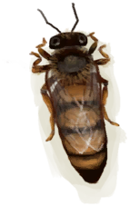

# 蜂巢  
> 最好先用烟熏它再动手。  
   
> 蜂巢可以在岛上的<b>丛林深处</b>找到。巢脾里可以提取蜂蜜和蜡，蜜蜂可以捕来建造你自己的人工蜂箱。  在与蜂巢交互之前，请确保先用火把或熏蜂器熏倒蜜蜂，否则它们会攻击你。  
  
<table class="table table-bordered"><tbody><tr ><td  style="width:80%;text-align:left;vertical-align:top;" >** 区域唯一 **  ** 不可堆叠 **</td><td  style="width:20%;text-align:left;vertical-align:top;" >

</td></tr></tbody></tbody></table>  
  
## 获取来源  
<table class="table table-bordered"><thead><tr ><th  style="text-align:left;vertical-align:top;" >来源</th><th  style="text-align:left;vertical-align:top;" >操作</th></tr></thead><tr ><td  style="text-align:left;vertical-align:top;" >[

[丛林深处](DeepJungle.md)](DeepJungle.md)</td><td  style="text-align:left;vertical-align:top;" >探索</td></tr></tbody></table>  
  
## 动作  
<table class="table table-bordered"><thead><tr ><th  style="text-align:left;vertical-align:top;" >动作</th><th  style="text-align:left;vertical-align:top;" >耗时</th><th  style="text-align:left;vertical-align:top;" >条件</th><th  style="text-align:left;vertical-align:top;" >变化</th><th  style="text-align:left;vertical-align:top;" >状态</th></tr></thead><tr ><td  style="text-align:left;vertical-align:top;" >采集 </td><td  style="text-align:left;vertical-align:top;" >45分</td><td  style="text-align:left;vertical-align:top;" >[

[光亮](Light.md)](Light.md): 10-100</td><td  style="text-align:left;vertical-align:top;" >** 自身：** →消失  ** 获得： ** ** [Beehive]  **   [

[巢脾](BeeHoneycomb.md)](BeeHoneycomb.md)(+2～+5)   [

[一群蜜蜂！(事件)](Event_BeesSwarming.md)](Event_BeesSwarming.md)(+1) </td><td  style="text-align:left;vertical-align:top;" >[

[污垢](Filth.md)](Filth.md)+20 [

[蜜蜂蛰刺](BeeStings.md)](BeeStings.md)+4～+16</td></tr><tr ><td  style="text-align:left;vertical-align:top;" >采集 </td><td  style="text-align:left;vertical-align:top;" >45分</td><td  style="text-align:left;vertical-align:top;" >[

[光亮](Light.md)](Light.md): 10-100</td><td  style="text-align:left;vertical-align:top;" >** 自身：** →消失  ** 获得： ** ** [Beehive]  **   [

[巢脾](BeeHoneycomb.md)](BeeHoneycomb.md)(+2～+5)   [

[蜂后](QueenBee.md)](QueenBee.md)(+1)   [

[蜜蜂](Bees.md)](Bees.md)(+2～+3) </td><td  style="text-align:left;vertical-align:top;" >[

[污垢](Filth.md)](Filth.md)+20 [

[蜜蜂蛰刺](BeeStings.md)](BeeStings.md)+2～+8</td></tr></tbody></table>  
  
## 可拖入  
<table class="table table-bordered"><thead><tr ><th  style="text-align:left;vertical-align:top;" >使用</th><th  style="text-align:left;vertical-align:top;" >动作</th><th  style="text-align:left;vertical-align:top;" >耗时</th><th  style="text-align:left;vertical-align:top;" >条件</th><th  style="text-align:left;vertical-align:top;" >变化</th><th  style="text-align:left;vertical-align:top;" >玩家状态</th></tr></thead><tr ><td  style="text-align:left;vertical-align:top;" >[

[火把(开)](TorchOn.md)](TorchOn.md) [

[熏蜂器(开)](BeeSmokerOn.md)](BeeSmokerOn.md)</td><td  style="text-align:left;vertical-align:top;" >烟熏 </td><td  style="text-align:left;vertical-align:top;" >-</td><td  style="text-align:left;vertical-align:top;" ></td><td  style="text-align:left;vertical-align:top;" >** 自身: ** 休眠

  +6(100%)</td><td  style="text-align:left;vertical-align:top;" ></td></tr></tbody></table>  
  
## 属性   
<table class="table table-bordered"><thead><tr ><th  style="text-align:left;vertical-align:top;" >属性</th><th  style="text-align:left;vertical-align:top;" >值</th><th  style="text-align:left;vertical-align:top;" >耗时</th><th  style="text-align:left;vertical-align:top;" >变化</th></tr></thead><tr ><td  style="text-align:left;vertical-align:top;" >休眠

</td><td  style="text-align:left;vertical-align:top;" >初始：0 最大：6</td><td  style="text-align:left;vertical-align:top;" >每15分钟-1 最多需要：1小时30分</td><td  style="text-align:left;vertical-align:top;" ></td></tr></tbody></table>  
  

