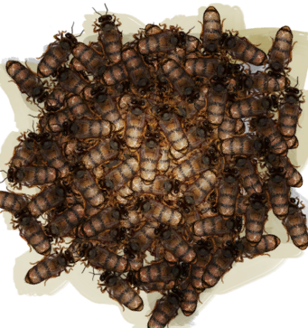

# 蜜蜂  
> 嗡嗡嗡……  
   
> 蜂巢可以在岛上的<b>丛林深处</b>找到。巢脾里可以提取蜂蜜和蜡，蜜蜂可以捕来建造你自己的人工蜂箱。  在与蜂巢交互之前，请确保先用火把或熏蜂器熏倒蜜蜂，否则它们会攻击你。  
  
  蜜蜂  |   图片   
 ----  |  ----:   
 **重量：**25  **标签：**	[“饲料”](tag_Feed.md), [“诱饵”](tag_Bait.md)  |     
  
## 获取来源  
来源  |  操作  
----  |  ----  
[繁殖中的蜂群](BeeSkepSwarming.md)  |  捕捉蜜蜂 ** 拖入：**[布袋](Sack.md)  
[蜂巢](Beehive.md)  |  采集  
## 可拖入  
使用  |  动作  |  耗时  |  条件  |  变化  |  玩家状态  
----  |  ----  |  ----  |  ----  |  ----  |  ----  
[火把(开)](TorchOn.md) [熏蜂器(开)](BeeSmokerOn.md)  |  熏   |  -  |    |  ** 自身: ** 休眠  +6(100%)  |    
## 可拖至  
[猪食槽](BoarFeeder.md) | [猪食槽](BoarFeeder.md) | [猪食槽(空)](BoarFeederEmpty.md) | [猪食槽(空)](BoarFeederEmpty.md) | [堆肥箱](CompostBin.md) | [灰山鹑喂食器](PartridgeFeeder.md) | [灰山鹑喂食器](PartridgeFeeder.md) | [灰山鹑喂食器(空)](PartridgeFeederEmpty.md) | [中陷阱的猕猴](CageTrapMacaque.md) | [母猪](BoarEnclosureFemale.md) | [母猪](BoarEnclosureFemale.md) | [公猪](BoarEnclosureMale.md) | [公猪](BoarEnclosureMale.md) | [小猪](BoarEnclosurePiglet.md) | [小猪](BoarEnclosurePiglet.md) | [母猪](BoarTiedFemale.md) | [母猪](BoarTiedFemale.md) | [公猪](BoarTiedMale.md) | [公猪](BoarTiedMale.md) | [小猪](BoarTiedPiglet.md) | [小猪](BoarTiedPiglet.md) | [猕猴朋友](MacaqueFriend.md) | [受伤的猕猴](MacaqueWounded.md) | [小灰山鹑](PartridgeChick.md) | [雌灰山鹑](PartridgeFemaleEnclosure.md) | [雌灰山鹑](PartridgeFemaleLive.md) | [雄灰山鹑](PartridgeMaleEnclosure.md) | [雄灰山鹑](PartridgeMaleLive.md) | [钓鱼线](FishingLine.md) | [钓鱼线](FishingLineRustic.md) | [钓鱼竿](FishingRod.md)  
## 可用于蓝图  
- [蜂箱(蓝图)](Bp_BeeSkep.md)  
- [鸟食(蓝图)](Bp_FeedBird.md)  
  
  
## 属性   
属性  |  值  |  耗时  |  变化  
----  |  ----  |  ----  |  ----  
休眠  |  初始：6 最大：6  |  每15分钟-1 最多需要：1小时30分  |  ** 到达0时： **  ** 自身 ** →消失  

