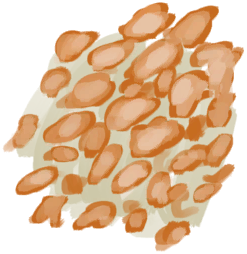

# 蜂蜡  
> 一小块蜡  
   
> 通过将<b>巢脾</b>压入碗或椰子壳中，可以从中提取蜂蜡。 可以将其组合成块，用于制作<b>蜡烛</b>：一种制作成本相对较低的持久光源。  
  
  蜂蜡  |   图片   
 ----  |  ----:   
 **重量：**100  |     
  
## 获取来源  
来源  |  操作  
----  |  ----  
[蜂蜜(蓝图)](Bp_Honey.md)  |  蓝图制造  
[巢脾](BeeHoneycomb.md)  |  提取蜂蜜 ** 拖入：**[“碗（容器）”](tag_ContainerBowl.md)  
## 可拖入  
使用  |  动作  |  耗时  |  条件  |  变化  |  玩家状态  
----  |  ----  |  ----  |  ----  |  ----  |  ----  
[蜂蜡](Beeswax.md)  |  做蜂蜡块   |  15分  |    |  ** 自身: ** → [蜂蜡块](BeeswaxBlock.md)  ** 使用物: ** →消失  |    
## 可拖至  
[蜂蜡](Beeswax.md)  

