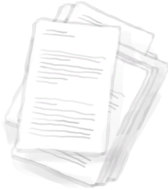

# 腰包  
> 舒服又实用。  
  
<table class="table table-bordered table0552" data-toggle="table"  data-show-header="false"><thead style="display:none"><tr ><th  style="width:50%;"  >title</th><th  style="width:50%;"  ></th></tr></thead><tr ><td  style="width:50%;"  >** 不可删除 **  ** 不可堆叠 **  ** 装备时等效于拿在手上 **  **重量：**150  **装备时减重：**-150  **标签：**	[“袋子”](tag_Bag.md), [“皮带”](tag_Belt.md), [“高价值物品”](tag_Valuable.md)  **装备：**[“腰带装备”](eTag_Belt.md)  **槽位：**2  **初始卡牌：**[

[护照](Passport.md)](Passport.md)&nbsp;&nbsp;&nbsp;&nbsp;[

[纸](Papers.md)](Papers.md)  **容量：**350  **减重：**-350</td><td  style="width:50%;"  >

<a href="BeltBag.md" style="color:black">腰包</a>

</td></tr></tbody></table>  
  

