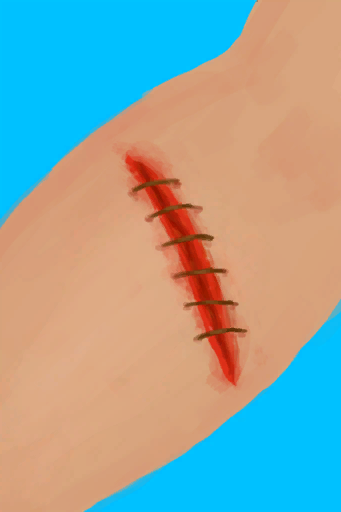

# 失血  
> 你的身体需要维持一定的血压。有些类型的流血伤口会降低你的血压，直到死亡。  如果你发现自己在流血，你应该优先在伤口上佩戴止血带以止血，然后在止血完成替换为敷料。 如果你不再失血，你的血压会自行恢复，并在这个过程中消耗额外的营养。  
  
#### ** 基础值: ** 0   
#### ** 变化范围: ** 0 ~ 20  
#### ** 基础变化率: ** 无   
## 阶段  
<table class="table table-bordered" data-toggle="table" ><thead><tr ><th  style="text-align:left;vertical-align:top;"  >范围</th><th  style="text-align:left;vertical-align:top;"  >名称</th><th  style="text-align:left;vertical-align:top;"  >描述</th><th  style="text-align:left;vertical-align:top;"  >影响状态</th><th  style="text-align:left;vertical-align:top;"  data-sortable="true"  >影响动作</th></tr></thead><tr ><td  style="text-align:left;vertical-align:top;"  >0 ～ 0</td><td  style="text-align:left;vertical-align:top;"  >没有流血</td><td  style="text-align:left;vertical-align:top;"  ></td><td  style="text-align:left;vertical-align:top;"  ></td><td  style="text-align:left;vertical-align:top;"  ></td></tr><tr ><td  style="text-align:left;vertical-align:top;"  >1 ～ 2</td><td  style="text-align:left;vertical-align:top;"  >

正在流血</td><td  style="text-align:left;vertical-align:top;"  >你正在失血。</td><td  style="text-align:left;vertical-align:top;"  >[

[情绪](Morale.md)](Morale.md)加成-1 [

[压力](Stress.md)](Stress.md)加成+2 [

[污垢](Filth.md)](Filth.md)加成+1 [

[血压](Blood.md)](Blood.md)加成-4</td><td  style="text-align:left;vertical-align:top;"  ></td></tr><tr ><td  style="text-align:left;vertical-align:top;"  >3 ～ 4</td><td  style="text-align:left;vertical-align:top;"  >

正在流血</td><td  style="text-align:left;vertical-align:top;"  >你正在失血。</td><td  style="text-align:left;vertical-align:top;"  >[

[情绪](Morale.md)](Morale.md)加成-1.5 [

[压力](Stress.md)](Stress.md)加成+3 [

[污垢](Filth.md)](Filth.md)加成+2 [

[血压](Blood.md)](Blood.md)加成-6</td><td  style="text-align:left;vertical-align:top;"  ></td></tr><tr ><td  style="text-align:left;vertical-align:top;"  >5 ～ 6</td><td  style="text-align:left;vertical-align:top;"  >

大量出血</td><td  style="text-align:left;vertical-align:top;"  >你正在大量失血。</td><td  style="text-align:left;vertical-align:top;"  >[

[情绪](Morale.md)](Morale.md)加成-2 [

[压力](Stress.md)](Stress.md)加成+4 [

[污垢](Filth.md)](Filth.md)加成+2 [

[血压](Blood.md)](Blood.md)加成-8</td><td  style="text-align:left;vertical-align:top;"  ></td></tr><tr ><td  style="text-align:left;vertical-align:top;"  >7 ～ 20</td><td  style="text-align:left;vertical-align:top;"  >

大量出血</td><td  style="text-align:left;vertical-align:top;"  >你正在大量失血。</td><td  style="text-align:left;vertical-align:top;"  >[

[情绪](Morale.md)](Morale.md)加成-2 [

[压力](Stress.md)](Stress.md)加成+4 [

[污垢](Filth.md)](Filth.md)加成+2 [

[血压](Blood.md)](Blood.md)加成-12</td><td  style="text-align:left;vertical-align:top;"  ></td></tr></tbody></table>  
  
## 可被以下操作改变  
<table class="table table-bordered" data-toggle="table" ><thead><tr ><th  style="text-align:left;vertical-align:top;"  >来源</th><th  style="text-align:left;vertical-align:top;"  >操作</th><th  style="text-align:left;vertical-align:top;"  data-sortable="true"  >值</th></tr></thead><tr ><td  style="text-align:left;vertical-align:top;"  >[

[左臂撕裂伤](W_ArmLacerationL.md)](W_ArmLacerationL.md)</td><td  style="text-align:left;vertical-align:top;"  >条件被动</td><td  style="text-align:left;vertical-align:top;"  >6</td></tr><tr ><td  style="text-align:left;vertical-align:top;"  >[

[右臂撕裂伤](W_ArmLacerationR.md)](W_ArmLacerationR.md)</td><td  style="text-align:left;vertical-align:top;"  >条件被动</td><td  style="text-align:left;vertical-align:top;"  >6</td></tr><tr ><td  style="text-align:left;vertical-align:top;"  >[

[左腿撕裂伤](W_LegLacerationL.md)](W_LegLacerationL.md)</td><td  style="text-align:left;vertical-align:top;"  >条件被动</td><td  style="text-align:left;vertical-align:top;"  >6</td></tr><tr ><td  style="text-align:left;vertical-align:top;"  >[

[右腿撕裂伤](W_LegLacerationR.md)](W_LegLacerationR.md)</td><td  style="text-align:left;vertical-align:top;"  >条件被动</td><td  style="text-align:left;vertical-align:top;"  >6</td></tr><tr ><td  style="text-align:left;vertical-align:top;"  >[

[左臂撕裂伤](W_ArmLacerationL.md)](W_ArmLacerationL.md)</td><td  style="text-align:left;vertical-align:top;"  >条件被动</td><td  style="text-align:left;vertical-align:top;"  >3</td></tr><tr ><td  style="text-align:left;vertical-align:top;"  >[

[已缝合的左臂撕裂伤](W_ArmLacerationLStitched.md)](W_ArmLacerationLStitched.md)</td><td  style="text-align:left;vertical-align:top;"  >条件被动</td><td  style="text-align:left;vertical-align:top;"  >3</td></tr><tr ><td  style="text-align:left;vertical-align:top;"  >[

[右臂撕裂伤](W_ArmLacerationR.md)](W_ArmLacerationR.md)</td><td  style="text-align:left;vertical-align:top;"  >条件被动</td><td  style="text-align:left;vertical-align:top;"  >3</td></tr><tr ><td  style="text-align:left;vertical-align:top;"  >[

[已缝合的右臂撕裂伤](W_ArmLacerationRStitched.md)](W_ArmLacerationRStitched.md)</td><td  style="text-align:left;vertical-align:top;"  >条件被动</td><td  style="text-align:left;vertical-align:top;"  >3</td></tr><tr ><td  style="text-align:left;vertical-align:top;"  >[

[左腿撕裂伤](W_LegLacerationL.md)](W_LegLacerationL.md)</td><td  style="text-align:left;vertical-align:top;"  >条件被动</td><td  style="text-align:left;vertical-align:top;"  >3</td></tr><tr ><td  style="text-align:left;vertical-align:top;"  >[

[已缝合的左腿撕裂伤](W_LegLacerationLStitched.md)](W_LegLacerationLStitched.md)</td><td  style="text-align:left;vertical-align:top;"  >条件被动</td><td  style="text-align:left;vertical-align:top;"  >3</td></tr><tr ><td  style="text-align:left;vertical-align:top;"  >[

[右腿撕裂伤](W_LegLacerationR.md)](W_LegLacerationR.md)</td><td  style="text-align:left;vertical-align:top;"  >条件被动</td><td  style="text-align:left;vertical-align:top;"  >3</td></tr><tr ><td  style="text-align:left;vertical-align:top;"  >[

[已缝合的右腿撕裂伤](W_LegLacerationRStitched.md)](W_LegLacerationRStitched.md)</td><td  style="text-align:left;vertical-align:top;"  >条件被动</td><td  style="text-align:left;vertical-align:top;"  >3</td></tr><tr ><td  style="text-align:left;vertical-align:top;"  >[

[鲨鱼咬伤](W_SharkBite.md)](W_SharkBite.md)</td><td  style="text-align:left;vertical-align:top;"  >条件被动</td><td  style="text-align:left;vertical-align:top;"  >3</td></tr><tr ><td  style="text-align:left;vertical-align:top;"  >[

[已缝合的左臂撕裂伤](W_ArmLacerationLStitched.md)](W_ArmLacerationLStitched.md)</td><td  style="text-align:left;vertical-align:top;"  >条件被动</td><td  style="text-align:left;vertical-align:top;"  >1.5</td></tr><tr ><td  style="text-align:left;vertical-align:top;"  >[

[已缝合的左腿撕裂伤](W_LegLacerationLStitched.md)](W_LegLacerationLStitched.md)</td><td  style="text-align:left;vertical-align:top;"  >条件被动</td><td  style="text-align:left;vertical-align:top;"  >1.5</td></tr><tr ><td  style="text-align:left;vertical-align:top;"  >[

[已缝合的右腿撕裂伤](W_LegLacerationRStitched.md)](W_LegLacerationRStitched.md)</td><td  style="text-align:left;vertical-align:top;"  >条件被动</td><td  style="text-align:left;vertical-align:top;"  >1.5</td></tr><tr ><td  style="text-align:left;vertical-align:top;"  >[

[左臂撕裂伤](W_ArmLacerationL.md)](W_ArmLacerationL.md)</td><td  style="text-align:left;vertical-align:top;"  >条件被动</td><td  style="text-align:left;vertical-align:top;"  >1</td></tr><tr ><td  style="text-align:left;vertical-align:top;"  >[

[右臂撕裂伤](W_ArmLacerationR.md)](W_ArmLacerationR.md)</td><td  style="text-align:left;vertical-align:top;"  >条件被动</td><td  style="text-align:left;vertical-align:top;"  >1</td></tr><tr ><td  style="text-align:left;vertical-align:top;"  >[

[左腿撕裂伤](W_LegLacerationL.md)](W_LegLacerationL.md)</td><td  style="text-align:left;vertical-align:top;"  >条件被动</td><td  style="text-align:left;vertical-align:top;"  >1</td></tr><tr ><td  style="text-align:left;vertical-align:top;"  >[

[右腿撕裂伤](W_LegLacerationR.md)](W_LegLacerationR.md)</td><td  style="text-align:left;vertical-align:top;"  >条件被动</td><td  style="text-align:left;vertical-align:top;"  >1</td></tr><tr ><td  style="text-align:left;vertical-align:top;"  >[

[已缝合的左臂撕裂伤](W_ArmLacerationLStitched.md)](W_ArmLacerationLStitched.md)</td><td  style="text-align:left;vertical-align:top;"  >条件被动</td><td  style="text-align:left;vertical-align:top;"  >0.5</td></tr><tr ><td  style="text-align:left;vertical-align:top;"  >[

[已缝合的右臂撕裂伤](W_ArmLacerationRStitched.md)](W_ArmLacerationRStitched.md)</td><td  style="text-align:left;vertical-align:top;"  >条件被动</td><td  style="text-align:left;vertical-align:top;"  >0.5</td></tr><tr ><td  style="text-align:left;vertical-align:top;"  >[

[已缝合的左腿撕裂伤](W_LegLacerationLStitched.md)](W_LegLacerationLStitched.md)</td><td  style="text-align:left;vertical-align:top;"  >条件被动</td><td  style="text-align:left;vertical-align:top;"  >0.5</td></tr><tr ><td  style="text-align:left;vertical-align:top;"  >[

[已缝合的右腿撕裂伤](W_LegLacerationRStitched.md)](W_LegLacerationRStitched.md)</td><td  style="text-align:left;vertical-align:top;"  >条件被动</td><td  style="text-align:left;vertical-align:top;"  >0.5</td></tr><tr ><td  style="text-align:left;vertical-align:top;"  >[

[左臂撕裂伤](W_ArmLacerationL.md)](W_ArmLacerationL.md)</td><td  style="text-align:left;vertical-align:top;"  >条件被动</td><td  style="text-align:left;vertical-align:top;"  >-3</td></tr><tr ><td  style="text-align:left;vertical-align:top;"  >[

[已缝合的左臂撕裂伤](W_ArmLacerationLStitched.md)](W_ArmLacerationLStitched.md)</td><td  style="text-align:left;vertical-align:top;"  >条件被动</td><td  style="text-align:left;vertical-align:top;"  >-3</td></tr><tr ><td  style="text-align:left;vertical-align:top;"  >[

[右臂撕裂伤](W_ArmLacerationR.md)](W_ArmLacerationR.md)</td><td  style="text-align:left;vertical-align:top;"  >条件被动</td><td  style="text-align:left;vertical-align:top;"  >-3</td></tr><tr ><td  style="text-align:left;vertical-align:top;"  >[

[已缝合的右臂撕裂伤](W_ArmLacerationRStitched.md)](W_ArmLacerationRStitched.md)</td><td  style="text-align:left;vertical-align:top;"  >条件被动</td><td  style="text-align:left;vertical-align:top;"  >-3</td></tr><tr ><td  style="text-align:left;vertical-align:top;"  >[

[左腿撕裂伤](W_LegLacerationL.md)](W_LegLacerationL.md)</td><td  style="text-align:left;vertical-align:top;"  >条件被动</td><td  style="text-align:left;vertical-align:top;"  >-3</td></tr><tr ><td  style="text-align:left;vertical-align:top;"  >[

[已缝合的左腿撕裂伤](W_LegLacerationLStitched.md)](W_LegLacerationLStitched.md)</td><td  style="text-align:left;vertical-align:top;"  >条件被动</td><td  style="text-align:left;vertical-align:top;"  >-3</td></tr><tr ><td  style="text-align:left;vertical-align:top;"  >[

[右腿撕裂伤](W_LegLacerationR.md)](W_LegLacerationR.md)</td><td  style="text-align:left;vertical-align:top;"  >条件被动</td><td  style="text-align:left;vertical-align:top;"  >-3</td></tr><tr ><td  style="text-align:left;vertical-align:top;"  >[

[已缝合的右腿撕裂伤](W_LegLacerationRStitched.md)](W_LegLacerationRStitched.md)</td><td  style="text-align:left;vertical-align:top;"  >条件被动</td><td  style="text-align:left;vertical-align:top;"  >-3</td></tr><tr ><td  style="text-align:left;vertical-align:top;"  >[

[鲨鱼咬伤](W_SharkBite.md)](W_SharkBite.md)</td><td  style="text-align:left;vertical-align:top;"  >条件被动</td><td  style="text-align:left;vertical-align:top;"  >-3</td></tr><tr ><td  style="text-align:left;vertical-align:top;"  >[

[左臂撕裂伤](W_ArmLacerationL.md)](W_ArmLacerationL.md)</td><td  style="text-align:left;vertical-align:top;"  >条件被动</td><td  style="text-align:left;vertical-align:top;"  >-6</td></tr><tr ><td  style="text-align:left;vertical-align:top;"  >[

[右臂撕裂伤](W_ArmLacerationR.md)](W_ArmLacerationR.md)</td><td  style="text-align:left;vertical-align:top;"  >条件被动</td><td  style="text-align:left;vertical-align:top;"  >-6</td></tr><tr ><td  style="text-align:left;vertical-align:top;"  >[

[左腿撕裂伤](W_LegLacerationL.md)](W_LegLacerationL.md)</td><td  style="text-align:left;vertical-align:top;"  >条件被动</td><td  style="text-align:left;vertical-align:top;"  >-6</td></tr><tr ><td  style="text-align:left;vertical-align:top;"  >[

[右腿撕裂伤](W_LegLacerationR.md)](W_LegLacerationR.md)</td><td  style="text-align:left;vertical-align:top;"  >条件被动</td><td  style="text-align:left;vertical-align:top;"  >-6</td></tr></tbody></table>  
  

