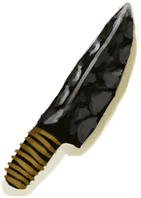
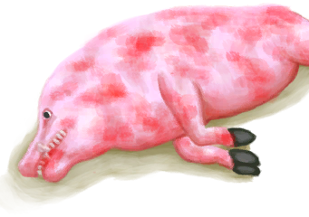

# 野猪尸体  
> 一头死掉的野猪，趁它腐烂前先剥下它的皮。  
   
> 野猪可以在岛上丛林覆盖的地区找到。它们是危险的猎物，所以在试图猎杀它们之前，确保你有足够的治疗用品，尤其是止血带。  野猪可以为你提供大量的肉、脂肪和兽皮。野猪肉营养丰富，脂肪有多种用途，从烹饪到制作蜡烛或水袋。兽皮可以用来制作衣服和许多有用的物品，甚至它们的獠牙也有用处。  
  
<table class="table table-bordered" data-toggle="table" ><tbody><tr ><td  style="width:80%;text-align:left;vertical-align:top;"  >** 不可删除 **  **重量：**3000  **标签：**	[“大的”](tag_Large.md)  ** 效果: ** [

[舒适度](Comfort.md)](Comfort.md)-250</td><td  style="width:20%;text-align:left;vertical-align:top;"  >

</td></tr></tbody></tbody></table>  
  
## 获取来源  
<table class="table table-bordered" data-toggle="table" ><thead><tr ><th  style="text-align:left;vertical-align:top;"  >来源</th><th  style="text-align:left;vertical-align:top;"  >操作</th></tr></thead><tr ><td  style="text-align:left;vertical-align:top;"  >[

[原木陷阱](LogTrap.md)](LogTrap.md)</td><td  style="text-align:left;vertical-align:top;"  >捕捉猎物</td></tr><tr ><td  style="text-align:left;vertical-align:top;"  >[

[陷坑](TrappingPit.md)](TrappingPit.md)</td><td  style="text-align:left;vertical-align:top;"  >捕捉猎物</td></tr><tr ><td  style="text-align:left;vertical-align:top;"  >[

[我拿下它了，但我受伤了。(事件)](Event_BoarFightMixedSuccess.md)](Event_BoarFightMixedSuccess.md)</td><td  style="text-align:left;vertical-align:top;"  >继续</td></tr><tr ><td  style="text-align:left;vertical-align:top;"  >[

[野猪倒下了！(事件)](Event_BoarFightSuccess.md)](Event_BoarFightSuccess.md)</td><td  style="text-align:left;vertical-align:top;"  >继续</td></tr><tr ><td  style="text-align:left;vertical-align:top;"  >[

[母猪](BoarEnclosureFemale.md)](BoarEnclosureFemale.md)</td><td  style="text-align:left;vertical-align:top;"  >宰杀 ** 拖入：**[大石块](StoneHeavy.md) , [“切割工具”](tag_Cutter.md) , [“斧”](tag_Axe.md) , [“一级矛”](tag_Spear.md)</td></tr><tr ><td  style="text-align:left;vertical-align:top;"  >[

[母猪](BoarEnclosureFemale.md)](BoarEnclosureFemale.md)</td><td  style="text-align:left;vertical-align:top;"  >噢不！</td></tr><tr ><td  style="text-align:left;vertical-align:top;"  >[

[母猪](BoarEnclosureFemale.md)](BoarEnclosureFemale.md)</td><td  style="text-align:left;vertical-align:top;"  >渴死了</td></tr><tr ><td  style="text-align:left;vertical-align:top;"  >[

[公猪](BoarEnclosureMale.md)](BoarEnclosureMale.md)</td><td  style="text-align:left;vertical-align:top;"  >宰杀 ** 拖入：**[大石块](StoneHeavy.md) , [“切割工具”](tag_Cutter.md) , [“斧”](tag_Axe.md) , [“一级矛”](tag_Spear.md)</td></tr><tr ><td  style="text-align:left;vertical-align:top;"  >[

[公猪](BoarEnclosureMale.md)](BoarEnclosureMale.md)</td><td  style="text-align:left;vertical-align:top;"  >转化</td></tr><tr ><td  style="text-align:left;vertical-align:top;"  >[

[公猪](BoarEnclosureMale.md)](BoarEnclosureMale.md)</td><td  style="text-align:left;vertical-align:top;"  >渴死了</td></tr><tr ><td  style="text-align:left;vertical-align:top;"  >[

[母猪](BoarTiedFemale.md)](BoarTiedFemale.md)</td><td  style="text-align:left;vertical-align:top;"  >宰杀 ** 拖入：**[大石块](StoneHeavy.md) , [“切割工具”](tag_Cutter.md) , [“斧”](tag_Axe.md) , [“一级矛”](tag_Spear.md)</td></tr><tr ><td  style="text-align:left;vertical-align:top;"  >[

[母猪](BoarTiedFemale.md)](BoarTiedFemale.md)</td><td  style="text-align:left;vertical-align:top;"  >转化</td></tr><tr ><td  style="text-align:left;vertical-align:top;"  >[

[母猪](BoarTiedFemale.md)](BoarTiedFemale.md)</td><td  style="text-align:left;vertical-align:top;"  >渴死了</td></tr><tr ><td  style="text-align:left;vertical-align:top;"  >[

[公猪](BoarTiedMale.md)](BoarTiedMale.md)</td><td  style="text-align:left;vertical-align:top;"  >宰杀 ** 拖入：**[大石块](StoneHeavy.md) , [“切割工具”](tag_Cutter.md) , [“斧”](tag_Axe.md) , [“一级矛”](tag_Spear.md)</td></tr><tr ><td  style="text-align:left;vertical-align:top;"  >[

[公猪](BoarTiedMale.md)](BoarTiedMale.md)</td><td  style="text-align:left;vertical-align:top;"  >转化</td></tr><tr ><td  style="text-align:left;vertical-align:top;"  >[

[公猪](BoarTiedMale.md)](BoarTiedMale.md)</td><td  style="text-align:left;vertical-align:top;"  >渴死了</td></tr></tbody></table>  
  
## 可拖入  
<table class="table table-bordered" data-toggle="table" ><thead><tr ><th  style="text-align:left;vertical-align:top;"  >使用</th><th  style="text-align:left;vertical-align:top;"  >动作</th><th  style="text-align:left;vertical-align:top;"  >耗时</th><th  style="text-align:left;vertical-align:top;"  >条件</th><th  style="text-align:left;vertical-align:top;"  >变化</th><th  style="text-align:left;vertical-align:top;"  >玩家状态</th></tr></thead><tr ><td  style="text-align:left;vertical-align:top;"  >[

[黑曜石刀](KnifeObsidian.md)](KnifeObsidian.md)</td><td  style="text-align:left;vertical-align:top;"  >剥皮 [“手部动作(组)”](HandAction.md) [“制造动作(组)”](CraftAction.md)</td><td  style="text-align:left;vertical-align:top;"  >3TP</td><td  style="text-align:left;vertical-align:top;"  >[

[光亮](Light.md)](Light.md): 10-100</td><td  style="text-align:left;vertical-align:top;"  >** 自身: ** → [

[剥皮的野猪](BoarSkinned.md)](BoarSkinned.md)  ** 使用物: ** 可用次数  -1  ** 获得: **   [

[新鲜兽皮](SkinFresh.md)](SkinFresh.md)(+3) 基础权重：1</td><td  style="text-align:left;vertical-align:top;"  >[

[污垢](Filth.md)](Filth.md)+15</td></tr><tr ><td  style="text-align:left;vertical-align:top;"  >[“切割工具”](tag_Cutter.md)</td><td  style="text-align:left;vertical-align:top;"  >剥皮 [“手部动作(组)”](HandAction.md) [“制造动作(组)”](CraftAction.md)</td><td  style="text-align:left;vertical-align:top;"  >4TP</td><td  style="text-align:left;vertical-align:top;"  >[

[光亮](Light.md)](Light.md): 10-100</td><td  style="text-align:left;vertical-align:top;"  >** 自身: ** → [

[剥皮的野猪](BoarSkinned.md)](BoarSkinned.md)  ** 使用物: ** 可用次数  -1  ** 获得: **   [

[新鲜兽皮](SkinFresh.md)](SkinFresh.md)(+3) 基础权重：1</td><td  style="text-align:left;vertical-align:top;"  >[

[污垢](Filth.md)](Filth.md)+15</td></tr></tbody></table>  
  
## 属性   
<table class="table table-bordered" data-toggle="table" ><thead><tr ><th  style="text-align:left;vertical-align:top;"  >属性</th><th  style="text-align:left;vertical-align:top;"  >值</th><th  style="text-align:left;vertical-align:top;"  >耗时</th><th  style="text-align:left;vertical-align:top;"  >变化</th></tr></thead><tr ><td  style="text-align:left;vertical-align:top;"  >耐久</td><td  style="text-align:left;vertical-align:top;"  >初始：192</td><td  style="text-align:left;vertical-align:top;"  >每15分钟-1 最多需要：192TP</td><td  style="text-align:left;vertical-align:top;"  >** 到达0时： **   [

[骨头](Bones.md)](Bones.md)(+4)  ** 自身 ** →消失</td></tr><tr ><td  style="text-align:left;vertical-align:top;"  >体重

</td><td  style="text-align:left;vertical-align:top;"  >初始：3000 最大：6000</td><td  style="text-align:left;vertical-align:top;"  >-</td><td  style="text-align:left;vertical-align:top;"  ></td></tr></tbody></table>  
  

