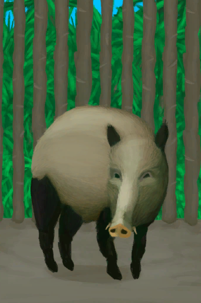

# 公猪  
> 可以宰了它获得猪肉和皮革，或者让它与母猪交配，以繁殖更多猪。  
  
  公猪  |   图片   
 ----  |  ----:   
 ** 可重命名 **  ** 不可堆叠 **  **标签：**	[“野猪”](tag_Boar.md), [“大的”](tag_Large.md), [“大型动物”](tag_LargeAnimal.md)  **可使用次数：**288  |     
  
## 获取来源  
来源  |  操作  
----  |  ----  
[小猪](BoarEnclosurePiglet.md)  |  转化  
[公猪](BoarTiedMale.md)  |  圈养在畜栏中  
## 动作  
动作  |  耗时  |  条件  |  变化  |  状态  
----  |  ----  |  ----  |  ----  |  ----  
放生   |  15分  |  [畜栏(环境)](Env_Enclosure.md)  |  消失  |  [蜂群密度](Pop_Boar.md)+1000  
捡起 [手部动作](HandAction.md)  |  30分  |  [光亮](Light.md): 10-100  |  → [公猪](BoarTiedMale.md) 压力  -250  |    
抚摸   |  15分  |    |  压力 + 25  |  [孤独感](Loneliness.md)-20 [压力](Stress.md)-10  
## 可拖入  
使用  |  动作  |  耗时  |  条件  |  变化  |  玩家状态  
----  |  ----  |  ----  |  ----  |  ----  |  ----  
[“诱饵”](tag_Bait.md)  |  喂食   |  15分  |    |  ** 自身: ** 饥饿 + 48 压力 + 12  ** 使用物: ** 消失  |    
[“喂”](tag_Meat.md)  |  喂食   |  15分  |    |  ** 自身: ** 饥饿 + 384 压力 + 50  ** 使用物: ** 消失  |    
[“喂/添加”](tag_Feed.md)  |  喂食   |  15分  |    |  ** 自身: ** 饥饿 + 192 压力 + 25  ** 使用物: ** 消失  |    
[“储水容器”](tag_WaterContainer.md)  |  喂水   |  -  |    |  ** 自身: ** 口渴 + 48 压力 + 25  ** 使用物: ** 含水量  -300  |    
[大石块](StoneHeavy.md)  |  宰杀 [手部动作](HandAction.md)  |  30分  |  [光亮](Light.md): 10-100  |  ** 自身: ** → [野猪尸体](BoarCarcass.md)  ** 使用物: ** 可用次数  -1  |  [污垢](Filth.md)+20  
## 属性   
属性  |  值  |  耗时  |  变化  
----  |  ----  |  ----  |  ----  
饥饿  |  初始：288 最大：576  |  每15分钟-1 最多需要：6天  |  ** 到达0时： **  → [野猪尸体](BoarCarcass.md)  
口渴  |  初始：288 最大：288  |  每15分钟-1 最多需要：3天  |  ** 到达0时：渴死了 **  → [野猪尸体](BoarCarcass.md)  
压力  |  初始：0 最大：1000  |  每15分钟-4 最多需要：2天14小时30分  |    
体重  |  初始：0 最大：6000  |  每15分钟-2 最多需要：31天6小时  |    
便便  |  初始：96 最大：96  |  每15分钟-1 最多需要：1天  |  ** 到达0时： ** ** [Poop] **   [粪便](Manure.md)(+1)   
## 被动效果  
名称  |  条件  |  变化(每15分钟)  |  玩家状态  
----  |  ----  |  ----  |  ----  
Starvation Protection  |  ** 需要属性：** 饥饿: 1～12 体重: 1～6000  |  饥饿+1  |    
Gaining Weight 1  |  ** 需要属性：** 饥饿: 288～432  |  体重+3  |    
Gaining Weight 2  |  ** 需要属性：** 饥饿: 433～576  |  体重+4  |    
Eat  |  ** 需要存在卡牌：** [猪食槽](BoarFeeder.md)  |  饥饿+2  |    
Drink  |  ** 需要存在卡牌：** [水槽](WateringTrough.md)  |  口渴+2  |    
Cure Stress  |  ** 需要属性：** 饥饿: 288～576 口渴: 144～288  |  压力+10  |    
Overcrowding  |  ** 需要属性：** 怀孕: 1～1536 ** 需要存在卡牌：** [“大型动物”](tag_LargeAnimal.md)  |  压力-0.66  |    
Poop  |  ** 需要存在卡牌：** [粪便](Manure.md)  |  压力-0.01  |    
Company  |    |    |  [孤独感](Loneliness.md)加成-1  
## 其他效果  
名称  |  目标  |  条件  |  变化  |  玩家状态  
----  |  ----  |  ----  |  ----  |  ----  
Boar Overeating  |  [猪食槽](BoarFeeder.md)  |  ** 需要属性：** 特殊1: 4500～6000  |  食物-1  |    
