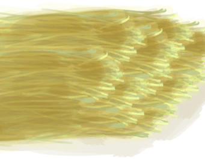

# 烤野猪肉  
> 美味！  
  
<table class="table table-bordered" data-toggle="table"  data-show-header="false"><thead style="display:none"><tr ><th  style="width:50%;text-align:left;vertical-align:top;"  >title</th><th  style="width:50%;text-align:left;vertical-align:top;"  ></th></tr></thead><tr ><td  style="width:50%;text-align:left;vertical-align:top;"  >**重量：**100  **标签：**	[“可烹饪的”](tag_Cookable.md), [“饲料”](tag_Feed.md), [“肉”](tag_Meat.md), [“人类食物”](tag_HumanFood.md)</td><td  style="width:50%;text-align:left;vertical-align:top;"  >

<a href="BoarMeatCooked.md" style="color:black">烤野猪肉</a>

野猪可以在岛上丛林覆盖的地区找到。它们是危险的猎物，所以在试图猎杀它们之前，确保你有足够的治疗用品，尤其是止血带。  野猪可以为你提供大量的肉、脂肪和兽皮。野猪肉营养丰富，脂肪有多种用途，从烹饪到制作蜡烛或水袋。兽皮可以用来制作衣服和许多有用的物品，甚至它们的獠牙也有用处。</td></tr></tbody></table>  
  
## 获取来源  
<table class="table table-bordered" data-toggle="table"  ><thead style=""><tr ><th  style="text-align:left;vertical-align:top;"  >来源</th><th  style="text-align:left;vertical-align:top;"  >操作</th></tr></thead><tr ><td  style="text-align:left;vertical-align:top;"  >[

[野猪肉](BoarMeat.md)](BoarMeat.md) , [

[营火](Campfire.md)](Campfire.md)</td><td  style="text-align:left;vertical-align:top;"  >野猪肉</td></tr><tr ><td  style="text-align:left;vertical-align:top;"  >[

[野猪肉](BoarMeat.md)](BoarMeat.md) , [

[粘土火盆](ClayFirePit.md)](ClayFirePit.md)</td><td  style="text-align:left;vertical-align:top;"  >野猪肉</td></tr><tr ><td  style="text-align:left;vertical-align:top;"  >[

[野猪肉](BoarMeat.md)](BoarMeat.md) , [

[火堆](Fire.md)](Fire.md)</td><td  style="text-align:left;vertical-align:top;"  >野猪肉</td></tr><tr ><td  style="text-align:left;vertical-align:top;"  >[

[野猪肉](BoarMeat.md)](BoarMeat.md) , [

[瓦斯炉(开)](GasCookerOn.md)](GasCookerOn.md)</td><td  style="text-align:left;vertical-align:top;"  >野猪肉</td></tr><tr ><td  style="text-align:left;vertical-align:top;"  >[

[野猪肉](BoarMeat.md)](BoarMeat.md) , [

[火炉](Stove.md)](Stove.md)</td><td  style="text-align:left;vertical-align:top;"  >野猪肉</td></tr><tr ><td  style="text-align:left;vertical-align:top;"  >[

[烟熏炉](Smoker.md)](Smoker.md)</td><td  style="text-align:left;vertical-align:top;"  >熏野猪肉 ** 拖入：**[野猪肉](BoarMeat.md)</td></tr><tr ><td  style="text-align:left;vertical-align:top;"  >[

[野猪肉](BoarMeat.md)](BoarMeat.md) , [

[烟熏炉](Smoker.md)](Smoker.md)</td><td  style="text-align:left;vertical-align:top;"  >野猪肉</td></tr><tr ><td  style="text-align:left;vertical-align:top;"  >[

[烟熏炉(塑料布)(点燃)](SmokerPlastic.md)](SmokerPlastic.md)</td><td  style="text-align:left;vertical-align:top;"  >熏野猪肉 ** 拖入：**[野猪肉](BoarMeat.md)</td></tr><tr ><td  style="text-align:left;vertical-align:top;"  >[

[野猪肉](BoarMeat.md)](BoarMeat.md) , [

[烟熏炉(塑料布)(点燃)](SmokerPlastic.md)](SmokerPlastic.md)</td><td  style="text-align:left;vertical-align:top;"  >野猪肉</td></tr></tbody></table>  
  
## 动作  
<table class="table table-bordered" data-toggle="table"  ><thead style=""><tr ><th  style="text-align:left;vertical-align:top;"  >动作</th><th  style="text-align:left;vertical-align:top;"  >耗时</th><th  style="text-align:left;vertical-align:top;"  data-sortable="true"  >条件</th><th  style="text-align:left;vertical-align:top;"  >变化</th><th  style="text-align:left;vertical-align:top;"  >状态</th></tr></thead><tr ><td  style="text-align:left;vertical-align:top;"  >食用 [“食用肉类动作(组)”](CarnivorousAction.md) [“进食动作(组)”](EatingAction.md)</td><td  style="text-align:left;vertical-align:top;"  >15分</td><td  style="text-align:left;vertical-align:top;"  ></td><td  style="text-align:left;vertical-align:top;"  >** 自身：** →消失</td><td  style="text-align:left;vertical-align:top;"  >[

[饱食](Satiation.md)](Satiation.md)+35 [

[胃](Stomach.md)](Stomach.md)+50 [

[水分](Hydration.md)](Hydration.md)+4 [

[压力](Stress.md)](Stress.md)-10 [

[情绪](Morale.md)](Morale.md)+5 [

[肉类<nobr>厌倦度</nobr>](SaturationMeat.md)](SaturationMeat.md)+45 [

[污垢](Filth.md)](Filth.md)+5</td></tr></tbody></table>  
  
## 可拖至  

[猪食槽](BoarFeeder.md)

[猪食槽](BoarFeeder.md)

[猪食槽(空)](BoarFeederEmpty.md)

[猪食槽(空)](BoarFeederEmpty.md)

[堆肥箱](CompostBin.md)

[灰山鹑喂食器](PartridgeFeeder.md)

[灰山鹑喂食器(空)](PartridgeFeederEmpty.md)

[中陷阱的猕猴](CageTrapMacaque.md)

[母猪](BoarEnclosureFemale.md)

[母猪](BoarEnclosureFemale.md)

[公猪](BoarEnclosureMale.md)

[公猪](BoarEnclosureMale.md)

[小猪](BoarEnclosurePiglet.md)

[小猪](BoarEnclosurePiglet.md)

[母猪](BoarTiedFemale.md)

[母猪](BoarTiedFemale.md)

[公猪](BoarTiedMale.md)

[公猪](BoarTiedMale.md)

[小猪](BoarTiedPiglet.md)

[小猪](BoarTiedPiglet.md)

[忠犬朋友](DogFriend.md)

[祖父](Grandfather.md)

[祖父(健康)](GrandfatherHealthy.md)

[猕猴朋友](MacaqueFriend.md)

[受伤的猕猴](MacaqueWounded.md)

[小灰山鹑](PartridgeChick.md)

[雌灰山鹑](PartridgeFemaleEnclosure.md)

[雌灰山鹑](PartridgeFemaleLive.md)

[雄灰山鹑](PartridgeMaleEnclosure.md)

[雄灰山鹑](PartridgeMaleLive.md)

  
  
## 可用于蓝图  

[

[猪食(蓝图)](Bp_FeedBoar.md)](Bp_FeedBoar.md)

  
  
  
## 可用于转化  
<table class="table table-bordered" data-toggle="table"  ><thead style=""><tr ><th  style="text-align:left;vertical-align:top;"  >转化为</th><th  style="text-align:left;vertical-align:top;"  >容器</th></tr></thead><tr ><td  style="text-align:left;vertical-align:top;"  >[

[烧焦物](CharredRemains.md)](CharredRemains.md)</td><td  style="text-align:left;vertical-align:top;"  >[

[营火](Campfire.md)](Campfire.md)</td></tr><tr ><td  style="text-align:left;vertical-align:top;"  >[

[烧焦物](CharredRemains.md)](CharredRemains.md)</td><td  style="text-align:left;vertical-align:top;"  >[

[粘土火盆](ClayFirePit.md)](ClayFirePit.md)</td></tr><tr ><td  style="text-align:left;vertical-align:top;"  >[

[烧焦物](CharredRemains.md)](CharredRemains.md)</td><td  style="text-align:left;vertical-align:top;"  >[

[火堆](Fire.md)](Fire.md)</td></tr><tr ><td  style="text-align:left;vertical-align:top;"  >[

[烧焦物](CharredRemains.md)](CharredRemains.md)</td><td  style="text-align:left;vertical-align:top;"  >[

[瓦斯炉(开)](GasCookerOn.md)](GasCookerOn.md)</td></tr><tr ><td  style="text-align:left;vertical-align:top;"  >[

[烟熏野猪肉](BoarMeatSmoked.md)](BoarMeatSmoked.md)</td><td  style="text-align:left;vertical-align:top;"  >[

[火炉](Stove.md)](Stove.md)</td></tr><tr ><td  style="text-align:left;vertical-align:top;"  >[

[烟熏野猪肉](BoarMeatSmoked.md)](BoarMeatSmoked.md)</td><td  style="text-align:left;vertical-align:top;"  >[

[烟熏炉](Smoker.md)](Smoker.md)</td></tr><tr ><td  style="text-align:left;vertical-align:top;"  >[

[烟熏野猪肉](BoarMeatSmoked.md)](BoarMeatSmoked.md)</td><td  style="text-align:left;vertical-align:top;"  >[

[烟熏炉(塑料布)(点燃)](SmokerPlastic.md)](SmokerPlastic.md)</td></tr></tbody></table>  
  
## 属性   
<table class="table table-bordered" data-toggle="table"  ><thead style=""><tr ><th  style="text-align:left;vertical-align:top;"  >属性</th><th  style="text-align:left;vertical-align:top;"  >值</th><th  style="text-align:left;vertical-align:top;"  >耗时</th><th  style="text-align:left;vertical-align:top;"  >变化</th></tr></thead><tr ><td  style="text-align:left;vertical-align:top;"  >耐久</td><td  style="text-align:left;vertical-align:top;"  >初始：192</td><td  style="text-align:left;vertical-align:top;"  >每15分钟-1 最多需要：2天</td><td  style="text-align:left;vertical-align:top;"  >** 到达0时： **  ** 自身 ** → [

[腐烂物](RottenRemains.md)](RottenRemains.md)</td></tr></tbody></table>  
  

