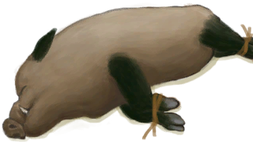

# 母猪  
> 一头活母猪。可以通过喂食喂水来维持生命，或者放养在畜栏里。  
  
<table class="table table-bordered" data-toggle="table"  data-show-header="false"><thead style="display:none"><tr ><th  style="width:50%;text-align:left;vertical-align:top;"  >title</th><th  style="width:50%;text-align:left;vertical-align:top;"  ></th></tr></thead><tr ><td  style="width:50%;text-align:left;vertical-align:top;"  >** 不可堆叠 **  **重量：**3000  **标签：**	[“野猪”](tag_Boar.md), [“大的”](tag_Large.md), [“大型动物”](tag_LargeAnimal.md)  **可用次数：**288</td><td  style="width:50%;text-align:left;vertical-align:top;"  >

<a href="BoarTiedFemale.md" style="color:black">母猪</a>

</td></tr></tbody></table>  
  
## 获取来源  
<table class="table table-bordered" data-toggle="table"  ><thead style=""><tr ><th  style="text-align:left;vertical-align:top;"  >来源</th><th  style="text-align:left;vertical-align:top;"  >操作</th></tr></thead><tr ><td  style="text-align:left;vertical-align:top;"  >[

[陷坑](TrappingPit.md)](TrappingPit.md)</td><td  style="text-align:left;vertical-align:top;"  >捕捉猎物</td></tr><tr ><td  style="text-align:left;vertical-align:top;"  >[

[母猪](BoarEnclosureFemale.md)](BoarEnclosureFemale.md)</td><td  style="text-align:left;vertical-align:top;"  >捡起</td></tr><tr ><td  style="text-align:left;vertical-align:top;"  >[

[小猪](BoarTiedPiglet.md)](BoarTiedPiglet.md)</td><td  style="text-align:left;vertical-align:top;"  >转化</td></tr></tbody></table>  
  
## 动作  
<table class="table table-bordered" data-toggle="table"  ><thead style=""><tr ><th  style="text-align:left;vertical-align:top;"  >动作</th><th  style="text-align:left;vertical-align:top;"  >耗时</th><th  style="text-align:left;vertical-align:top;"  >条件</th><th  style="text-align:left;vertical-align:top;"  >变化</th><th  style="text-align:left;vertical-align:top;"  >状态</th></tr></thead><tr ><td  style="text-align:left;vertical-align:top;"  >圈养在畜栏中 </td><td  style="text-align:left;vertical-align:top;"  >-</td><td  style="text-align:left;vertical-align:top;"  >[

[畜栏(环境)](Env_Enclosure.md)](Env_Enclosure.md)存在于手中/面板</td><td  style="text-align:left;vertical-align:top;"  >** 自身：** → [

[母猪](BoarEnclosureFemale.md)](BoarEnclosureFemale.md)</td><td  style="text-align:left;vertical-align:top;"  ></td></tr><tr ><td  style="text-align:left;vertical-align:top;"  >放生 </td><td  style="text-align:left;vertical-align:top;"  >15分</td><td  style="text-align:left;vertical-align:top;"  >~~[

[畜栏(环境)](Env_Enclosure.md)](Env_Enclosure.md)存在于手中/面板~~</td><td  style="text-align:left;vertical-align:top;"  >** 自身：** →消失</td><td  style="text-align:left;vertical-align:top;"  >[野猪种群数量](Pop_Boar.md)+1000</td></tr></tbody></table>  
  
## 可拖入  
<table class="table table-bordered" data-toggle="table"  ><thead style=""><tr ><th  style="text-align:left;vertical-align:top;"  >使用</th><th  style="text-align:left;vertical-align:top;"  >动作</th><th  style="text-align:left;vertical-align:top;"  >耗时</th><th  style="text-align:left;vertical-align:top;"  >条件</th><th  style="text-align:left;vertical-align:top;"  >变化</th><th  style="text-align:left;vertical-align:top;"  >玩家状态</th></tr></thead><tr ><td  style="text-align:left;vertical-align:top;"  >[“诱饵”](tag_Bait.md) [“弱效食料”](tag_FeedWeak.md)</td><td  style="text-align:left;vertical-align:top;"  >喂食 </td><td  style="text-align:left;vertical-align:top;"  >15分</td><td  style="text-align:left;vertical-align:top;"  ></td><td  style="text-align:left;vertical-align:top;"  >** 自身: ** 饥饿

  +48(8.33%) 压力

  +12(1.2%)  ** 使用物: ** →消失</td><td  style="text-align:left;vertical-align:top;"  ></td></tr><tr ><td  style="text-align:left;vertical-align:top;"  >[“肉”](tag_Meat.md) [“强效食料”](tag_FeedRich.md)</td><td  style="text-align:left;vertical-align:top;"  >喂食 </td><td  style="text-align:left;vertical-align:top;"  >15分</td><td  style="text-align:left;vertical-align:top;"  ></td><td  style="text-align:left;vertical-align:top;"  >** 自身: ** 饥饿

  +384(66.67%) 压力

  +50(5%)  ** 使用物: ** →消失</td><td  style="text-align:left;vertical-align:top;"  ></td></tr><tr ><td  style="text-align:left;vertical-align:top;"  >[“饲料”](tag_Feed.md)</td><td  style="text-align:left;vertical-align:top;"  >喂食 </td><td  style="text-align:left;vertical-align:top;"  >15分</td><td  style="text-align:left;vertical-align:top;"  ></td><td  style="text-align:left;vertical-align:top;"  >** 自身: ** 饥饿

  +192(33.33%) 压力

  +25(2.5%)  ** 使用物: ** →消失</td><td  style="text-align:left;vertical-align:top;"  ></td></tr><tr ><td  style="text-align:left;vertical-align:top;"  >[“储水容器”](tag_WaterContainer.md)</td><td  style="text-align:left;vertical-align:top;"  >喂水 </td><td  style="text-align:left;vertical-align:top;"  >-</td><td  style="text-align:left;vertical-align:top;"  ></td><td  style="text-align:left;vertical-align:top;"  >** 自身: ** 口渴

  +48(16.67%) 压力

  +25(2.5%)  ** 使用物: ** 含水量  -300</td><td  style="text-align:left;vertical-align:top;"  ></td></tr><tr ><td  style="text-align:left;vertical-align:top;"  >[

[大石块](StoneHeavy.md)](StoneHeavy.md) [“切割工具”](tag_Cutter.md) [“斧”](tag_Axe.md) [“一级矛”](tag_Spear.md)</td><td  style="text-align:left;vertical-align:top;"  >宰杀 [“手部动作(组)”](HandAction.md)</td><td  style="text-align:left;vertical-align:top;"  >30分</td><td  style="text-align:left;vertical-align:top;"  >[

[光亮](Light.md)](Light.md): 10-100</td><td  style="text-align:left;vertical-align:top;"  >** 自身: ** → [

[野猪尸体](BoarCarcass.md)](BoarCarcass.md)  ** 使用物: ** 可用次数  -1</td><td  style="text-align:left;vertical-align:top;"  >[

[污垢](Filth.md)](Filth.md)+20</td></tr></tbody></table>  
  
## 属性   
<table class="table table-bordered" data-toggle="table"  ><thead style=""><tr ><th  style="text-align:left;vertical-align:top;"  >属性</th><th  style="text-align:left;vertical-align:top;"  >值</th><th  style="text-align:left;vertical-align:top;"  >耗时</th><th  style="text-align:left;vertical-align:top;"  >变化</th></tr></thead><tr ><td  style="text-align:left;vertical-align:top;"  >饥饿

</td><td  style="text-align:left;vertical-align:top;"  >初始：576 最大：576</td><td  style="text-align:left;vertical-align:top;"  >每15分钟-1 最多需要：6天</td><td  style="text-align:left;vertical-align:top;"  >** 到达0时： **  ** 自身 ** → [

[野猪尸体](BoarCarcass.md)](BoarCarcass.md)</td></tr><tr ><td  style="text-align:left;vertical-align:top;"  >口渴

</td><td  style="text-align:left;vertical-align:top;"  >初始：288 最大：288</td><td  style="text-align:left;vertical-align:top;"  >每15分钟-1 最多需要：3天</td><td  style="text-align:left;vertical-align:top;"  >** 到达0时：渴死了 **  ** 自身 ** → [

[野猪尸体](BoarCarcass.md)](BoarCarcass.md)</td></tr><tr ><td  style="text-align:left;vertical-align:top;"  >压力

</td><td  style="text-align:left;vertical-align:top;"  >初始：0 最大：1000</td><td  style="text-align:left;vertical-align:top;"  >每15分钟-5 最多需要：2天2小时</td><td  style="text-align:left;vertical-align:top;"  ></td></tr><tr ><td  style="text-align:left;vertical-align:top;"  >体重

</td><td  style="text-align:left;vertical-align:top;"  >初始：3000 最大：6000</td><td  style="text-align:left;vertical-align:top;"  >每15分钟-2 最多需要：31天6小时</td><td  style="text-align:left;vertical-align:top;"  ></td></tr><tr ><td  style="text-align:left;vertical-align:top;"  >Lactating</td><td  style="text-align:left;vertical-align:top;"  >初始：0 最大：1344</td><td  style="text-align:left;vertical-align:top;"  >-</td><td  style="text-align:left;vertical-align:top;"  ></td></tr></tbody></table>  
  

